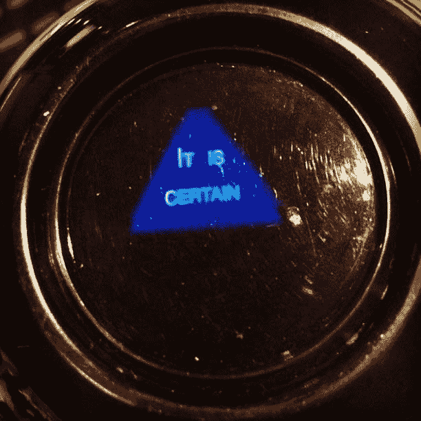

# 回归个人贡献者的旅程

> 原文：<https://dev.to/codeboten/the-journey-back-to-being-an-individual-contributor-312m>

有几个人问我最近的职称变动。在管理一个基础设施团队两年后，我将职业轨迹转回个人贡献角色。我想分享一些关于转变的想法，希望能帮助其他处于类似情况的人。

#### 旅途

几个月前，我陷入了自我怀疑的深渊。你知道，那些你质疑你所说和所做的一切。我开始怀疑自己是否还能写代码。当经理的第一年，我能够在工作之外挤出时间来写代码。但是家里有了蹒跚学步的孩子和新生儿，我所有的空闲时间都花在了为人父母上。

大约在同一时间，我开始阅读高效人士的七个习惯。多年来，许多人向我推荐这本书，但我从未抽出时间去读它。这本书促使我开始审视自己能控制什么来提高自己的幸福水平。在目前的情况下，我有能力改变什么？我想写代码来增加我的快乐，但是找不到时间去做。所以我寻找方法来减少我日常生活中的任何浪费时间的活动。这让我可以节省一些专门用于编程的时间。很快，我对编写极少量的代码变得如此兴奋，以至于我会熬夜到深夜，第二天早上醒来时充满了前一天晚上工作的兴奋。

这是一个关键的转折点。一天早上，我开始向妻子讲述我前一天晚上发现的一段几乎不相关的代码。她说了一句话，大意是多年没见我这么兴奋了。那时我知道有些事情必须改变。

#### 神话

有些人认为进入管理层是一种晋升。作为一个个人贡献者超过十年后，这是唯一的选择。很长一段时间，我也相信这一点。在一些行业，管理轨道直接与经济补偿挂钩。你负责的人越多，你赚的钱就越多。在软件行业，一旦你的职业生涯到了一定的高度，就变成了一套平行的轨道。成为一名经理并不意味着职业生涯的提升，而是朝着一个完全不同的方向前进。你不再用代码编写和设计解决方案，而是从不同的角度来解决问题。

这个神话让我花了几个星期痛苦地思考我是否应该和我的经理讨论我想改变的想法。我的职业生涯是否倒退了一步？毕竟，在某些时候，我在多个项目中管理着多达 11 个人。成功不就是这样衡量的吗？说我要重新写代码不就等于放弃了吗？

#### 动机

我最常被问到的一个问题是，是什么促使我换工作。现在回想起来，我意识到有一些我以前不知道的关于自己的事情:

1.  我喜欢写代码。与技术合作和探索新的问题空间驱动着我。通过概念证明和构建东西来帮助他人让我兴奋不已。
2.  我以我个人完成的事情来衡量我的成功。作为一名经理，我认为我的工作是让我的团队取得成功。当团队取得成功时，我为团队成员感到兴奋。随着人们成长并承担更大的责任，我为他们感到兴奋，但我从未真正从中获得成就感。
3.  我被驱使去创造影响力。在与我的合作伙伴进行了多次交谈后，我确信我可以离开目前的职位，对我的组织产生更大的影响。

#### 学问

虽然我决定离开管理层，但我很高兴有机会管理一个伟大的团队。当经理时，我学到了很多东西。有些事情人们很早就告诉过我，但直到后来才记起。有些似乎很明显，但它们值得重复。

1.  **不要再担心**写代码了。你越早放下你*正在*解决的问题，你就能越早开始思考你*必须*解决的新问题。
2.  向你的新同事寻求帮助。在某种程度上，所有的经理都是新手。他们了解这个角色的挑战，并能分享宝贵的经验。
3.  将职责交给团队成员。这给他们提供了一个提升的机会，你也有机会腾出一些时间向前看。拥有一个问题、产品或项目并不意味着你必须自己做所有的事情。
4.  想办法**衡量**激励*你*的那一周你的投入和产出。
5.  找一个**好教练**。我很幸运能够接触到一些伟大的教练，他们帮助我克服了早期面临的挑战。

#### 未来

人们问我是否完全放弃了管理。答案是不知道。我所知道的是，在我职业生涯的这个阶段，这不适合我。我很乐意写代码，并且相信这是我此时能产生最大影响的地方。