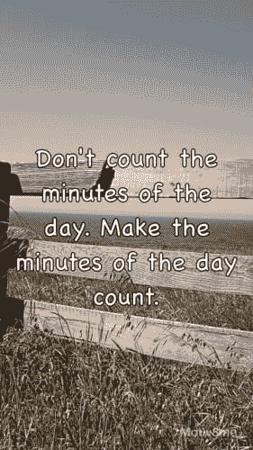

# 我的第一个 iOS 应用程序之旅

> 原文：<https://dev.to/tapresle/the-journey-to-my-first-ios-app-3o4n>

我一直对开发移动应用很感兴趣，之前在 2014 年左右发布了一个 Android 应用，并为此努力奋斗。从那以后已经过了几年，所以我想我应该尝试一下我在 Swift 开发的经历，因为我已经在专业的 webdev 岗位上工作了大约五年，学到了很多关于理解和使用不同语言和框架的知识。这让我想起了我在 2016 年开始的一个名为 Motiv8me 的项目。Motiv8me 最初是作为一个 web 应用程序存在的，它仍然可以在这里找到并且我认为它将是一个不同于你传统的 todo 或 journal 应用程序的良好开端项目。

## 从哪里开始？

当然是 Swift [文档](https://swift.org/documentation/#the-swift-programming-language)！我没有遵循这个应用程序的任何指南或教程，只是开始阅读文档以及一些有创意的谷歌搜索来给我指明正确的方向，这对弄清楚如何创建一个新的图像来保存在设备上非常有帮助。

## 对低级别细节进行讲解！

这个应用程序的代码不是很复杂，我有几个故事板，一个用于主循环，另一个用于创建自定义图像。对于主循环，它实际上是将一个 UIImageView 和两个 UILabels 分层。UIImageView 和 quote UILabel 是一个 10 秒钟的循环，它将改变图像、报价和字体。还有几个点击手势，单击会循环到另一个随机图像、引用和字体，双击会暂停当前设置。我还实现了一种方法，通过在主循环上滑动来创建自己的图像，这是一些更复杂的工作开始发挥作用的地方。

当编写自定义图像功能时，我遇到了很多关于位置和确保实时预览与最终图像匹配的问题。我很快了解到，没有一种内置的方法可以点击 UILabel 并打开键盘，这导致我用 UITextView 替换了报价的 UILabel 以获得编辑功能。这个问题解决后，我继续创建图像并保存到用户的设备上。使用 UIKit 的 UIGraphics 系列功能，我将图层渲染到图像中...背景图片在右边，但是报价和应用程序标签却在左上角。我发现当使用`UIView.layer.render(in: CGContext)`时，层上 CGRects 的原点位置被忽略了，所以我能够通过在渲染之前将报价和应用标签作为子视图放入主 UIImageView 来解决这个问题。这允许我在渲染整个图像之前正确地放置所有的部分。

## 开发完成后，我如何将它展示给用户？

媒体上有一个很棒的[帖子](https://medium.com/@the_manifest/how-to-publish-your-app-on-apples-app-store-in-2018-f76f22a5c33a)，是我用来帮助我完成这个过程的。最简单的就是获得一个开发者帐户(每年 99 美元)，在 App Store Connect(以前的 iTunes Connect)上设置你的应用程序，然后设置你的应用程序进行审查和销售。你需要一些你的应用目标设备的截图，一个应用图标，和一些元数据(例如。描述)供潜在用户阅读以对您的应用程序感兴趣。一旦你有了所有必要的信息，你就可以提交你的应用程序进行审查，如果审查成功，它通常会在 24-48 小时后出现在商店里。

## 那么我从这里学到了什么，又该何去何从？

老实说，我不知道为什么不早点开始。在整个过程中，我学到了很多关于如何开发和调试 Swift 应用程序的知识，也学到了很多关于 iOS 生态系统的知识。到目前为止，在没有任何营销的情况下，我只有几十次下载，但我也能够发布一个更新，并在一两天内拥有大约 90%的安装用户群更新。在一天结束时，我希望我能对某人的一天产生影响，即使是很小的影响，并帮助那些可能需要一点动力或灵感来度过这一天的人。

如果你想查看这款应用，你可以点击[这里](https://itunes.apple.com/us/app/motiv8me/id1447784871?mt=8)，它适用于 iPhone 和 iPad。我还在 [Github](https://github.com/tapresle/Motiv8meiOS) 上开源了代码，如果那更符合你的速度的话。