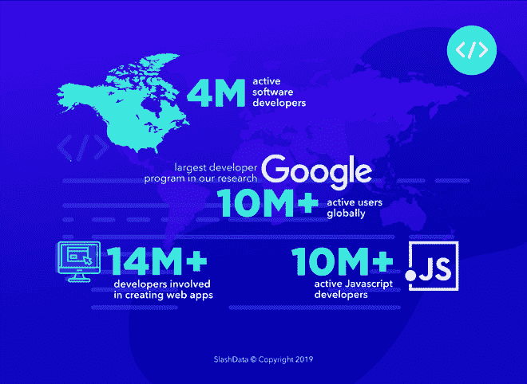

# 最大的开发者社区:批判的观点

> 原文：<https://dev.to/deveconomics/the-largest-developer-community-a-critical-view-4d33>

这篇文章首先出现在我们的[博客上。](https://www.developereconomics.com/largest-developer-community)

当开发人员评估新技术时，他们经常关注的一个因素是围绕该技术的社区的规模和实力。“在需要的时候，我能得到同伴的帮助和支持吗？”这是开源技术如此受欢迎的原因之一。相反，技术供应商经常用社区号来表明他们的美德:“我们的产品被数百万开发者使用，选择我们吧！”

然而，有理由对这种思路提出批评。核心小组的活动，或者实际上是供应商本身，可能比纯粹的用户数量更能获得巨大的支持。大多数技术不受网络效应的影响:当更多的开发者采用它们时，它们并不会变得更有价值。即使在开源项目中，核心贡献者也往往只有一小部分。此外，供应商可能会故意夸大他们报告的数字，或者仅仅因为他们没有好的数据。

在/Data，我们已经在全球开发者社区上维护和发布评估数年了。我们一年两次的调查也让我们对这些开发人员如何分布在各个社区有了一个很好的了解。因此，让我们看看在哪里可以找到一些最大的开发者社区，以及这些社区可能真的有多强大。

## 你说的“社区”是什么意思？

开发人员数量最多的地区是北美的 ，预计 2018 年年中有 400 万活跃软件开发人员 ，以及欧洲(欧盟 28 国中有 380 万)。然而，给这些社区打电话有点牵强。这些地区的开发人员分散在不同的国家和城市，使用不同的技术和语言。北美包括相对同质的美国，但也包括各种拉丁美洲国家。欧洲包括像英国这样的软件强国，但也包括较小的东欧国家。从寻找支持你的同行(或招募人才)的角度来看，围绕特定技术在城市聚集的小团体比考虑更广泛的地理范围更有用。

在我们的研究中，最大的开发者项目是谷歌 ，在全球拥有超过 1000 万活跃用户。谷歌很擅长通过论坛之类的方式来授权和支持他们的社区。也就是说，在供应商驱动的文档、教程和培训、工具等开发人员支持方面，他们也有很高的开发人员满意度。Google 是很多开发者的默认选择；不清楚这是因为他们社区的力量还是因为他们自己提供的价值。他们当然提供了多种技术，其中一种产品的经验不一定会转化为另一种产品。也许将它们视为社区的集合更为正确。

软件行业的不同部门情况如何？超过 1400 万名开发者参与了网络应用的开发。 我们再一次对这个跨技术社区的分裂感到好奇。扇区视图可能不是正确的分析级别。

最后，我们可以看一个技术。有超过 1000 万活跃的 Javascript 开发者，使得它成为当今世界上最流行的编程语言。在这里，我们可以看到一种更强烈的社区意识，论坛、现实生活中的团体、学习机构等等都是围绕着语言组织起来的。

简而言之，当我们说“社区”时，我们的意思并不明确。(就此而言，“开发人员”也不是，但那是另一篇博文的内容)。社区规模不一定是同质性、一致性或活动水平的指标。这使得评估开发者社区的价值变得不那么简单。

## 如何(不)统计开发者

如果你对开发者社区的评估感兴趣，你会毫无疑问地看到非常高的数字。开发者工具定期报告数百万的用户数量；像 Stack Overflow 或 Github 这样声称覆盖面广的社区，会报告有数千万开发者。在/Data，我们对这样的数字持怀疑态度，尤其是如果你打算用它们来做领养决定的话。

首先，因为不清楚每个来源在他们认为是(活跃的)开发人员的界限在哪里。是否包括 IT 专业人员、开发人员或系统管理员？曾经做过账号，但是从来没有主动使用过产品的人呢？

然而，更大的问题似乎是这些数字的来源。互联网上流传的大多数估计都是基于(独特的)页面浏览量、下载量、IP 地址等等。所有这些都容易受到乘数效应的影响，至少是由于多机器和多浏览器软件测试、频繁清理测试用的缓存和 cookies、开发工具的重复下载以及开发自动化(例如构建服务器)。被放弃的账户也可能严重扭曲估计值。有时候，我们遇到的数字似乎毫无根据。

像这样的测量只是实际活跃开发者数量的模糊指示，因此也是社区力量的模糊指示。它们在供应商之间往往没有可比性。更不用说报告他们能找到的最大数量符合供应商的自身利益。指示实际开发者活动的指标，比如月活跃用户，是非常罕见的。

## 结论

无论您是一名正在考虑职业发展方向的开发人员，还是正在决定采用哪种技术的人，支持社区有多强大的问题都是完全合理的。然而，要评估社区的真正好处，请确保使用正确的范围和可靠、有意义的数字。

就我们而言，我们将继续为您提供我们对活跃软件开发人员的最佳估计，使用的资源是最近编码活动的直接证据。为此，我们将重视您的意见。[我们目前正在开发人员经济系列](https://survey.developereconomics.com/surveys/de16?utm_source=Owned%20-%20newsletter&utm_medium=owned&utm_campaign=Dev.to%20post)中进行另一项调查。如果你是一名软件开发人员，请考虑回答这些问题。如果你不是开发人员，但是在软件行业工作，把这个链接传给你的开发人员朋友和同事。

完成的每一项调查都有机会赢得 **Oculus Rift +Touch 虚拟现实系统以测试您的创作(或只是玩玩)、三星 S9 PLus、200 美元的软件订阅费或价值 12，000 美元的奖金池中的其他奖品！**

另外，如果您推荐其他开发人员参加调查，您可能会赢得高达 1000 美元的现金奖励。请不要忘记在参加调查前注册，以便我们知道您希望参与抽奖！

我们还将向 Raspberry Pi 基金会捐赠 2000 美元，帮助年轻人学习如何编码，因此越多的开发人员参加调查，我们就越有可能帮助社区发展！

你说什么，你加入吗？