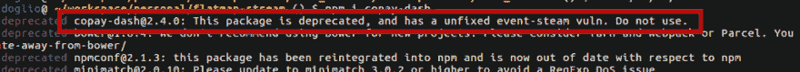

# 最新的国家预防机制违规…或者是吗？

> 原文：<https://dev.to/bnevilleoneill/the-latest-npm-breach-or-is-it-28ij>

### 最新的 npm 违约……或者是？

> TL；DR:某个家伙把他流行的 Node.js repo 给了一个黑客，而那个黑客给它添加了可以窃取你的比特币钱包的代码！想知道这是怎么发生的吗？继续读…

不到一个月前，Node.js 社区发生了一件非常有影响的事情，你可能会错过它，因为它只影响了一些与加密货币相关的项目。

但是如果你仔细阅读所发生的事情，你会意识到受影响的项目或者甚至受影响的软件开发领域并不是真正的受害者，这次攻击实际上是对开源世界的一次打击。

让我解释一下。

### 到底发生了什么事？

让我们从头开始，因为现在一段时间过去了，主要受影响方有机会解决问题，但仍有许多错误信息在流传(毕竟这是互联网)。

许多人把它称为“最新的 npm 漏洞”或“对 npm 的黑客攻击”，但这是他们搞错的事情之一。这并不是针对 NPM 的(NPM 是每个 Node.js 开发人员用来管理他们的项目中包含哪些包的节点包模块)。这是对一个特定实体的非常集中的攻击:一个叫做 **copay-dash** 的包。

你将无法在 npmjs.com 找到它，但如果你只是尝试安装它，你将能够这样做，虽然你也会看到以下有趣的消息，而你这样做:

该消息让您知道您不应该信任此包，尽管罪魁祸首拼写错误。受到邪恶一方影响的实际包不是“事件流”，而是“事件流”。让我们看看这是如何发生的。

### 附带损害

最好的攻击是那些你看不到的攻击，对吗？在这种情况下，我们最终会知道攻击者在互联网上被称为 **right9ctrl** (正如所料，他们的真实身份仍然是一个谜)，他影响了一个*不同的*包，一个月下载量超过 200 万的包，希望它能与 copay-dash 包用于同一个项目。

如果你非常不幸地发现自己在项目中同时使用了这两种工具，恶意代码就会运行，试图窃取你比特币钱包的公钥，并将它们发送到位于吉隆坡的主机服务器。

这次攻击很狡猾，它没有攻击最初的目标，而是影响了第二个可选的软件包，但是这个软件包被社区大量使用。

现在的问题是，这个黑客是如何获得 event-stream 的代码的，他们是如何以 Eich 的名义成功感染它的？

遗憾的是，这个问题的答案是，他们仅仅通过请求访问就获得了访问权。你看，event-stream 只是成千上万个开源项目中的一个，这些项目每天都被各地的开发者免费使用和维护(这是关键所在)。

所以当一个有意愿的贡献者向这个包的所有者提出一个 Pull 请求(一个将一个给定的改进合并到原始源代码中的请求)时，这个人并没有真正地考虑它。这个项目的所有者叫做 Dominic Tarr，他已经说过好几次了，他对维护这个代码已经没有兴趣了，他不再使用这个库了，而且他从维护它中也没有得到什么。所以他不只是合并拉请求，他还把项目的所有权(虽然不是 Github repo)给了黑客。

是的，就这样，黑客获得了推送新代码和覆盖软件包版本的能力，迫使大多数开发人员认为他们需要更新他们的本地副本。

您可以看到事件流的[提交历史，并且您会注意到最后 16 次提交是由同一个用户进行的，但是有一次是至关重要的，黑客添加了一个新的依赖项。你看，这位用户没有直接修改事件流库，而是创建了一个不同的包，名为 **flatmap-stream** ，并将其作为一个依赖项添加，基本上增加了与一个新工具的兼容性，知道(很可能)开发人员不会关心查看和通读这个第三方库的代码，他们只会关心对他们的源代码所做的更改(如果有的话)。你可以在这里看到提交细节](https://github.com/dominictarr/event-stream/commits/master)。

这就是“黑客”的范围，之后，为了强制版本更新和其他小细节，进行了几次提交，但没什么大问题，损害已经造成了。

可悲的是，对恶意存储库的访问已被撤销，现在如果我们试图访问 flatmap-stream 的存储库或 npmjs.com 页面，我们得到的只是以下消息:

此软件包名称目前未被使用，但之前被另一个软件包占用。为了避免恶意使用，npm 保留了包的名称，但是并不严格，如果你需要的话，我们可能会给你。

*你可以通过联系[support@npmjs.com](mailto:support@npmjs.com)并询问名字来获得这个包。*

虽然没有正式发布，但可以在网上的几个博客帖子中找到这些代码(这里是[，例如](https://schneid.io/blog/event-stream-vulnerability-explained/))，它没有那么长，但它实际上是通过解密自己，并将恶意代码注入 Copay 的库中来工作的。然而，这不是本文的重点，实际上远非如此。

### 哪里出了问题？

为了理解为什么会发生这种情况，我们需要看看业主(以及这个问题被发现后所有人都指向的人)多米尼克·塔尔(Dominic Tarr)说过什么:

*嘿各位——这不仅仅是一次性的事情，很可能* ***会成为你们依赖树中的许多其他模块*******现在对它们的作者*** *来说是一个负担。我并不是出于利他主义的动机而创造这个代码，我创造它是为了好玩…我认为 npm 上的大部分小模块都是出于这样的原因而创建的。然而，那是很久以前的事了…我以前和其他人分享过出版权。当然，如果我意识到他们有恶意，我是不会这么做的，但是在那个时候，这看起来像是有人真的想帮我。* *自 node/npm 早期以来，与其他贡献者共享提交访问/发布权限是一种广泛的社区实践。*[_ _](https://felixge.de/2013/03/11/the-pull-request-hack.html)*……开源是共享驱动的！…**

 *你可以在这里阅读完整的声明和对话，当然，加粗的部分和删减的部分是我添加的，以说明问题。整篇文章包含了他的推理背后的所有细节，但你只需阅读上面的段落就能明白要点。

本质上，黑客攻击了开源软件的软肋。事实是维护开源包，尤其是流行的包可能是一种负担，开源开发者的倦怠非常普遍。他们竭尽全力获得高质量的代码，因此其他人可以从他们的工作中获利，而不需要任何回报。或者至少没有直接的报复，因为有人可能会认为保持流行的软件包，是向我们行业的人介绍自己时的一张很好的名片。它到达了一个点，甚至这还不够，开发人员只是放弃他们的工作。谁能责怪他们呢？

如果他们的代码被泄露是他们的错还是没有检查两次就使用库的人的错？如果你仔细想想，我们的行业是独一无二的，因为我们免费与他人分享我们的经验。在其他工作中，这并不总是发生。但是在软件开发中，情况并非如此，那些拥有诀窍的人分享它，他们写博客，他们公开分享他们的代码。想一想。开源运动改变了我们的行业，使我们能够合作，并从彼此的成就中成长。

但是今天我们读到了开源运动的黑暗面(并且[不是第一次](https://eslint.org/blog/2018/07/postmortem-for-malicious-package-publishes))，我们了解到并非一切都是完美的，如果没有一个支持它们的系统，即使是最好的意图也可能会落空。开源开发者不能像今天这样继续工作，我们已经到了一个地步，一个小的公共模块中的一个变化就可以影响数百万用户，并可以被用来窃取敏感信息，我们需要开源 2.0。

不管这意味着什么，它必须以支持系统的形式出现，以帮助开发者避免精疲力竭。每个人都热衷于提出的两个快速想法是:

1.  **支付给开发商。**我们应该找到一种方法，将支付开发人员工作报酬的方式正规化。但是谁付钱呢？我们会强迫所有人付钱吗？那岂不是违背了开源的实际意义？这个想法有一些优点，但需要正确实施，否则会弊大于利。
2.  如果你在使用开源软件，那就参与进来。这个听起来可能更好，但我认为它同样难以实现。就像我们已经成功创造了一个乌托邦式的行业，每个人都愿意彼此分享知识。那些真正这样做的人，花费无数的时间来完善他们的技术和维护他们的代码，只是这个行业的一小部分。我没有这个数字，但我敢打赌，大多数开发商只是简单地索取而不回馈。这也不是一个简单的问题，他们为什么不回馈社会呢？是因为他们不知道如何？是因为他们不在乎吗？他们真的知道如果他们分享他们在使用的库中发现的 bug 会造成多大的影响吗？

我没有答案，但我觉得它可能来自以上两点的混合。不过，整个问题可以总结为一句话(虽然这并不会使提出解决方案变得更容易，但至少更容易向他人解释):开发人员需要接受开源教育， ***每个人*** 都需要明白他们可以回馈，并且应该尽可能这样做。无论是漏洞修复、出版教程、视频评论还是你能想到的任何其他方式，但这应该是大多数人的责任，而不是少数人的负担。

你有解决开发者倦怠的方法吗？你有什么建议来改善开源维护者的生活？请在下面留下您的评论或发微博给我，地址: [@deleteman123](https://twitter.com/deleteman123)

### Plug: [LogRocket](https://logrocket.com/signup/) ，一款适用于网络应用的 DVR

<figcaption>[https://logrocket.com/signup/](https://logrocket.com/signup/)</figcaption>

LogRocket 是一个前端日志工具，可以让你回放问题，就像它们发生在你自己的浏览器中一样。LogRocket 不需要猜测错误发生的原因，也不需要向用户询问截图和日志转储，而是让您重放会话以快速了解哪里出错了。它可以与任何应用程序完美配合，不管是什么框架，并且有插件可以记录来自 Redux、Vuex 和@ngrx/store 的额外上下文。

除了记录 Redux 操作和状态，LogRocket 还记录控制台日志、JavaScript 错误、堆栈跟踪、带有头+正文的网络请求/响应、浏览器元数据和自定义日志。它还使用 DOM 来记录页面上的 HTML 和 CSS，甚至为最复杂的单页面应用程序重新创建像素级完美视频。

免费试用。

* * **