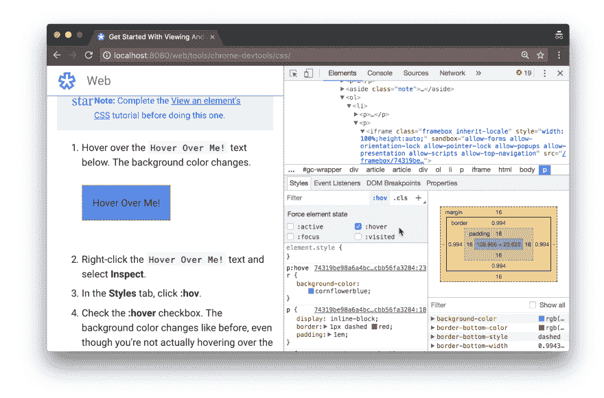

# CSS 的层次

> 原文：<https://dev.to/laurieontech/the-layers-of-css-3ae5>

所以，当我上次在这里的时候，我们讨论了 Javascript 栈的各个层，以及它们是如何结合在一起，在美丽的混乱的框架上构建框架的！

如果你错过了那篇文章，请点击这里查看:[Javascript 的层](https://dev.to/laurieontech/the-layers-of-javascript-15op)。

那个帖子好像引起了一堆人的共鸣，很奇妙。在我写这篇文章的时候，我开始尝试修复我的网站上的一个元素的对齐问题。在尝试这样做的过程中，我突然意识到 CSS 也有层次。所以，我们开始吧！

## W3C 和标准

如果你以前听说过这个，请打断我，CSS 有一个标准。该标准由 CSS 工作组(W3C)控制。2011 年，W3C 做出决定，CSS 标准将被分成可以独立发展的模块。因此，该语言不再有完整的版本更新。你可能听说过 CSS3，它是 CSS 的最新版本。从技术上讲，该标准并不正式存在，因为它现在都是独立的模块，但人们使用这个术语是因为所有的模块都是从第 3 级标准化开始的。

基于这个标准，它取决于浏览器是否支持它。每个浏览器都有自己的 CSS 解析器/渲染引擎。这就是为什么你经常听到人们谈论 Internet Explorer 支持什么和不支持什么。因此，就像 Javascript 一样，您担心 CSS 是否能被显示它的浏览器解释。

## CSS 和 DOM

当你在浏览器中打开你的站点时，渲染引擎解析 HTML 并解释 CSS。当它将元素添加到 DOM 树中时，它将元素映射到它们相关的样式。在这里，您可以打开检查器，查看给定元素的具体样式。

[](https://res.cloudinary.com/practicaldev/image/fetch/s--Etkhw0To--/c_limit%2Cf_auto%2Cfl_progressive%2Cq_auto%2Cw_880/https://developers.google.com/web/tools/chrome-devtools/css/imgs/set-hover.png) 
*如果你愿意，你甚至可以随意改变风格！*

## 层叠式，像埃及的河流

CSS 实际上代表级联样式表。当浏览器解释 CSS 时，它必须考虑来自不同来源的不同样式表。

存在由浏览器本身提供的浏览器样式；有“作者”样式，它们是你(或其他人)构建的应用于正在呈现的站点的样式表；您甚至可以使用用户样式来覆盖特定人的站点视图的样式。

当它们冲突时会发生什么？谁赢了？CSS 有一个层次结构来描述如何将这些不同的样式合并在一起，并且哪个是权威的取决于具体情况。

> 更多细节请查看[CSS 级联介绍](https://developer.mozilla.org/en-US/docs/Web/CSS/Cascade)

## 我知道 CSS！等等，这个少民是谁？！

因此，除了代码解释的层次之外，编写 CSS 还有很多层次。当我们想到样式时，我们通常会想到一个充满键值对的 CSS 文件，这些键值对将样式分配给我们的代码。这些基本上是应用于指定 HTML 元素的规则。

```
a {
    color: black;
} 
```

Enter fullscreen mode Exit fullscreen mode

然而，CSS 已经获得了一些朋友。同样受欢迎的还有 LESS 和 Sass。这些被认为是 CSS 预处理器。它们采用了基本的 CSS 并扩展了可用的语法，因此您可以在样式文件中直接包含变量和嵌套规则(以及更多)。

```
$brand-color: #fc3;
a {
    color: $brand-color;
}
nav {
    background-color: $brand-color;
} 
```

Enter fullscreen mode Exit fullscreen mode

这是一个 Sass 语法的例子

> 顺便说一句，萨斯曾经是它自己的语言。在版本 3 之后，它与 CSS 兼容，所以现代的 Sass 实际上是 SCSS，使用文件扩展名. scss. Oh，并且[仍然存在](http://thesassway.com/editorial/sass-vs-scss-which-syntax-is-better)，一些人更喜欢使用原始的 Sass 语法，所以要小心。欢乐时光！

## 特异性和选择器

关于样式，需要理解的一件重要事情是，它们是以一种允许开发人员在任何最有效的级别应用它们的方式设计的。由于一个页面上有如此多的 HTML 元素，选择一个影响所有标题或所有按钮的样式要比单独设计每一个要容易得多。CSS 通过使用将样式映射到元素的选择器来处理这个问题。有三种类型的选择器。

*   类型选择器
*   类别选择器
*   属性选择器
*   Id 选择器

> 也有通用选择器，但它们对特异性没有影响

选择器可以以多种方式组合使用。第一种方法是使用多个选择器来增加映射到的元素的特异性。

```
a {
    color: black;
}

a.thanos {
    color: purple;
} 
```

Enter fullscreen mode Exit fullscreen mode

结合这个 HTML，链接会是什么颜色？

```
<a class="thanos" href="/"> Click Me! </a> 
```

Enter fullscreen mode Exit fullscreen mode

链接会是紫色的！这是因为它有类名`thanos`，给了它两个选择器。我们拥有的`a`标签样式只使用一个选择器来映射到一个元素，所以`thanos`规则更加具体并且胜出。

使用这种类型的特殊性，你可以使网站上的所有链接都是黑色的，而仍然决定一个页面上的一个链接应该是紫色的。然而，如果你尝试这样做，会发生什么呢？

```
a {
    color: black;
}

.thanos {
    color: purple;
} 
```

Enter fullscreen mode Exit fullscreen mode

在这两种情况下只有一个选择器，所以可以推测，样式会发生冲突。然而，CSS 有规则来决定它应该听哪种风格。这是选择器特异性发挥作用的第二种方式。操作的顺序是 id 选择器是最具体的，接下来是与属性选择器相关的类选择器，然后是标签选择器。

如果你感兴趣，Mozilla 对此有更深入的解释。请注意，您可以结合使用这两个特殊性概念。

## 内嵌样式

好，下一层！到目前为止，我一直假设所有的 CSS 都包含在某个样式表中。但是，样式可以直接在 HTML 中指定。但是，这将覆盖项目样式表中该元素的样式。这是因为根据 CSS，内联样式被认为更具体。

```
return (
    <h1 style={{ margin: 0, flex: 1 }}>
        LAURIE             
    </h1>
)} 
```

Enter fullscreen mode Exit fullscreen mode

许多人认为内联样式是糟糕的实践。其原因是因为这个特殊性问题。让样式在没有意识到的情况下被覆盖，因为您已经在较低的级别编写了它们，会很快变得混乱。此外，内联样式通常会迫使您编写更多的 CSS，因为您正在单独设计可能重复和共享样式的元素。

## 我想我知道这种风格从何而来？

这些风格层次有很多排列。CSS 的部分挑战是任何给定的样式都可以用许多不同的方式产生。重要的是你把你的风格放在哪里，是什么触发了它们，等等。但是知道正确的工作层将有助于你保持直线。如果你记不住，把这张方便的小抄放在你的后兜里。

* * *

如果你正在寻找类似这样的其他内容，请查看:
[不要被错误所迷惑](https://dev.to/laurieontech/don-t-get-fooled-by-errors-314c)
[在线学习技巧和窍门](https://dev.to/laurieontech/online-learning-tips-and-tricks-1lgi)
[我的关于 Gatsby 和 GraphQL 的系列文章](https://dev.to/laurieontech/rewriting-a-static-website-using-gatsby-and-graphql---part-1-53o0)