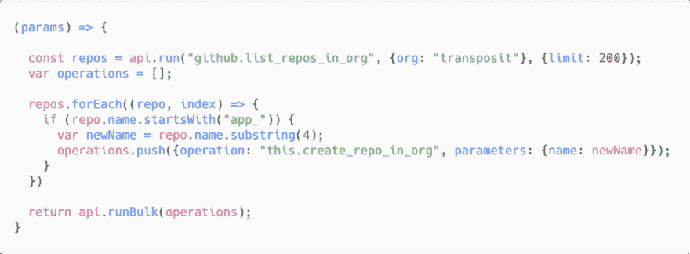
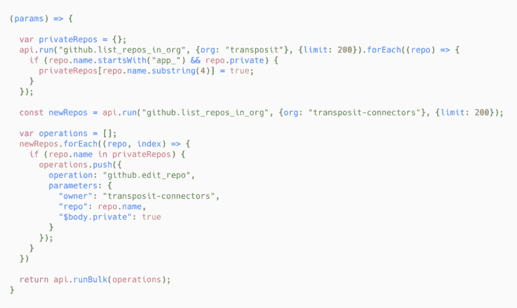
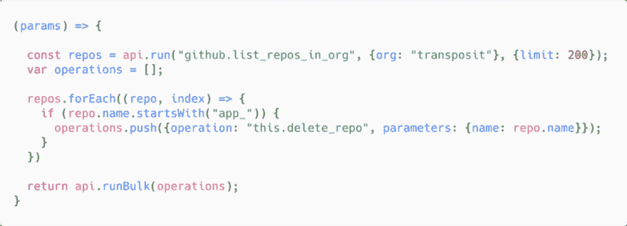

# 用 Transposit 迁移 Github 存储库的改变生活的魔力

> 原文：<https://dev.to/transposit/the-life-changing-magic-of-migrating-github-repositories-with-transposit-169g>

作者:杨妮娜

我不是囤积者。我只是碰巧在一个组织中管理大量的 GitHub 库。但是我们需要所有这些仓库，我发誓！

为了帮助开发人员轻松地与 API 交互，Transposit 构建了一系列连接器。每个连接器都位于一个 GitHub 组织中自己的存储库中。但是随着我们的连接器库的增长，我们的组织变得越来越混乱。是时候把它们清理干净了。

 

<figcaption>图片来源:【twotwentyone.net】</figcaption>

### **目标**

创建一个新的 GitHub org，并将我们大约 100 个连接器存储库迁移到它上面。快速而全面地完成这项工作，以尽量减少对开发人员与这些连接器交互的干扰。

### **实现**

当然我想自动化这一点——让这些过程变得简单是我们建造 Transposit 的原因之一！但我仍然惊讶于将任务翻译成代码是如此简单。

#### 第 0 步:新建 GitHub 组织

这是我手动完成的。

#### 第一步:从已有组织中取出存储库名称

 

<figcaption>在转置中，是 JavaScript 的一行</figcaption>

 

<figcaption>…或者一行 SQL</figcaption>

Transposit 的一个重要特性是，它为开发人员处理 OAuth 舞蹈和凭证存储。存储了客户端 ID 和密码后，只需点击几下，就可以转置访问我的 GitHub 账户。

#### 步骤 2:对于每个连接器存储库，在新的 org 中创建与其同名的连接器

当我们将所有的 repos 都集中到一个 GitHub org 中时，我们使用前缀“app_”来区分我们的连接器库和其他代码(我们的主要代码库和支持项目)。因此，我可以使用这个前缀来标识要迁移的正确存储库，然后因为不再需要它而将其删除。

我做了一个创建新回购的操作:

 

<figcaption>该操作可以调用为“This . create _ repo _ in _ org”</figcaption>

我的主要操作是将其应用于所有带有“app_”前缀的回购:

 

<figcaption>不差< 20 行代码。</figcaption>

我按下“运行”按钮，它就启动了。

#### 第三步:意识到我已经意外地创建了所有的公共库，并运行一个修复程序

我们的一些连接器是开源的，一些仍在开发中，还没有准备好公开。哎呦。幸运的是，有了 Transposit，很容易将它们改回私有。

 

<figcaption>呼！</figcaption>

#### **步骤 4:迁移存储库内容**

我使用 python 脚本将存储库内容复制到他们的新家。**然而**，在写这篇博文的时候，我发现 GitHub 提供了一个真正的[资源库转移 API](https://developer.github.com/changes/2017-11-09-repository-transfer-api-preview/) ，我本可以使用它来处理这个步骤，并且将它与 Transposit 结合起来会使这个过程更加容易。Welp…下次的好信息。

#### **第 5 步:通知我的团队更新他们的本地存储库远程，以指向新的组织**

我为此编写了另一个脚本。同样，使用存储库传输 API 会更好，它会警告您更新后的 remote *和*仍然会推送到新的存储库。

#### 第六步:删除旧仓库

 

<figcaption>眼熟吗？</figcaption>

### 结束

这种迁移还有其他方式。我本可以通过 GitHub UI 手动转移所有回购的所有权，但那会花很长时间。我可以使用对 GitHub APIs 的原始请求来完成迁移，但是这需要仔细阅读 API 和认证文档，并且会产生更多出错的机会。也有特定于 GitHub 的 CLI 可以达到同样的效果，但需要学习语法，我不太可能再次使用。

使用 Transposit，我使用 JavaScript 和 SQL 在几个小时内完成了迁移。我的 API 调用的细节被抽象掉了，我开始关注我的实现的逻辑，而不是设置步骤的细节。这个过程快速而高效，现在我们所有的存储库都在它们适当的位置。

您的用例可能不同，但是您希望在不陷入单调乏味的情况下进行构建的想法可能是相同的。也许[换位](https://www.transposit.com/)也能给你带来快乐。

* * *