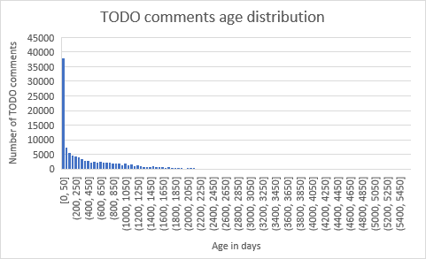
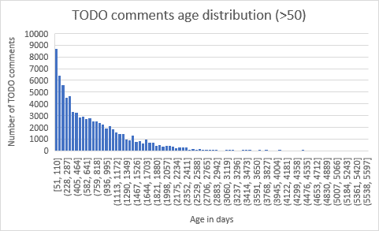

# TODO 注释的生存期:结果

> 原文：<https://dev.to/petermorlion/the-lifetime-of-todo-comments-the-results-503o>

长期以来，我一直认为代码中的 TODO 注释不会很快得到修复。为了得到这方面的一些数字，我开始分析一组 GitHub 库。你可以在我之前的文章中阅读[我是如何研究 TODO 注释的生命周期的。](https://www.petermorlion.com/the-lifetime-of-todo-comments/)

在这篇文章中，我将看看这些数字。我还会谈谈我的研究中的一些不足之处，以及我如何在下一轮中解决它们。

## 概述

如前所述，我使用了一个分类为包含。NET 代码。

以下是一些数字:

*   23561 个存储库
*   94928 个文件
*   120611 待办事项注释
*   所有 C#文件，数据集中没有 VB.NET 或 F#

## 删除“坏”数据

有两条记录的 TODO 注释的期限为负值。这是由于 GitHub 的 GraphQL 或 me 使用了错误的查询而导致的错误结果。如果你知道如何修复它，请[回答我的 StackOverflow 问题](https://stackoverflow.com/questions/56054038/github-graphql-query-not-returning-last-commit)。

还有很多 0 天的待办事项注释。这是因为我将注释的引入与最近的提交进行了比较。然而，许多存储库被放在 GitHub 上作为一种存档。整个代码库被提交并推送到 GitHub 一次，然后就再也不会被触及。

这些是我们应该排除或考虑的事情。

对于接下来的部分，请记住，我们正在查看仍然存在的 TODO 注释。我还没有研究已经修复的 TODO 注释。

## 结论

**平均而言**，当前的一组待办事项注释是在最后一次提交前 528 天引入的。那是**快一年半了**。在这段时间里，解决这个问题并不重要。

如果我们看一下**的中位数**，这个数字稍微好一点。一半的 TODO 评论存活时间不到 **246 天**。还是很久。

我画了一张所有数字的图表，以及它们是如何分布的:

值得注意的是，大多数 TODO 注释存在不到 50 天。当然，这些也可能是更年轻的存储库(即那些仅出于存档目的而放在 GitHub 中的存储库)。

过滤掉那些“年轻的”存储库，得到了这个图表:

正如您所看到的，许多 TODO 注释仍然相当年轻。30%的 TODO 注释不到一年(第 30 个百分位数是 280 天)。因此，这些问题仍有机会相对“快速”地得到解决。

“快”这个词在这里有争议。我个人认为，对于 TODO 注释来说，即使 107 天(第 10 百分位)也太长了。但是如果 30%是 280 天或更短，这也意味着 70%的 TODO 注释超过 280 天。

事实上，我检查了 365 天的百分位数。它的值为 0.377，因此当前 TODO 注释中有 62.3%的注释超过了一年。这些问题可能很难再得到解决。

你可以在 GitHub 库的[中找到这个项目的数据文件和源代码。](https://github.com/petermorlion/ToDoCommentAnalyzer)

## 下一步

显然，研究更多的语言会很有趣。比较它们甚至会很有趣。

我想研究的另一件事是固定的评论。如前所述，我只查看**当前 TODO 注释**。但是为了查看所有 TODO 注释的平均生存期，我必须克隆多个存储库并检查整个日志。

这样，我可以看到注释何时被引入，何时被修正。这需要一个完全不同的过程。这也将花费更长的时间，或者我将不得不使用更小的数据集。

另一个下一步是过滤掉过时的存储库。例如，我可以在过去 3 个月(或者其他任意时间)发生最后一次提交的存储库上运行分析。

最后，还有更多我可以自动化的。比如我现在用 Excel 计算一切。但是因为数据的大小，Excel 变慢了很多。

## 做什么？

但是如果 TODO 注释在我们的代码中没有提供太多的价值，那么我们该如何处理它们呢？如果我们现在不能做一些事情，但又不想忘记，怎么办？下周请关注关于此事的另一篇文章。

如果你对这个小小的研究有任何意见，或者想帮助改进它，请告诉我。发表评论，[联系我](https://www.redstar.be/contact/)，或者在 Twitter 上给我发消息。