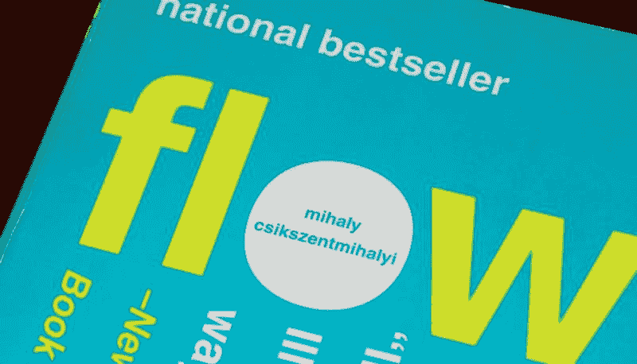
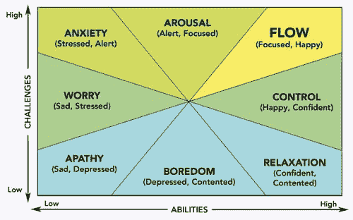
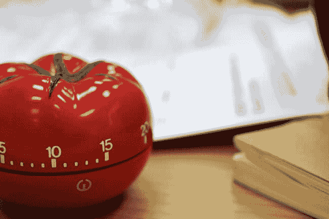

# 你职业生涯中最重要的图表

> 原文：<https://dev.to/anastasionico/the-most-important-graph-of-your-career-3el>

你太棒了，

如果你点击了这个标题的帖子，并且正在阅读这篇文章，而不是等待杰克保罗的最新视频或坐在你的沙发上看网飞，让我告诉你，你太棒了！。

众所周知，以提升自己为目标的人并不常见。人们通常会有一个好感度的高峰，在第一次或第二次困难之后会降低。

今天，我们将讨论为什么会出现这种情况，以及如何持续改进。

几项研究表明，这种方法不仅能让你在职业生涯中掌握更多技能，还能让你的生活更加快乐。

告诉我以下情节是否发生在你身上:

你刚刚花了几个月的时间掌握了某种技能，现在你已经独立了，你认为自己几乎是这方面的专家，几天后，在你大脑的一个偏远角落，一个问题开始越来越多地出现:

“现在怎么办？”。

所以你又花了几个月的时间来学习和提高另一项技能，这个问题又出现了，周而复始。

别担心，

这是做人的常态。

而且，好消息是，也正是你生活的这一方面可以被掌握并让你满意。

### 心理学的最优体验(流)

[米哈里·契克森米哈](https://en.wikipedia.org/wiki/Mihaly_Csikszentmihalyi)是畅销书《[心流:最佳体验的心理学](https://www.amazon.co.uk/Flow-Psychology-Experience-Perennial-Classics-ebook/dp/B000W94FE6)》的作者。

在他的书中，

米哈里采访了许多人，他们不仅被认为是各自领域的专家，而且是成功人士，甚至是更快乐的人。

受访者的角色分散在最不同的类别，从运动员到艺术家、医生和工程师

米哈里将心流描述为一种心理状态，在这种状态下，你的自我消失了，你进入了一个高效的工作流程。

这个工作流程是如此的紧张，以至于一些被采访的人说，在这些恍惚的阶段，他们甚至忘记了更基本的需求，比如吃饭或者上厕所。

在电影《无限》中，惊人的布莱德利·库珀扮演的爱德华“埃迪”莫拉完美地描述了这种精神状态，这是一个著名的例子。

如果你没有看过这部电影，剧情讲述了一个人，通过一种特殊的药物，能够释放更大比例的脑力，进入这种心流状态后，比这个星球上任何人都更有生产力，学得更快。

这是电影和书籍中反复出现的主题，事实上，在斯嘉丽·约翰逊主演的《露西》中也有这样的例子。

这些恍惚状态，这些流动的结果是，一旦出去，你得到了想要的结果，我有了富有成效的感觉，然后在大脑中释放出让我们感到快乐的物质。

这难道不是我们努力的最终目标吗？

### 挑战图

在他的书中，米哈里通过一个图表描述了这种流动状态，他称之为“挑战图”。

这张图表分为 8 个部分，每个部分代表一种精神状态。

这张图表分为 8 个部分，每个部分代表一种精神状态。

虽然有些可能会被考虑，米哈里建议集中和流动状态。

把图表想象成一个难度/时间的关系，通过掌握一项特殊技能，我们不难看到自己的旅程。

无论是一种新的编程语言还是一种让我们工作得更好的新工具。

让我们举一个实际的例子。

让我们考虑一个笛卡儿坐标系，在横坐标上我们放置学习一些新技能所花费的时间，顺序代表技能在我们当前水平下所要求的难度水平。

### 冷漠。

在这里，所有的活动都非常简单，不需要任何技能。

结果是完全缺乏兴趣、热情和关心。

简单来说，如果你没有学到任何新的东西，并且你对此不感兴趣，那你将很难甚至不可能变得快乐。

### 放松。

放松包括在没有觉醒的情况下保持低紧张度。

这种精神状态是在需要高水平的技巧时获得的，难度很低。

因此，工作在没有压力和兴奋的情况下进行

### 控制

控制阶段是达到心流状态的最佳阶段。

在这个阶段，没有压力，需要的技能水平非常高。

就我个人而言，这是我更愿意到达心流状态的道路。

这种状态很大的一个问题就是非常容易停留在停滞状态。

由于挑战的程度不够高，人们倾向于长时间停留在这种舒适的水平上，然而，从长远来看，他们降低了学习新技能的绝对速度。

### 担心

担忧是对现实或潜在问题的焦虑或不安的感觉。

这可能是最糟糕的阶段，因为它不仅离我们心中的目标(达到心流)非常远，而且同时，情况比我们处于冷漠状态时还要糟糕。

这种状态，事实上，对冷漠的差异，即使它不需要你的许多技能，也需要一定程度的挑战。

### 觉醒

令人兴奋的是，当你在周日早上早早醒来，知道你将在你最喜欢的咖啡店里花几个小时一边喝着卡布奇诺一边学习一门新的编程语言或一个新的 PHP 框架。

这与控制水平非常相似，从这一点很容易达到心流状态，但在这种情况下，挑战更大，结果也不总是理想的。

事实上，

可能会发生这样的情况，在花了几个小时阅读文档后，你明白你需要更多的时间，即使只是开始一个新的基本项目。

很容易回到焦虑和担心的状态，而不是达到心流的状态。

### 流量

最后，最后的状态是心流状态，精神状态的圣杯。

Csikszentmihályi 将这种状态定义为最佳体验，

它给了我们很高的满足感，能够达到这个水平主要取决于这个人的技能，达到最终目标的愿望和挑战所需的难度。

尽管心流的概念是由 Mihály Csíkszentmihályi 在 1975 年提出的，但它已经存在了数百年，在佛教和道教中也可以找到类似的思想。

他们说，尽管在大多数情况下，当处于心流状态时，个人能够决定专注于什么以及专注多长时间，但他们专注于他们的唯一目标，即意识到他们的周围环境。

Schaffer(2013 年)的 7 个条件描述了另一个更近的流动状态，它们是:

*   知道该做什么
*   知道如何去做
*   知道自己做得有多好
*   知道去哪里(如果涉及导航)
*   高感知挑战
*   高感知技能
*   不受干扰

Schaffer 还参考了流动状态问卷来测量上述每个状态。

### 如何获取流量，学习更快？

现在你明白了它是什么，以及当你尝试学习一项新技能时，你能找到的其他精神状态是什么，是时候看看如何达到心流的一些技巧了。

第一条建议是要有快速和频繁的反馈。

从这个意义上说，编码是最好的活动之一，只需在我们的代码中改变一个简单的分号，一旦文件被保存，反馈就会立即到来。

浏览器会告诉你新代码是否有效，或者你是否还需要修改脚本。

第二个变量是长期反馈，也称为最终目标。

如果有了快速反馈，你可以通过定义最终目标立即看到我们的行动所取得的进展，你就可以给他们一个目标。

然后，您可以检查您是否正在接近或远离最终产品，无论它是您想要学习的新技能，还是使用您已经知道的编程语言部署新的 web 应用程序。

第三，

这也是程序员遇到最多问题的地方。

挑战必须是困难的，但并非不可能获得。

如前所述，

我认为从控制或唤起状态返回是非常容易的，从心流状态进入焦虑状态甚至更容易。

你就想一个小说，他刚写完第一本 HTML 基础的书，直接上了四人帮的《设计模式》。

一个更好的进步的例子是从 PHP 的基础转到一些更复杂的主题，比如面向对象编程的[，最终学习一些 PHP 框架](http://anastasionico.uk/blog/the-complete-guide-to-object-oriented-programming)的

如果你不完全臣服于网络开发，你很可能什么都不能理解。

所需的技能不能遥不可及，要达到并保持流畅的状态，就必须有小而持续的改进。

最后一个要考虑的变量是分心。

是的，

我知道，因为来自脸书、Instagram 等的通知，我们很难远离那个每 40 秒钟就要出现一次的辉煌目标。

但如果我们想达到心流状态，学习一项新技能，或者即使我们只想在白天更有效率一点，智能手机之类的使用就必须减少。

正如克里斯·贝利(Chris Bailey)在他的书《*生产力项目*》(顺便提一下，另一本伟大的书)中所写的那样，即使互联网、数字对象和分心事物总体上是刺激的，但它们会转移我们对目标的注意力，它们的使用必须减少到预先确定的时间段。

### 如何学习

你已经知道，当你学习一项新技能时，你的大脑正在经历不同的精神状态。

你也理解了采取什么步骤来达到心流状态。

已经很凉了。

现在你已经进入心流状态，你可以很容易地达到它，你如何高效地学习呢？

这里有一些最好的心理学家在过去几十年创造的技巧:

### 番茄工作法

当我们必须学习新的东西或者我们必须为一个项目工作时，一个主要的问题就是开始。

有多少次你想知道是去健身房还是吃完最后一块蛋糕？

这是自然的，这是发生在你大脑内部前额叶皮层和边缘系统之间的化学冲动之间的斗争。

不幸的是，

这场战斗的结果是多次拖延，

这是一项发明的技术，旨在解决这个问题并提高你的时间管理技能，这就是弗朗西斯科·西里洛在 20 世纪 80 年代末发明的所谓的[番茄工作法](http://francescocirillo.com/pages/pomodoro-technique)

它的名字来源于意大利厨房里使用的计时器的形状，“Pomodoro”的意思是西红柿，意思是在工作一段时间后休息一下。

目标是在任务完成运行时不要给大脑带来压力。

当您设置输入目标而不是输出目标时，这种技术特别有效，

(输入目标的一个例子是:写一篇博文 90 分钟，而输出目标是:完成一篇博文)

如果你决定使用番茄技术，其他需要考虑的重要因素是建立一个合适的场所，

这意味着提前准备好你需要的一切，书，笔记本电脑，约会，甚至钢笔和铅笔。

在这些极度专注的时期，分心的时刻肯定会发生，不要被转移，拿一个笔记本，注意每一次分心。

你可以在休息的时候做研究，做进一步的考虑。

这让你更有效率，增加你注意力的肌肉力量。

有几个应用程序可以用来消除你的拖延症，它们是:

### 费曼手法

理查德·费曼是著名的物理学家，

除了成为 1965 年的诺贝尔奖获得者，他还为一项重要的学习技术命名。

费曼技术应用起来非常简单，但同样有效。

这项技术分为四个阶段，基本目标是能够用最简单的方式解释你正在学习的东西。

在第一阶段，你必须写下你正在研究的课题的名称，以及当前课程的目标，仅此而已。

在研究该主题之后，第二阶段包括用简单的语言和例子解释该主题，

做这个练习可以让你找出你没有完全理解的地方，然后把注意力集中在这些地方。

最后一步是把解释简化到最少的术语，尽量去掉技术行话和复杂的词语。

想象一下，必须向一个孩子解释这个概念。

无论是在你想加深对某个概念的理解的情况下，还是在你只想回顾一个你已经知道的话题的情况下，这种技巧都是非常有用的。

### 空格重复

最近的研究表明，就一般学习和以最佳方式学习新概念而言，空间重复是目前可用的最佳技术。

这里的想法很简单，在学校期间，你学到了所有你能学到的东西，所有的话题都在一起，可能是在重要考试的前一天晚上。

两个月过去了，信息已经不在你的大脑里了。

空间重复通过明智地利用时间解决了这个问题。

快速示例:

想学习 PHP 中的一个新函数？

1.  今天详细研究一下函数，
2.  然后明天，
3.  然后三天后
4.  终于在一周内。

在早期记住新的功能，让它“粘”在记忆中，

随着函数更容易记忆，学习的频率降低，直到完全消除。

即使这个过程比其他技术要长得多，最终的结果也是这个函数会在内存中保留更长时间，如果不是永远的话。

有用的应用程序:

### 接下来学什么？

接下来学什么？

这是另一个每天被许多 web 开发人员问及的问题，

接下来学什么？今年最新的流行趋势是什么？我该不该离开 PHP 去 Golang？Python 呢？如果我改为学习 React 呢？

正如你刚刚看到的，被这些问题弄得不知所措只需要 10 秒钟。

避开它！

看看你的周围，选择一门语言，学习基础知识，把基础知识背下来，然后当你觉得准备好了，有控制力了，你就会学习新的技能。

艰难地学习 PHP 和其他语言从来都不是一个坏选择。

主要目标是找到心流的状态，记得吗？

一旦进入并使用了这篇文章中提到的技巧，以你最喜欢的速度学习你想要的一切将会容易得多。

根据你的水平，我建议你看看下面的博客系列:

[PHP 的基础](http://anastasionico.uk/blog/php-basics-for-web-developer)学习这门语言的基础知识

[面向对象编程](http://anastasionico.uk/blog/the-complete-guide-to-object-oriented-programming)关于面向对象编程的一个易于理解的系列文章，

[复习 24 个 PHP 框架](http://anastasionico.uk/blog/guide-to-php-frameworks-part-1)提升水平，准备成为专业人士。

* * *

[

]([http://eepurl.com/dIZqjf](http://eepurl.com/dIZqjf)

* * *

说到学习，在我的职业生涯中对我帮助很大的一个惊人的应用程序是电子学习平台 teamtreehouse。

他们目前提供 4 个月的免费服务(价值 100 美元)。

[看一看吧！。](http://treehouse.7eer.net/c/1374240/294479/3944)

([附属链接](http://treehouse.7eer.net/c/1374240/294479/3944)

*最初发表于*[*anastasionico . uk*](http://anastasionico.uk/blog/learn-web-development-php)*。*