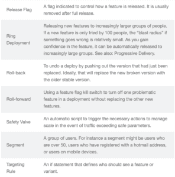
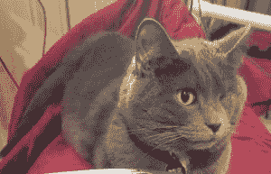

# 猫的命名…或特征旗帜图案

> 原文：<https://dev.to/wiredferret/the-naming-of-cats-or-feature-flag-patterns-hh9>

咿呀！我非常兴奋能在今年开始，因为我已经努力了一段时间的东西已经准备好让你们所有人看了！

[特征标志词汇表](http://featureflags.io/feature-flag-glossary/)

如果你没有一个名字，你很难使用一个模式，甚至很难想象它，所以我们把所有能想到的特征标志模式的名字放在一起。我相信我们会继续添加，也欢迎你加入。

这里有一个片段:

额外的诗歌内容:

* *猫的命名**

艾略特的作品

给猫命名是一件困难的事情，

它不仅仅是你的节日游戏之一；

当我告诉你，一只猫必须有三个不同的名字时，你可能会认为我疯了。

首先，有家庭日常使用的名字，

如彼得、奥古斯都、阿隆佐或詹姆士，

如维克多或乔纳森，乔治或比尔·贝利——

都是比较感性的日常名字。

如果你觉得好听，还有更花哨的名字，

有些是给绅士用的，有些是给女士用的:

比如柏拉图、阿德墨托斯、伊莱克特、得墨忒耳-

但都是些日常使用的名字。

但是我告诉你，一只猫需要一个特别的名字，

一个奇特的，更有尊严的名字，

不然他怎么能保持尾巴垂直，

或者展开他的胡须，或者珍惜他的骄傲？

这一类的名字，我可以给你一个法定人数，

比如 Munkustrap，Quaxo，或者 Coricopat，

比如 Bombalurina，或者 else jelly rum-

从来不属于一只以上猫的名字。

但是除此之外，还有一个名字，就是

，这个名字你永远也猜不到；

任何人类研究都无法发现的名字——

但猫自己知道，而且永远不会坦白。

当你注意到一只猫在沉思时，

原因，我告诉你，总是一样的:

他的头脑正全神贯注地沉思着

他的思想，他的思想，他的名字:

他的不可名状

Effanineffable

深沉而不可理解的奇异的名字。

