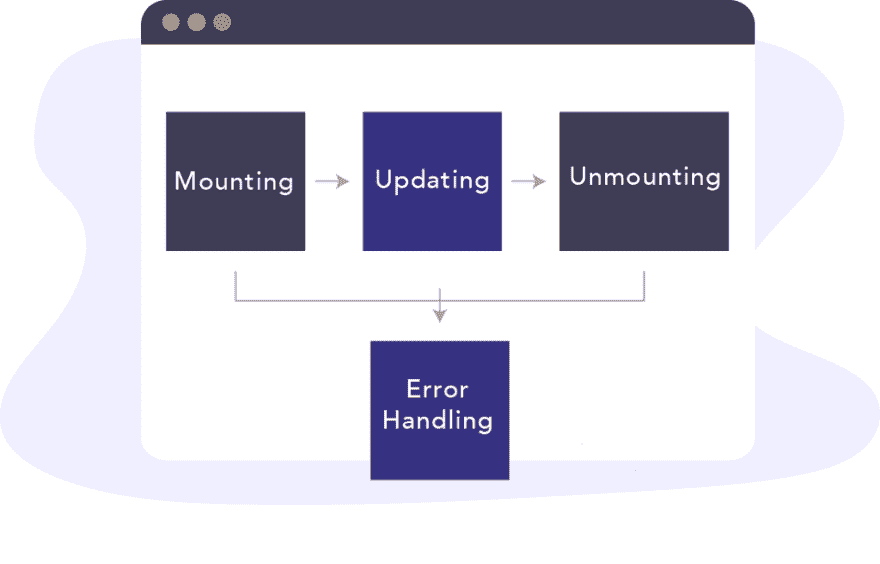
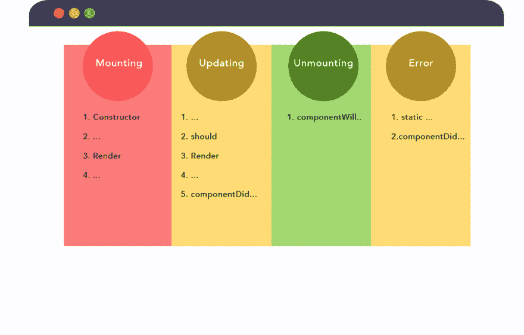
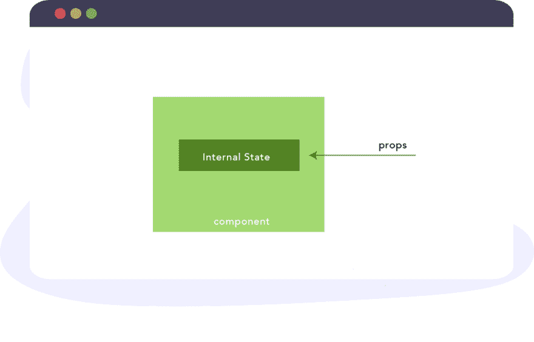
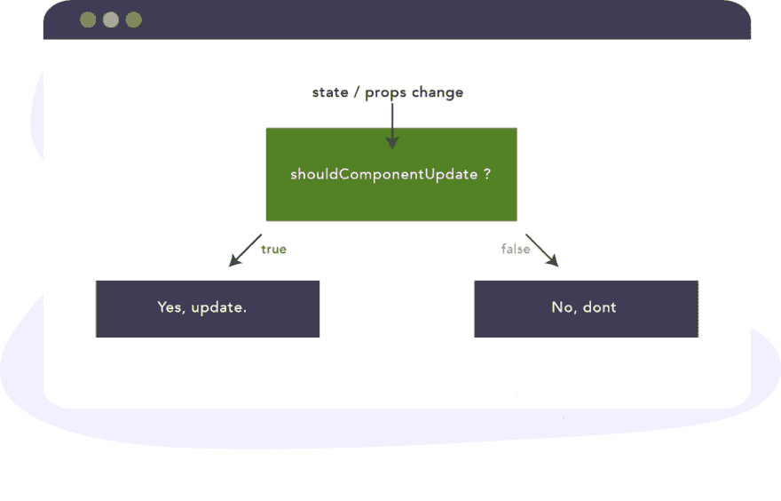
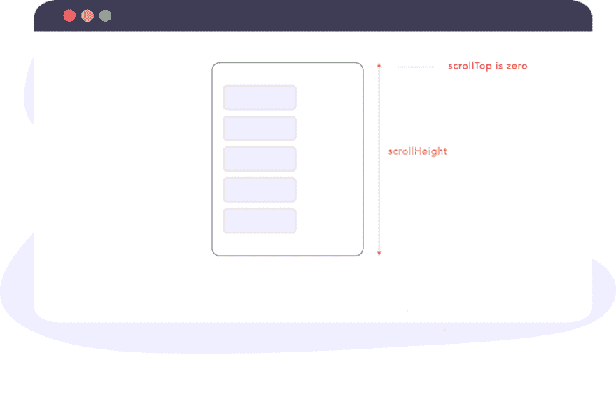
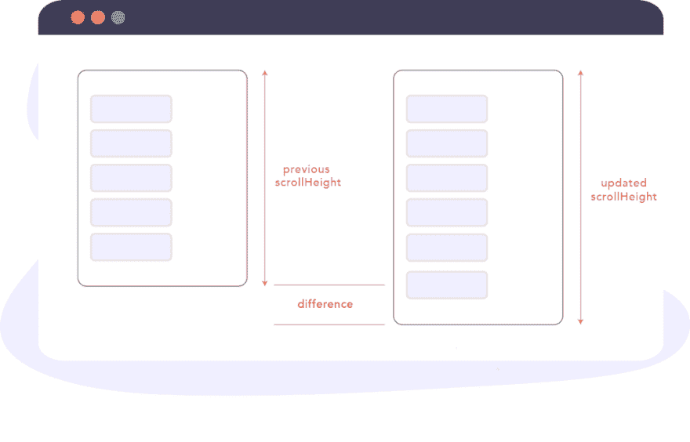
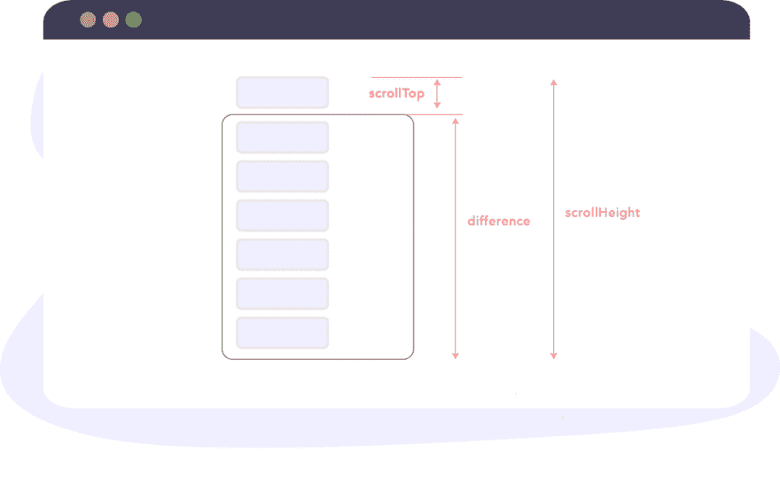
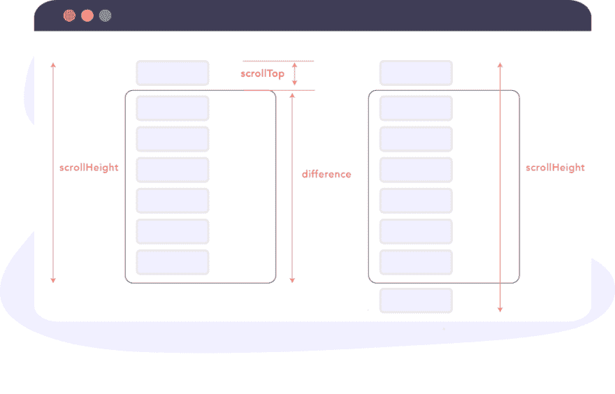

# (新的)反应生命周期方法——用简单易懂的语言

> 原文：<https://dev.to/bnevilleoneill/the-new-react-lifecycle-methods-in-plain-approachable-language-3hc0>

[](https://res.cloudinary.com/practicaldev/image/fetch/s--EQQSj3hw--/c_limit%2Cf_auto%2Cfl_progressive%2Cq_auto%2Cw_880/https://thepracticaldev.s3.amazonaws.com/i/smeh3shx376tqzfbg1zi.png)

什么是生命周期方法？新的 React16+生命周期方法如何适应？怎么才能直观的了解它们是什么，为什么有用？

如果您对 React 生命周期方法的工作方式有疑问，请不要再问了。

[](https://logrocket.com/signup/)

### 生命周期方法到底是怎么回事？

反应组分都有各自的相。

让我进一步解释一下。

如果我对您说，“构建一个 Hello World 组件”，我相信您会继续编写类似这样的内容:

```
class HelloWorld extends React.Component {
   render() {
return <h1> Hello World </h1> 
   }
} 
```

当在客户端上呈现和查看该组件时，您可能会看到这样的视图:

[](https://res.cloudinary.com/practicaldev/image/fetch/s--e0yDvh3S--/c_limit%2Cf_auto%2Cfl_progressive%2Cq_auto%2Cw_880/https://cdn-images-1.medium.com/max/1024/1%2Ad3XwZCmQVc9EdCCEesDy4A.png)

组件在到达这里之前已经经历了几个阶段。这些阶段通常被称为组件生命周期。

对人类来说，我们有，小孩，成人，老人。对于 React 组件，我们有**安装、更新和卸载。**

巧合的是，**安装**一个组件就像把一个新生婴儿带到这个世界上。这是组件对生命的第一瞥。在这个阶段，组件被创建(您的代码和 react 的内部)，然后被插入到 DOM 中。

这是组件经历的第一个阶段。**安装阶段**。不要忘记这一点。

这并没有结束。React 组件“增长”。更确切地说，组件经历了**更新阶段**。

对于 react 组件，没有更新，组件将保持它们在 DOM 世界中创建时的状态。

您编写的许多组件都会得到更新——无论是通过状态还是道具的改变。因此，他们也要经历这个阶段。**更新阶段**。

组件经历的最后一个阶段称为**卸载阶段。**

在这个阶段，组件“死亡”。在 React 行话中，它正被从它的世界——DOM——中移除。

关于组件生命周期本身，这差不多就是你需要知道的全部了。

哦，React 组件还要经历一个阶段。有时候代码不运行或者某处有 bug。别担心。组件正在经历**错误处理**阶段。类似于人类去看医生。

现在，您已经理解了 React 组件的四个基本阶段或生命周期。

1.  **挂载** —在这个阶段，组件被创建(你的代码，和 react 的内部)，然后被插入到 DOM 中
2.  **更新** —一个 React 组件“增长”
3.  **卸载** —最终阶段
4.  **错误处理**——有时代码无法运行，或者某处有错误

[](https://res.cloudinary.com/practicaldev/image/fetch/s--sjz46dji--/c_limit%2Cf_auto%2Cfl_progressive%2Cq_auto%2Cw_880/https://cdn-images-1.medium.com/max/1024/1%2ArubjO6t-iBoNjS_K1rOkzQ.png)

**NB**:React 组件可能不会经历所有阶段。组件可能在下一分钟被装载和卸载，而没有任何更新或错误处理。为了便于解释，图示(以及我们到目前为止的例子)假设组件经历了所有阶段。

### 了解阶段及其相关的生命周期方法

[](https://res.cloudinary.com/practicaldev/image/fetch/s--CDAGj7gO--/c_limit%2Cf_auto%2Cfl_progressive%2Cq_auto%2Cw_880/https://cdn-images-1.medium.com/max/1024/1%2Amn-ZLTS2qc1zhRZiZbL_gw.png)

了解元件经历的阶段是等式的一部分。另一部分是理解 react 在每个阶段提供的方法。

这些在每个阶段对组件可用的方法就是通常所说的**组件生命周期方法**。

让我们看一下所有 4 个阶段的可用方法——安装、更新、卸载和错误处理。

让我们先来看看安装阶段特有的方法。

### 挂载生命周期方法

挂载阶段指的是从创建组件并将其插入 DOM 开始的阶段。

以下方法被调用(按顺序)

#### 1。构造函数()

这是组件被“赋予生命”时调用的第一个方法。

在组件安装到 DOM 之前，调用构造函数方法。

通常，你需要初始化状态，并在构造函数方法中绑定事件处理方法。

这里有一个简单的例子:

```
const MyComponent extends React.Component {
  constructor(props) {
   super(props) 
    this.state = {
       points: 0
    }  
    this.handlePoints = this.handlePoints.bind(this) 
    }   
} 
```

我想你对构造函数方法很熟悉，所以我就不进一步解释了。

值得注意的是，这是组件安装到 DOM 之前调用的第一个方法。

此外，构造函数是**而不是**来引入任何副作用或订阅，如事件处理程序。

#### 2。静态 getDerivedStateFromProps()

在解释这个生命周期方法如何工作之前，让我向您展示如何使用这个方法。

基本结构是这样的:

```
const MyComponent extends React.Component {
  ... 

  static getDerivedStateFromProps() {
//do stuff here
  }  
} 
```

该方法接受道具和状态:

```
... 

  static getDerivedStateFromProps(props, state) {
//do stuff here
  }  

... 
```

你可以返回一个对象来更新组件的状态:

```
... 

  static getDerivedStateFromProps(props, state) { 
     return {
        points: 200 // update state with this
     }
  }  

  ... 
```

或者返回 null 不做更新:

```
... 

  static getDerivedStateFromProps(props, state) {
    return null
  }  

... 
```

我知道你在想什么。这种生命周期方法到底为什么重要？嗯，这是很少使用的生命周期方法之一，但在某些情况下它会派上用场。

记住，这个方法在组件在初始挂载时呈现到 DOM 之前被调用。

下面是一个简单的例子:

考虑一个呈现足球队得分的简单组件。

正如您所料，点数存储在组件状态对象中:

```
class App extends Component {
  state = {
    points: 10
  }

  render() {
    return (
      <div className="App">
        <header className="App-header">
          
          <p>
            You've scored {this.state.points} points.
          </p>
        </header>
      </div>
    );
  }
} 
```

这样做的结果如下:

[](https://res.cloudinary.com/practicaldev/image/fetch/s--XYdQUIvn--/c_limit%2Cf_auto%2Cfl_progressive%2Cq_auto%2Cw_880/https://cdn-images-1.medium.com/proxy/1%2A5w0IXEgr6Cea1c8v9cKiJg.png) 

<figcaption>源代码可能在 Github 上得到[。](https://github.com/ohansemmanuel/points)</figcaption>

请注意，文本显示，*您已经获得了* ***10*** *点* —其中 10 是状态对象中的点数。

只是举个例子，如果你放入如下所示的静态 getDerivedStateFromProps 方法，会渲染多少个点？

```
class App extends Component {
  state = {
    points: 10
  }

  // *******
  //  NB: Not the recommended way to use this method. Just an example. Unconditionally overriding state here is generally considered a bad idea
  // ********
  static getDerivedStateFromProps(props, state) {
    return {
      points: 1000
    }
  }

  render() {
    return (
      <div className="App">
        <header className="App-header">
          
          <p>
            You've scored {this.state.points} points.
          </p>
        </header>
      </div>
    );
  }
} 
```

现在，我们有静态的 getDerivedStateFromProps 组件生命周期方法。如果你还记得前面的解释，这个方法在组件被挂载到 DOM 之前被调用。通过返回一个对象，我们甚至在组件呈现之前就更新了它的状态。

这是我们得到的结果:

[](https://res.cloudinary.com/practicaldev/image/fetch/s--4Mb0zjM9--/c_limit%2Cf_auto%2Cfl_progressive%2Cq_auto%2Cw_880/https://cdn-images-1.medium.com/proxy/1%2ALgd3A9O6rJoI-kStrY4XPA.png)

1000 来自静态 getDerivedStateFromProps 方法中的更新状态。

这个例子是人为设计的，并不像静态 getDerivedStateFromProps 方法那样。我只是想确保你先了解基本知识。

使用这种生命周期方法，仅仅因为您可以更新状态并不意味着您应该继续这样做。静态 getDerivedStateFromProps 方法有特定的用例，否则您将使用错误的工具解决问题。

那么什么时候应该使用静态的 getDerivedStateFromProps 生命周期方法呢？

方法名 getDerivedStateFromProps 由五个不同的单词组成，“*从 Props 获得派生状态”。*

本质上，该方法允许组件更新其内部状态以响应属性的变化。

如果你需要理解的话，你可以再读一遍。

[](https://res.cloudinary.com/practicaldev/image/fetch/s--DGYWnrvI--/c_limit%2Cf_auto%2Cfl_progressive%2Cq_auto%2Cw_880/https://cdn-images-1.medium.com/max/1024/1%2A5wnVTjwxxOrtd15-21FzZA.png)

同样，以这种方式的组件状态被称为**派生状态**。

根据经验，派生状态应该谨慎使用，因为如果你不确定自己在做什么，你可能会将[微妙的错误](https://reactjs.org/blog/2018/06/07/you-probably-dont-need-derived-state.html#common-bugs-when-using-derived-state)引入到你的应用程序中。

#### 3。提供；给予

调用静态 getDerivedStateFromProps 方法后，下一个生命周期方法是 render 方法:

```
class MyComponent extends React.Component {
// render is the only required method for a class component 
   render() {
    return <h1> Hurray! </h1>
   }
} 
```

如果你想把元素渲染到 DOM，渲染方法就是你写这个的地方(如上所示)，也就是返回一些 JSX。

您也可以返回如下所示的普通字符串和数字:

```
class MyComponent extends React.Component {
   render() {
    return "Hurray" 
   }
} 
```

或者返回如下所示的数组和片段:

```
class MyComponent extends React.Component {
   render() {
    return [
          <div key="1">Hello</div>, 
          <div key="2" >World</div>
      ];
   }
} 
```

```
class MyComponent extends React.Component {
   render() {
    return <React.Fragment>
            <div>Hello</div>
            <div>World</div>
      </React.Fragment>
   }
} 
```

如果您不想呈现任何东西，您可以在 render 方法:
中返回一个布尔值或 null

```
class MyComponent extends React.Component { 
   render() {
    return null
   }
}

class MyComponent extends React.Component {
  // guess what's returned here? 
  render() {
    return (2 + 2 === 5) && <div>Hello World</div>;
  }
} 
```

最后，您还可以从呈现方法
中返回一个[门户](https://reactjs.org/docs/portals.html)

```
class MyComponent extends React.Component {
  render() {
    return createPortal(this.props.children, document.querySelector("body"));
  }
} 
```

关于 render 方法需要注意的一点是 render 函数应该是纯函数，即不要试图使用 setStateor 或与外部 API 交互。

#### 4。componentDidMount()

调用 render 后，组件被挂载到 DOM，并调用 componentDidMount 方法。

这个函数在组件被挂载到 DOM 后立即被调用。

有时，您需要在挂载之后立即从组件树中获取一个 DOM 节点。这是正确的组件生命周期方法。

例如，您可能有一个模态，并希望在特定的 DOM 元素中呈现该模态的内容。以下可能有效:

```
class ModalContent extends React.Component {

  el = document.createElement("section");

  componentDidMount() {
    document.querySelector("body).appendChild(this.el);
  }

  // using a portal, the content of the modal will be rendered in the DOM element attached to the DOM in the componentDidMount method. 

} 
```

如果您还想在组件安装到 DOM 后立即发出网络请求，这也是一个很好的地方:

```
componentDidMount() {
  this.fetchListOfTweets() // where fetchListOfTweets initiates a netowrk request to fetch a certain list of tweets. 
} 
```

您也可以设置订阅，如计时器。这里有一个例子:

```
// e.g requestAnimationFrame 
componentDidMount() {
    window.requestAnimationFrame(this._updateCountdown);
 }

// e.g event listeners 
componentDidMount() {
    el.addEventListener()
} 
```

只是确保在组件卸载时取消订阅。当我们讨论 componentWillUnmount 生命周期方法时，我将向您展示如何做到这一点。

至此，安装阶段结束。让我们看看组件经历的下一个阶段——更新阶段。

### 更新生命周期的方法

每当 react 组件的状态或属性发生变化时，该组件都会被重新呈现。简而言之，组件被更新。这是组件生命周期的更新阶段。

那么，当组件要被更新时，调用什么生命周期方法呢？

#### 1。静态 getDerivedStateFromProps()

首先，静态 getDerivedStateFromProps 方法也被调用。这是第一个被调用的方法。我已经在挂载阶段解释了这个方法，所以我将跳过它。

需要注意的是，在安装和更新阶段都会调用这个方法。同样的方法。

#### 2。shouldComponentUpdate()

一旦静态 getDerivedStateFromProps 方法被调用，接下来就会调用 shouldComponentUpdate 方法。

默认情况下，或者在大多数情况下，当状态或道具改变时，您会希望组件重新呈现。但是，您可以控制这种行为。

[](https://res.cloudinary.com/practicaldev/image/fetch/s--3Y7nqwrO--/c_limit%2Cf_auto%2Cfl_progressive%2Cq_auto%2Cw_880/https://cdn-images-1.medium.com/max/1024/1%2AxpOue2D_CdBdQL2-MmoD8Q.png)

在这个生命周期方法中，你可以返回一个布尔值——真或假，并控制组件是否被重新渲染，即在状态或道具改变时。

这种生命周期方法主要用于性能优化措施。然而，这是一个非常常见的用例，所以当你不希望组件在状态和道具不变的情况下重新渲染时，你可以使用内置的 [PureComponent](https://reactjs.org/docs/react-api.html#reactpurecomponent) 。

#### 3。渲染()

在调用 shouldcomponentdupdate 方法之后，会立即调用 render 这取决于 shouldcomponentdupdate 返回的值，该值默认为 true。

#### 3。getSnapshotBeforeUpdate()

在调用 render 方法之后，接下来将调用 getSnapshotBeforeUpdatelifcycle 方法。

这个有点复杂，但我会慢慢解释它是如何工作的。

您可能不会总是使用这种生命周期方法，但在某些特殊情况下，它可能会派上用场。特别是当您需要在更新完成后从 DOM 获取一些信息(并可能更改它)时。

重要的是。getSnapshotBeforeUpdate 中从 DOM 查询的值将引用 DOM 更新前的值。即使之前调用了 render 方法。

一个可能有帮助的类比是关于你如何使用版本控制系统，比如 git。

一个基本的例子是，您编写代码，并在提交给回购之前准备好您的更改。

在这种情况下，假设在实际推送到 DOM 之前调用了 render 函数来暂存您的更改。因此，在实际的 DOM 更新之前，从 getSnapshotBeforeUpdate 检索的信息指的是实际的可视 DOM 更新之前的信息。

对 DOM 的实际更新可能是异步的，但是 getSnapshotBeforeUpdate 生命周期方法总是在 DOM 更新之前被调用。

如果你还没有得到它，不要担心。我给你举个例子。

这个生命周期方法派上用场的一个经典例子是在一个聊天应用程序中。

我已经在前面的示例应用程序中添加了一个聊天窗格。

[](https://res.cloudinary.com/practicaldev/image/fetch/s--njbYICse--/c_limit%2Cf_auto%2Cfl_progressive%2Cq_auto%2Cw_880/https://cdn-images-1.medium.com/proxy/1%2AmjRyC6lSmhq38vEhgYThJw.png) 

<figcaption>看到右边的聊天窗格了吗？</figcaption>

聊天窗格的实现和您想象的一样简单。App 组件中有一个无序列表，其中包含一个聊天组件:

```
<ul className="chat-thread">
    <Chats chatList={this.state.chatList} />
 </ul> 
```

聊天组件呈现聊天列表，为此，它需要一个聊天列表属性。这基本上是一个数组。在本例中，一个由 3 个字符串值组成的数组，["Hey "，" Hello "，" Hi"]。

聊天组件有一个简单的实现，如下所示:

```
class Chats extends Component {
  render() {
    return (
      <React.Fragment>
        {this.props.chatList.map((chat, i) => (
          <li key={i} className="chat-bubble">
            {chat}
          </li>
        ))}
      </React.Fragment>
    );
  }
} 
```

它只是通过 chatList prop 映射并呈现一个列表项，该列表项又被设计成看起来像一个聊天气泡:)。

不过，还有一件事。聊天窗格标题中有一个“添加聊天”按钮。

[](https://res.cloudinary.com/practicaldev/image/fetch/s--So_J-DOq--/c_limit%2Cf_auto%2Cfl_progressive%2Cq_auto%2Cw_880/https://cdn-images-1.medium.com/proxy/1%2AB4cllvTOFasbw6pasGk4AQ.png) 

<figcaption>看到聊天窗格顶部的按钮了吗？</figcaption>

点击此按钮将在显示的消息列表中添加新的聊天文本“Hello”。

这就是实际情况:

[](https://res.cloudinary.com/practicaldev/image/fetch/s--UPO_sFr4--/c_limit%2Cf_auto%2Cfl_progressive%2Cq_66%2Cw_880/https://cdn-images-1.medium.com/proxy/1%2At7cLFKAjuAIstmDwZdSIYQ.gif) 

<figcaption>添加新的聊天消息。</figcaption>

与大多数聊天应用程序一样，这里的问题是每当聊天消息的数量超过聊天窗口的可用高度时，预期的行为是自动向下滚动聊天窗格，以便可以看到最新的聊天消息。现在不是这样的。

[](https://res.cloudinary.com/practicaldev/image/fetch/s--4fAfEcJO--/c_limit%2Cf_auto%2Cfl_progressive%2Cq_66%2Cw_880/https://cdn-images-1.medium.com/max/1024/1%2AT8NI8_od1UIBJPbmsRVS_Q.gif) 

<figcaption>我们寻求的最终行为。</figcaption>

让我们看看如何使用 getSnapshotBeforeUpdate 生命周期方法来解决这个问题。

getSnapshotBeforeUpdate 生命周期方法的工作方式是，当它被调用时，它将前面的属性和状态作为参数传递给它。

所以我们可以使用 prevProps 和 prevState 参数，如下所示:

```
getSnapshotBeforeUpdate(prevProps, prevState) {

} 
```

在这个方法中，你应该返回一个值或者 null:

```
getSnapshotBeforeUpdate(prevProps, prevState) {
   return value || null // where 'value' is a  valid JavaScript value 
} 
```

这里返回的任何值都会被传递给另一个生命周期方法。你很快就会明白我的意思。

getSnapshotBeforeUpdate 生命周期方法本身不起作用。它旨在与 componentDidUpdate 生命周期方法结合使用。

当你把我们试图解决的问题放在心上时，让我们来看看 componentDidUpdate 生命周期方法。

#### 4。componentDidUpdate()

在调用 getSnapshotBeforeUpdate 之后，将调用此生命周期方法。与 getSnapshotBeforeUpdate 方法一样，它接收前面的属性和状态作为参数:

```
componentDidUpdate(prevProps, prevState) {

} 
```

然而，这还不是全部。

getSnapshotBeforeUpdate 生命周期方法返回的任何值都作为第三个参数传递给 componentDidUpdate 方法。

让我们调用 getSnapshotBeforeUpdate 的返回值， *snapshot* ，下面是我们之后得到的:

```
componentDidUpdate(prevProps, prevState, snapshot) {

} 
```

有了这些知识，我们来解决聊天自动滚动位置的问题。

为了解决这个问题，我需要提醒(或教)你一些 DOM 几何。所以请容忍我。

同时，这里是维护聊天窗格中滚动位置所需的所有代码:

```
getSnapshotBeforeUpdate(prevProps, prevState) {
    if (this.state.chatList > prevState.chatList) {
      const chatThreadRef = this.chatThreadRef.current;
      return chatThreadRef.scrollHeight - chatThreadRef.scrollTop;
    }
    return null;
  }

  componentDidUpdate(prevProps, prevState, snapshot) {
    if (snapshot !== null) {
      const chatThreadRef = this.chatThreadRef.current;
      chatThreadRef.scrollTop = chatThreadRef.scrollHeight - snapshot;
    }
  } 
```

这是聊天窗口:

[](https://res.cloudinary.com/practicaldev/image/fetch/s--BbewJSic--/c_limit%2Cf_auto%2Cfl_progressive%2Cq_auto%2Cw_880/https://cdn-images-1.medium.com/proxy/1%2AxKPOdMA9C1fsBMNeDBr9Dg.png)

但是，下图突出显示了保存聊天消息的实际区域(无序列表，存放消息的 ul)。

[](https://res.cloudinary.com/practicaldev/image/fetch/s--wZYN43sp--/c_limit%2Cf_auto%2Cfl_progressive%2Cq_auto%2Cw_880/https://cdn-images-1.medium.com/proxy/1%2Ag1LuWGX0le9k91WSOCvjaQ.png)

正是这个 ul，我们持有使用 React Ref 的参考。

```
<ul className="chat-thread" ref={this.chatThreadRef}>
   ...
</ul> 
```

首先，因为 getSnapshotBeforeUpdate 可能通过任意数量的 props 甚至是状态更新来触发更新，所以我们在检查是否确实有新聊天消息的条件中包装代码:

```
getSnapshotBeforeUpdate(prevProps, prevState) {
    if (this.state.chatList > prevState.chatList) {
      // write logic here
    }

  } 
```

getSnapshotBeforeUpdate 必须返回值。如果没有添加聊天消息，我们将返回 null:

```
getSnapshotBeforeUpdate(prevProps, prevState) {
    if (this.state.chatList > prevState.chatList) {
      // write logic here
    }  
    return null 
} 
```

现在考虑 getSnapshotBeforeUpdate 方法的完整代码:

```
getSnapshotBeforeUpdate(prevProps, prevState) {
    if (this.state.chatList > prevState.chatList) {
      const chatThreadRef = this.chatThreadRef.current;
      return chatThreadRef.scrollHeight - chatThreadRef.scrollTop;
    }
    return null;
  } 
```

首先，考虑所有聊天消息的整体高度不超过聊天窗格高度的情况。

[](https://res.cloudinary.com/practicaldev/image/fetch/s--OcVVKGkI--/c_limit%2Cf_auto%2Cfl_progressive%2Cq_auto%2Cw_880/https://cdn-images-1.medium.com/max/1024/1%2AiSwbToUuE4Cj1cE_s1Jf6A.png)

这里，表达式 chatthreadref . scroll height-chatthreadref . scroll top 将等效于 chatThreadRef.scrollHeight - 0。

当对其进行评估时，它将等于聊天窗格的[scroll height](https://developer.mozilla.org/en-US/docs/Web/API/Element/scrollHeight)——就在新消息被插入 DOM 之前。

如果您还记得前面的解释，getSnapshotBeforeUpdate 方法返回的值作为第三个参数传递给 componentDidUpdate 方法。我们称这个快照为:

```
componentDidUpdate(prevProps, prevState, snapshot) {

 } 
```

这里传入的值是更新 DOM 之前的 scrollHeight。

在 componentDidUpdate 中，我们有下面的代码，但是它做什么呢？

```
componentDidUpdate(prevProps, prevState, snapshot) {
    if (snapshot !== null) {
      const chatThreadRef = this.chatThreadRef.current;
      chatThreadRef.scrollTop = chatThreadRef.scrollHeight - snapshot;
    }
  } 
```

实际上，我们是以编程方式从上向下垂直滚动窗格，距离等于 chatthreadref . scroll height-snapshot；。

因为 snapshot 引用更新前的 scrollHeight，所以上面的表达式返回新聊天消息的高度加上由于更新而导致的任何其他相关高度。请参见下图:

[](https://res.cloudinary.com/practicaldev/image/fetch/s--Xt9IknKz--/c_limit%2Cf_auto%2Cfl_progressive%2Cq_auto%2Cw_880/https://cdn-images-1.medium.com/max/1024/1%2A8uQmkLjLXpzbZQN8JJ71UQ.png)

当整个聊天窗格高度被消息占据(并且已经向上滚动了一点)时，getSnapshotBeforeUpdate 方法返回的快照值将等于聊天窗格的实际高度。

[](https://res.cloudinary.com/practicaldev/image/fetch/s--dU13_H5g--/c_limit%2Cf_auto%2Cfl_progressive%2Cq_auto%2Cw_880/https://cdn-images-1.medium.com/max/1024/1%2Ak2dioTIozf78at5G_G4_jg.png)

componentDidUpdate 的计算将 scrollTop 值设置为额外消息高度的总和——这正是我们想要的。

[](https://res.cloudinary.com/practicaldev/image/fetch/s---dETN2Zf--/c_limit%2Cf_auto%2Cfl_progressive%2Cq_auto%2Cw_880/https://cdn-images-1.medium.com/max/1024/1%2A3DDset-1uLpUeQfvALluZQ.png)

对，就是这样。

如果您遇到了困难，我确信仔细阅读解释(再一次)或检查源代码将有助于澄清您的问题。也可以用评论区问我:)。

### 卸载生命周期方法

在组件卸载阶段调用以下方法。

#### componentWillUnmount()

在组件被卸载和销毁之前，componentWillUnmount 生命周期方法被立即调用。这是执行任何必要清理的理想位置，例如清除计时器、取消网络请求或清理在 componentDidMount()中创建的任何订阅，如下所示:

```
// e.g add event listener
componentDidMount() {
    el.addEventListener()
}

// e.g remove event listener 
componentWillUnmount() {
    el.removeEventListener()
 } 
```

### 错误处理生命周期方法

有时事情变糟，会抛出错误。当一个**后代**组件(即它们下面的组件)抛出错误时，调用以下方法。

让我们实现一个简单的组件来捕捉演示应用程序中的错误。为此，我们将创建一个名为 ErrorBoundary 的新组件。

下面是最基本的实现:

```
import React, { Component } from 'react';

class ErrorBoundary extends Component {
  state = {};
  render() {
    return null;
  }
}

export default ErrorBoundary; 
```

#### static getDerivedStateFromError()

每当在子代组件中引发错误时，首先调用此方法，引发的错误作为参数传递。

从该方法返回的任何值都用于更新组件的状态。

让我们更新 ErrorBoundary 组件来使用这个生命周期方法。

```
import React, { Component } from "react";
class ErrorBoundary extends Component {
  state = {};

  static getDerivedStateFromError(error) {
    console.log(`Error log from getDerivedStateFromError: ${error}`);
    return { hasError: true };
  }

  render() {
    return null;
  }
}

export default ErrorBoundary; 
```

现在，每当在子代组件中抛出错误时，该错误将被记录到控制台 console.error(error)中，并从 getDerivedStateFromError 方法返回一个对象。这将用于更新错误边界组件的状态，即 hasError: true。

#### componentidcatch()

在引发后代组件中的错误后，也会调用 componentDidCatch 方法。除了抛出的错误之外，它还被传递了一个参数，该参数表示关于错误的更多信息:

```
componentDidCatch(error, info) {

} 
```

在这种方法中，您可以将收到的错误或信息发送到外部日志服务。与 getDerivedStateFromError 不同，componentDidCatch 允许副作用:

```
componentDidCatch(error, info) {
    logToExternalService(error, info) // this is allowed. 
        //Where logToExternalService may make an API call.
} 
```

让我们更新 ErrorBoundary 组件来使用这个生命周期方法:

```
import React, { Component } from "react";
class ErrorBoundary extends Component {
  state = { hasError: false };

  static getDerivedStateFromError(error) {
    console.log(`Error log from getDerivedStateFromError: ${error}`);
    return { hasError: true };
  }

  componentDidCatch(error, info) {
    console.log(`Error log from componentDidCatch: ${error}`);
    console.log(info);
  }

  render() {
    return null
  }
}

export default ErrorBoundary; 
```

此外，由于 ErrorBoundary 只能捕获来自后代组件的错误，我们将让组件呈现作为子组件传递的任何内容，或者在出错时呈现默认的错误 UI:

```
... 

render() {
    if (this.state.hasError) {
      return <h1>Something went wrong.</h1>;
    }

    return this.props.children;
 } 
```

我模拟了一个 javascript 错误，每当你添加第五条聊天消息时。看看工作中的误差边界:

[https://www.youtube.com/embed/BDkTLdOw5XM](https://www.youtube.com/embed/BDkTLdOw5XM)

### 结论

关于 React 中生命周期方法的主题已经讨论了很长时间了——包括最近增加的内容。

我希望你现在能更直观地理解这些方法是如何工作的。

回头见！

* * *

### Plug: [LogRocket](https://logrocket.com/signup/) ，一款适用于网络应用的 DVR

[](https://logrocket.com/signup/)

<figcaption>[https://logrocket.com/signup/](https://logrocket.com/signup/)</figcaption>

LogRocket 是一个前端日志工具，可以让你回放问题，就像它们发生在你自己的浏览器中一样。LogRocket 不需要猜测错误发生的原因，也不需要向用户询问截图和日志转储，而是让您重放会话以快速了解哪里出错了。它可以与任何应用程序完美配合，不管是什么框架，并且有插件可以记录来自 Redux、Vuex 和@ngrx/store 的额外上下文。

除了记录 Redux 操作和状态，LogRocket 还记录控制台日志、JavaScript 错误、堆栈跟踪、带有头+正文的网络请求/响应、浏览器元数据和自定义日志。它还使用 DOM 来记录页面上的 HTML 和 CSS，甚至为最复杂的单页面应用程序重新创建像素级完美视频。

免费试用。

* * *

(新的)React 生命周期方法的帖子以简单易懂的语言首次出现在[博客](https://blog.logrocket.com)上。