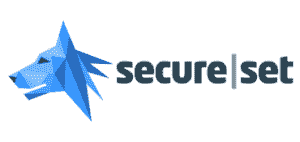

# 网络安全之路

> 原文：<https://dev.to/farmanp/the-path-to-cybersecurity-2kmg>

TL；DR - I 将参加 SecureSet 的 PATH 项目。跟着我，看看准备和参与是什么感觉

再过大约 100 天(确切地说是 102 天)，我将参加一个名为 [SecureSet](https://secureset.com/programs/path-part-time-summer-2019-denver/) 的网络安全训练营，该训练营位于科罗拉多州的丹佛市。这个程序叫做 PATH(因此标题中有大写字母)。我在网络安全方面的第一次经历是由 SecureSet 主办的“夺旗(CTF)”活动。研究我在文件系统方面的方法，并找到能让我更上一层楼的线索，这让我感觉很有收获。在过去的两年里，我在做了大约两周的网页设计后，才认真考虑进入这个市场。当时，我对就业市场越来越失望，因为越来越多的训练营产生了大量的“工程师”。这让我觉得在一个饱和的市场里很拥挤。

我怎么可能有机会？也许我应该换个领域，放弃！有超过 100 万的开发者，而且增长速度非常快。但是我没有把钱扔给 SecureSet 来解决我的问题，而是给了自己几个月的时间去找工作。我很高兴我这样做了，因为我可能会错过一些我进入这个市场想做的很棒的事情:成为 Codecademy 的顾问，为一家健康&健康创业公司开发软件，现在在我目前的工作岗位上，是 Staples 的一名分析师！

> 网络开发就业市场的现状

我现在的位置让我取得了很多成就，提高了我的技术技能和软技能:

*   用 Python、Ruby 和 Java 等语言在线指导了 100 多名学生有关计算机科学和网页设计的各种主题
*   在为 200 个客户进行系统集成后，协助 Angular 和 Wordpress 进行前端设计变更
*   加入并指导健身房使用管理产品，为新平台做好准备
*   借助 Splunk，帮助减少 80%的手动工作并提高交付率

解决这些问题让我对工作中学到的东西感到很舒服。这就是我在芝加哥参加的一个名为 Dev Bootcamp 的训练营所准备的。这是我的梦想，我对自己选择的职业道路很满意，并期望成为一名 UX 设计师，就像我希望在 2020 年成为的那样。

但随后在 2017 年 9 月 7 日，关于 Equifax 数据泄露的内幕交易秘密被爆出。近 1.45 亿美国人面临身份被盗的风险！它激怒了我如何处理这一切，特别是因为我在寻找一所房子购买。事情只会变得更糟:黑客操纵受害者去一个[钓鱼网站](https://www.theverge.com/2017/9/20/16339612/equifax-tweet-wrong-website-phishing-identity-monitoring)并输入更多敏感信息，以确保他们会受到“保护”，政府几乎没有谴责，我们仍在寻找[问题的答案](http://fortune.com/2018/09/07/equifax-data-breach-one-year-anniversary/)。这增加了我重新考虑进入网络安全市场的想法的动力。

当我准备在这个领域接受教育时，我想提供一个进入网络安全职业生涯的个人视角。我希望提供一些关于需要什么、市场需求是什么以及你可以期望解决什么样的问题的见解。对我来说，我想成为消费者安全的倡导者，因为我不再相信我们可以指望别人来保护我们。我的希望是通过工程和调查性报道让读者了解网络自卫。

在这样做的时候，我在 GitHub 上创建了一个 [repo](https://github.com/farmanp/cybersecurity-bootcamp) 来跟踪我在工程方面的进展，同时我使用 dev.to 和 [Medium](https://medium.com/watchdogs) 来反思我到目前为止在高层次上所学到的东西。戴夫。我想用它来进行深入的技术分析。

让我知道你们所有人的想法，以及当你们通过这次偶遇感同身受地生活时，什么可能是有趣的！感谢阅读，祝大家好运。