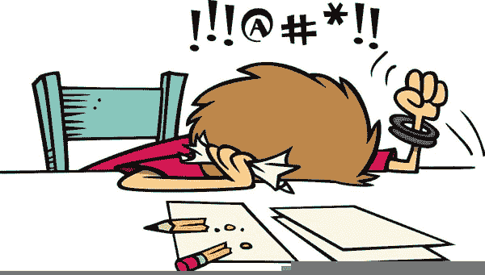
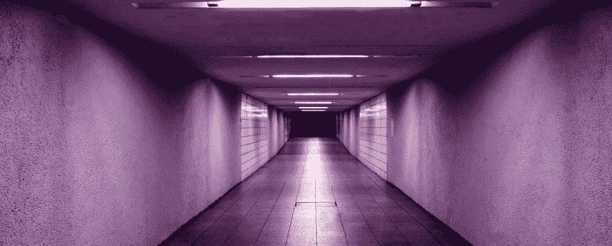
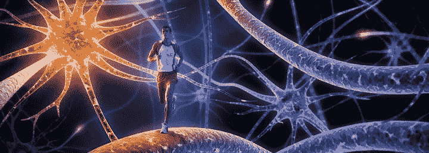
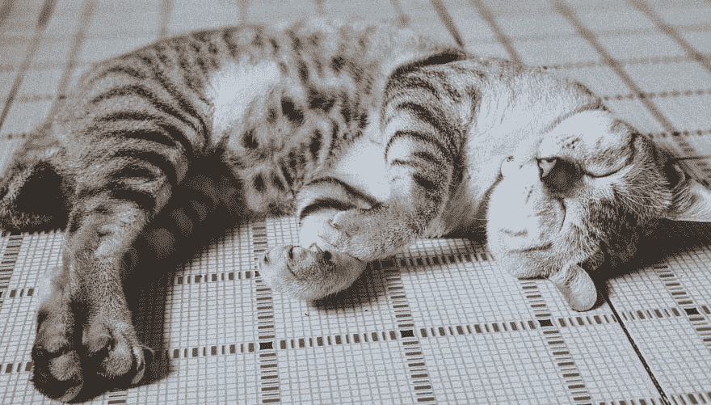

# 走开的力量

> 原文：<https://dev.to/matthewbrophy/the-power-of-stepping-away-2ige>

我们都经历过。无论是在软件开发期间，还是在搬进一个新公寓并试图通过一个狭窄的门口挤一张沙发时，我们都遇到过似乎不可能解决的问题。
 
在一项具有挑战性的活动中，有很多时候，我们会受益于简单地远离问题，给自己一个全新的视角。社会通常教导我们不要放弃。解决难题的唯一方法就是不断尝试，直到找到为止。虽然肯定有从重复中受益的活动，利用古老的格言“熟能生巧”，但根据活动的不同，这种策略实际上可以在不同程度上有效。有时候，最好的选择就是离开，给自己一个喘息的机会，获得一个全新的视角。

### 关于心理学的一点

那么，为什么停止会有帮助呢？人脑是非常神秘的。对于我们(以及大多数哺乳动物)来说，除了实现我们的最终目标之外，很容易陷入无所事事的状态。我们很容易变得狭隘。在她题为“为什么‘走开’会增加创造力”的文章中，Susan Weinschenk 博士非常简洁地描述了为什么狭隘的视野会限制我们的创造力和解决问题的能力。前额叶皮层位于我们的前额。在其他事情中，它是我们大脑的一部分，不仅负责专注于手头的任务，还负责搜索我们记忆中的现有信息，并将其与其他记忆中的其他信息相结合。如果你问我，听起来工作量很大！正是通过前额叶皮层的努力工作，我们才能够提出新的想法和解决问题。

就像 UFC 拳击手过于专注于混合武术的一个方面(相当危险)，让我们的前额皮质过于专注于解决问题的一个方面真的会抑制我们看到全貌的能力。当我们远离一个问题，给我们的大脑一个“重置”的机会时，它允许前额叶皮层再次参与搜索和组合。这给了我们一个更好的机会来利用我们可能从以前的记忆中学到的概念，也给了我们一个机会在旧信息和新信息之间建立联系，这些新信息可能是我们刚刚从试图热切地解决手头的问题中学到的。

<figure></figure>

### 让休息变得值得！

那么，当我们从一项艰巨的任务中休息一下时，我们应该做些什么呢？为了充分利用这一点，当你放下工作休息一会儿的时候，有一些活动是强烈推荐的，这些活动会给你的大脑带来很大的压力。最重要的是，尽量让你与让你紧张的工作相关的感觉得到休息。

1.  锻炼

    <figure> 

    <figcaption>有些纨绔子弟在一块跑个脑</figcaption>

    </figure>

    锻炼，不管采取什么形式，都会释放内啡肽。内啡肽在体内引发一种积极的感觉，类似于吗啡的作用(* *)。内啡肽还与你大脑中的受体相互作用，减少疼痛的感知(是的，它们甚至会减少学习编程时固有的无助感)。一些适合办公室的快速锻炼方法:

    a.独自或和你的同伴去散步。

    b.在楼梯井做一些跳跃运动或俯卧撑(或者如果你想展示你的精英形态，就在你的桌子旁边)。

    c.在卫生间隔间门上做一些引体向上(大声咕哝以发挥你在办公室的统治力，让大家知道你在卫生间做引体向上)。

    d.在你最喜欢的会议室里，挑战你的同伴来一场“无拘无束”的摔跤比赛。根据你所在的州，你可以让一个办公室同事玩赌博，赌谁会赢。

    也许最好只是去散步或慢跑...

2.  静思

    <figure> 

    <figcaption>照片由伊莎贝·温特在 Unsplash 上</figcaption>

    </figure>

    就...让你的大脑、身体，尤其是眼睛休息一会儿。说真的，冥想直接对抗大多数抑制解决问题和创造力的东西。冥想已经被证明可以:

    a.减轻压力(编程是有压力的工作)

    b.控制焦虑(我焦虑只是写焦虑)

    c.增强自我意识(见上文)

    d.延长注意力持续时间(看起来很相关...)

    e.可能有助于对抗上瘾(比如当你明显需要休息时试图解决问题)。

    如果你需要一些冥想方面的帮助，你可以在你的移动设备上找到一些免费的应用程序，提供简单的冥想指导。

3.  午睡

    <figure> 

    <figcaption>图片来源:Thien Phu Pham on Unsplash</figcaption>

    </figure>

    我(到目前为止)个人最喜欢的休息方式——小睡一会儿是提高警觉性和记忆认知能力的最有效的活动之一。就像绘画、拉小提琴或烹饪美食一样，午睡也是一种艺术形式。为了理解午睡的复杂性，一个人必须练习午睡数年，并作为我们这个时代最伟大的午睡者之一的替补进行训练。好吧，不尽然。午睡其实很容易理解:
    1.  你选择午睡的时间是你午睡最重要的因素。当我们入睡时，我们的大脑会经历不同的阶段。不同长度的小睡会极大地影响我们醒来时的感觉。基本上，把你的午睡限制在 30 分钟以内。理想情况下，如果你训练得足够好，能很快入睡，15-20 分钟最好。根据你想完成的目标来计划午睡的时间。更长时间的小睡会带来更持久的好处，但也会导致明显的昏昏沉沉。如果你晚上有一场马拉松式的工作，你可能想多睡一会儿，但是为了快速爆发能量和恢复精神，试着把你的打盹限制在 30 分钟以内，因为这阻止了大脑超越“浅睡眠”阶段。
    2.  练习。说真的。如果你不习惯午睡，或者习惯长时间午睡，只需设置 20-30 分钟的闹钟，养成午睡的习惯。即使你没有“睡着”,只是休息和关闭你的感官知觉也是一种很好的随意冥想形式。
    3.  生活窍门:在午睡前喝一杯咖啡。平均来说，咖啡因需要 20 分钟才能通过你的消化系统到达你的大脑(就好像它本来就应该这样)...).

    大量研究表明，午睡能提高警觉性，但午睡也能提高记忆力。具体来说，它改善了陈述性记忆——回忆特定知识片段的能力。

总而言之，如果你正在纠结一个难以解决的问题，那就休息一下吧。让你的大脑休息一下，15 分钟后再来一次。你会惊讶于自己新发现的视角和深刻的理解。好吧，也许不是...但至少你会得到一些锻炼或在此期间睡个好觉。