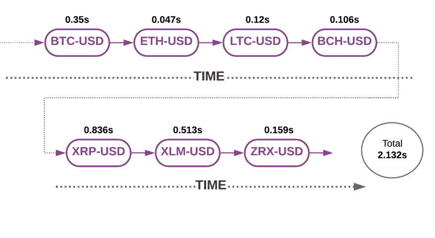
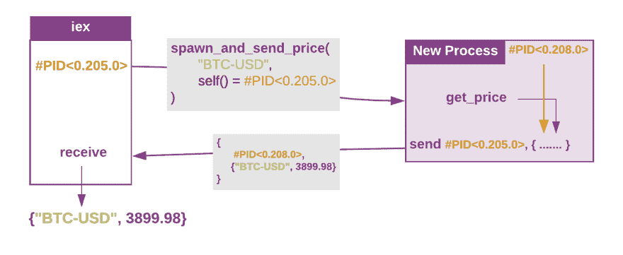
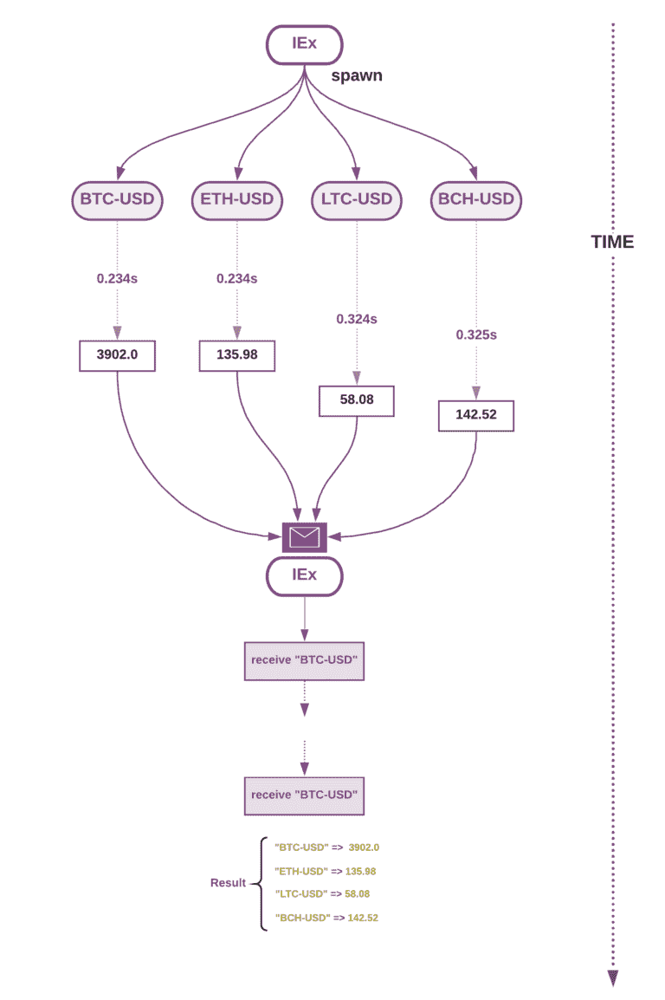

# Elixir 并发的基本原理:一个完整的例子

> 原文：<https://dev.to/alvisesus/the-primitives-of-elixir-concurrency-a-full-example--16e2>

你对仙丹和凤凰有热情吗？订阅 Poeticoding 时事通讯，加入快乐的普通读者，通过电子邮件接收新帖子。

#### 以前关于并发的文章

*   [如何孕育仙丹的过程](https://www.poeticoding.com/spawning-processes-in-elixir-a-gentle-introduction-to-concurrency/)
*   嘿，Process，有一条消息给你！

### [T1】简介](#intro)

让我们将前几篇关于并发性的文章付诸实践。在本文中，我们将看到如何完全实现我们的[初始加密货币示例](https://www.poeticoding.com/spawning-processes-in-elixir-a-gentle-introduction-to-concurrency/#http_api_requests)，仅使用[httposin](https://github.com/edgurgel/httpoison)模块和 [`spawn`](https://hexdocs.pm/elixir/Kernel.html#spawn/1) ， [send](https://hexdocs.pm/elixir/Kernel.html#send/2) 和`receive`来处理并发。最后，我们将使用[任务](https://hexdocs.pm/elixir/Task.html)来重构它，这使得一切都变得简单多了！

我们的目标是从[比特币基地](https://docs.pro.coinbase.com/)同时下载不同的价格，并返回带有最新价格的地图。

# `get_price`功能

让我们一步一步来看如何获得单个产品的当前价格。

```
iex> product_id = "BTC-USD"
iex> url = "https://api.pro.coinbase.com/products/#{product_id}/ticker"

iex> %HTTPoison.Response{body: body} = HTTPoison.get!(url)
%HTTPoison.Response{
  body: "{\"trade_id\":60538353, ..."
  headers: ...
  ...
}

iex> ticker = Jason.decode!(body)
%{
  "price" => "3891.76000000",
  ...
}

iex> price = String.to_float(ticker["price"])
3891.76 
```

好的，它工作了，我们得到了浮动价格，但是我不会直接把这段代码放到函数中:它是耦合的，需要一点重构。

# 解耦 get_price 函数

让我们从简单的开始，定义一个函数`ticker_url(product_id)`来返回给定产品的 URL 字符串。

```
defmodule Coinbase.Client do

    @coinbase_base_url "https://api.pro.coinbase.com"

    def ticker_url(product_id),
      do: "#{@coinbase_base_url}/products/#{product_id}/ticker"
end 
```

简单。

现在，通过在我们的`get_price`函数中直接使用像 HTTPoison 和 Jason 这样的库，我们将`get_price`实现与其外部依赖项耦合起来。如果将来我们想把我们的 HTTP 客户端改成类似于 [Tesla](https://github.com/teamon/tesla) 或 [Mint](https://github.com/ericmj/mint) 的东西，我们将需要改变所有代码中所有依赖函数的实现。

相反，我们可以创建一个名为`Coinbase.HTTPClient`的新模块，用它来包装 HTTPoison 和 Jason。

```
defmodule Coinbase.HTTPClient do
  def get_json!(url) do
    HTTPoison.get!(url)
    |> Map.get(:body)
    |> Jason.decode!()
  end
end 
```

为简洁起见，我们不处理任何 HTTPoison 或 Jason 错误。`get_json!(url)`发出一个 HTTP GET 请求，并对 JSON 响应进行反序列化，以 [Map](https://hexdocs.pm/elixir/Map.html) 的形式返回。

我们现在只使用 HTTPClient 模块而不是 HTTPoison 和 Jason 来定义我们的`get_price`函数。

```
defmodule Coinbase.Client do
    alias Coinbase.HTTPClient

    def get_price(product_id) do
        product_id
        |> ticker_url()
        |> HTTPClient.get_json!()
        |> Map.get("price")
        |> String.to_float()
  end

end 
```

我们看到，由于有了仙丹管道，这段代码更容易阅读，也更容易更改，因为如果我们想将[杰森](https://github.com/michalmuskala/jason)改为[毒药](https://github.com/devinus/poison)或[HTT 毒药](https://github.com/edgurgel/httpoison)改为[特斯拉](https://github.com/teamon/tesla)，我们只需要更改我们的`HTTPClient.get_json!/1`实现。

José Valim 的文章《模拟和显式契约》( Mocks and explicit contracts )( T1)中也展示了这种重构，在这篇文章中，我们看到了解耦如何让测试我们的代码变得更加容易。如果你没看过那篇文章，我认为它是值得的。

# 按顺序获取多个价格-快速基准

我们定义了一个新的函数来获得多个价格。

```
defmodule Coinbase.Client do

    def get_prices(products) do
        products
        |> Enum.map(&get_price/1)
    end

end 
```

`get_prices/1`列举产品列表，并依次请求每一个产品的价格，返回一个价格列表。

正如我们在开始讨论并发性的前一篇文章中看到的那样，一次获取一个价格并不是非常有效。我们的计算机大部分时间都是空闲的，等待服务器的响应。

让我们看看连续获得七种不同产品的价格需要多长时间，这样我们可以在以后与并发的价格进行比较。

[](https://res.cloudinary.com/practicaldev/image/fetch/s--pAF6Sb9U--/c_limit%2Cf_auto%2Cfl_progressive%2Cq_auto%2Cw_880/https://1o6jjh24p1t92lcqci49qg8a-wpengine.netdna-ssl.com/wp-content/uploads/2019/03/sequential_requests-2.png)

为了对时间进行基准测试，我们定义了`Coinbase.measure_time(func)`，它运行传递的函数，计算运行时间。

```
defmodule Coinbase do

  def cyan_text(text) do
    IO.ANSI.cyan() <> text <> IO.ANSI.reset()
  end

  def measure_time(func) do
    time_start = System.monotonic_time(:millisecond)
    result = func.()
    time_end = System.monotonic_time(:millisecond)
    seconds = (time_end - time_start)/1000
    cyan_text("time #{seconds}s") |> IO.puts()
    result
  end
end 
```

读完[后，用 IO 冷却药剂(第二部分)中的 CLIs。ANSI](https://dennisbeatty.com/2019/03/12/cool-clis-in-elixir-part-2-with-io-ansi.html) ，我决定给基准输出增加一些色彩。然后使用`cyan_text`功能将时间打印成青色。

太好了，让我们依次得到这七种产品的价格，看看我们需要多少时间。

```
iex> products = ["BTC-USD","ETH-USD","LTC-USD", \
...>             "BCH-USD","XRP-USD","XLM-USD", \
...>             "ZRX-USD"]

iex> import Coinbase, only: [measure_time: 1]
iex> measure_time fn -> 
...>   Coinbase.Client.get_prices(products) 
...> end

time 2.132s
[3895.98, 136.01, 58.04, 141.6, 0.3131, 0.105945, 0.271112] 
```

该函数返回一个价格列表:第一个价格对应于列表中的第一个产品“etc 美元”，第二个对应于“ETH-美元”等等。为了更容易理解，最好返回这样的地图

```
%{
    "BTC-USD" => 3895.98,
    "ETH-USD" => 136.01,
    ...
} 
```

其中产品是地图的关键，价格是价值。

让我们在`get_prices/1`中修改传递给`Enum.map`的函数，返回一个包含 product_id 和价格的元组。然后，我们可以使用 [`Enum.into/2`](https://hexdocs.pm/elixir/Enum.html#into/2) 将二元元组列表转换成一个映射。

```
def get_prices(products) do
    products
    |> Enum.map(fn product_id ->
        {product_id, get_price(product_id)}
    end)
    |> Enum.into(%{})
end 
```

这次它返回一个人类可读的结果

```
iex> Coinbase.Client.get_prices(products)
%{
  "BCH-USD" => 141.66,
  "BTC-USD" => 3895.99,
  "ETH-USD" => 136.05,
  ...
} 
```

# 并发

[我们看到`spawn`在一个新的进程中运行给定的函数，立即返回](https://www.poeticoding.com/spawning-processes-in-elixir-a-gentle-introduction-to-concurrency#spawning-processes)。我们能够同时提出我们的请求。但是，没有消息，我们只能打印结果。

我们现在使`get_prices/1`并发，而不改变函数结果。输出仍然是一个包含产品和价格的地图。

让我们开始关注一个并发请求，然后扩展到多个请求就很容易了。

```
def spawn_and_send_price(product_id, dst_pid) do
    spawn fn ->
      price = get_price(product_id)
      send dst_pid, {self(), {product_id, price}}
    end
end 
```

创建一个新进程并立即返回其 pid。[正如我们在上一篇文章](https://www.poeticoding.com/hey-process-there-is-a-message-for-you/)中看到的，我们接收返回结果的方式是使用*消息*。为此，我们将`dst_pid`作为第二个参数传递，这是我们希望以元组的形式接收结果的 pid。

```
{from_pid, {product_id, price}} 
```

当我们将消息发送回`dst_pid`时，我们将`self()`作为元组的第一个元素进行传递。`self()`返回被调用的进程的 pid。在这种情况下，pid 是衍生进程的 PID。

随着信息发送一些参考信息总是好的，这样接收者更容易理解信息是关于什么的以及来自谁。[在`receive`块中，传递 pid 对于过滤来自所选进程](https://www.poeticoding.com/the-beauty-of-pattern-matching-in-elixir/#pin-operator)的消息也很有用。

让我们在`iex`上试试这个功能。

```
iex> self
#PID<0.205.0>
iex> pid = Coinbase.Client.spawn_and_send_price("BTC-USD",self())
#PID<0.208.0>

iex> receive do
...>   {^pid, result} -> result
...> end
{"BTC-USD", 3899.98} 
```

[](https://res.cloudinary.com/practicaldev/image/fetch/s--LId3yuYT--/c_limit%2Cf_auto%2Cfl_progressive%2Cq_auto%2Cw_880/https://1o6jjh24p1t92lcqci49qg8a-wpengine.netdna-ssl.com/wp-content/uploads/2019/03/single_concurrent_request.png)

很好，我们可以用刚刚使用的`receive`块定义一个`await/1`函数。

```
def await(pid) do
    receive do
        {^pid, result} -> result
    end
end 
```

`await(pid)`等待`receive`，并返回给定`pid`发送的结果。

我们现在已经具备了使用 Elixir 管道编写紧凑并发`get_prices(products)`函数的一切。

```
def get_prices(products) do
    products
    |> Enum.map(&spawn_and_send_price/1)
    |> Enum.map(&await/1)
  |> Enum.into(%{}) 
end 
```

*   第一个`Enum.map`为每个产品运行`spawn_and_send_price(product_id)`，返回一个 PID 列表。
*   第二个`Enum.map`将 pid 列表作为输入，为每个 PID 运行`await(pid)`。然后它返回结果列表。
*   `Enum.into`在映射中转换元组列表`[{"BTC-USD",3902.0}, {"ETH-USD", 135.98}, ..]`。

[](https://res.cloudinary.com/practicaldev/image/fetch/s--i4zeYxsx--/c_limit%2Cf_auto%2Cfl_progressive%2Cq_auto%2Cw_880/https://1o6jjh24p1t92lcqci49qg8a-wpengine.netdna-ssl.com/wp-content/uploads/2019/03/concurrent_spawn_and_receive-768x1154.png)

我们一边在 iex 上测时间，一边试试吧。

```
iex> measure_time fn -> 
...>   Coinbase.Client.get_prices(products) 
...> end

time 0.421s
%{
  "BTC-USD" => 3902.0,
  "ETH-USD" => 135.98,
  "LTC-USD" => 58.08,
  "BCH-USD" => 142.52,
  "XRP-USD" => 0.3133,
  "XLM-USD" => 0.106001,
  "ZRX-USD" => 0.269627
} 
```

太神奇了，只有 **0.421 秒**。我们看到这个版本比另一个版本快了多少，那个版本用了 *2.132 秒*。

# 任务

我们已经直接使用`spawn`、`send`和`receive`构建了我们的并发函数。这有助于理解如何在 Elixir 中处理并发，但通常使用像 [Task](https://hexdocs.pm/elixir/Task.html) 这样的模块会更好，这使得并发更容易。

> 方便产卵和等待任务。任务是指在其整个生命周期中执行一个特定动作的进程，通常很少或根本不与其他进程通信。

我们重构了`get_prices(products)`，去掉了我们写的两个函数，`spawn_and_send_price(product_id,dst_pid)`和`await(pid)`。我们现在用`Task.async`和`Task.await`T5】

```
def get_prices(products, :task) do
    products
    |> Enum.map(&Task.async(fn -> {&1, get_price(&1)} end))
    |> Enum.map(&Task.await/1)
    |> Enum.into(%{})
end 
```

这种动态与我们在定制版中看到的非常相似。如果我们只运行`Task.async`，我们会看到消息被发送到我们当前的进程。

```
iex> products \
...> |> Enum.map(&Task.async(
...> fn -> 
...>    {&1, Coinbase.Client.get_price(&1)}
...> end))
[%Task{}, %Task{}, ...]

iex> iex(3)> :erlang.process_info self(), :messages
{:messages,
 [
   {#Reference<...>, {"ETH-USD", 139.63}},
   {#Reference<...>, {"LTC-USD", 60.52}},
   {#Reference<...>, {"BCH-USD", 152.76}},
   ...
]} 
```

`Task.async`返回一个任务结构而不是 pid，它将被`Task.await`用来从 iex 进程的邮箱中获取结果。

# 给最有激情的你一个小小的挑战！

摆弄完上面的代码后，试着把最后一步`Enum.into`移到`get_prices`里。该函数将返回元组列表`{product, price}`。

尝试多次获取价格！你看到什么特别的东西了吗？我们发出的请求是并发的，每一个都随机花费不同的时间，但是结果总是相同的。你知道为什么吗？

有没有办法把结果列表从最快的请求到最慢的请求排序？

欢迎在下面评论区回答！期待大家的建议！

# 订阅

你对仙丹和凤凰有热情吗？订阅 Poeticoding 时事通讯，加入快乐的普通读者，通过电子邮件接收新帖子。