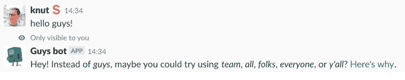
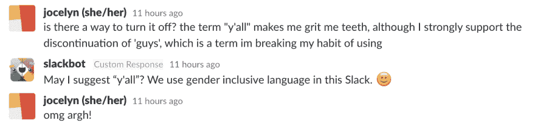

# “你们”的问题是

> 原文：<https://dev.to/kmelve/the-problem-with-you-guys-51h7>

我做了一个机器人，当你在 Slack 中写 *guys* 时，它会建议一些替代的措辞。这引起了一些讨论。

> 克努特梅尔维尔💬[@ kmelve](https://dev.to/kmelve)为 [@SlackHQ](https://twitter.com/SlackHQ) 制作了一个“家伙机器人”，巧妙地低声说你可以使用更包容的语言🏳️‍🌈，而不是公开的 Slackbot 拍拍手腕。@glitch 看起来非常像它的合适主人。[guys-bot-for-slack . glitch . me](https://t.co/CA5DNRQTGF)2018 年 12 月 10 日 22:16 点38155

我在不同的 Slack 社区中看到，人们已经实现了一个 Slackbot 响应，每当人们写“guys”时就会触发，建议一些被认为更具包容性的替代方案。它还链接到 [Vox](https://www.vox.com/2015/6/11/8761227/you-guys-sexism-language) 上一篇关于 npm 的 *you guys* -jar 的文章。类似的评论也发表在[大西洋](https://www.theatlantic.com/family/archive/2018/08/guys-gender-neutral/568231/)上，其中包括一位语言学家的评论。论坛上也有一些帖子，人们在那里讨论“男人”这个词是否被认为是中性的。

毫不奇怪，并不是每个人都相信机器人的合法性。我有几个人告诉我(代表世界上说英语的那部分人)说“guys”实际上是自然性别(我知道)。一些人走得更远，认为这是审查和破坏他们的谈话方式。很容易指出他们中有多少人不是…男人。(嗯，一个都没有)。

我的推文也获得了很多赞和转发，这表明一些人欣赏这个想法，或者至少希望被它所标志的东西所隶属。这让我们更接近手的问题。因为我确信“男人机器人”是解决我们试图解决的问题的正确方法:如何在技术领域建立一个友好和包容的社区。我把它拿出来一部分是作为一个实验，并通过对它的反应了解更多。

## 没有人喜欢别人说他们错了

我受过很多犯错的训练。我花了几年时间在大学里，被告知我在各种创造性的方面都是错的。接受错误是学习和发展知识的重要部分，尤其是在科学领域。尽管如此，当有人告诉我时，我还是经常会变得防御和情绪化。这是非常人性化的反应。这是我必须积极努力的事情。

令人恼火的原因是，它通常有道德层面，这与你的任何意图都不一致。我敢打赌，大多数人在和一群人打招呼时说“嗨，伙计们！”不打算排外，而是恰恰相反。当你立即得到一个刻板的回答，暗示这种看似无害的讲话方式可能会被认为对一些人有害时，我毫不怀疑有些人可能会觉得这很迟钝。

不过，我怀疑，在一个仍然主要由男性主导的领域里，那些经历过没有被以各种方式纳入的人，可能会有更同情的反应，因为他们得到了机器人试图解决的问题。

## 机器人缺乏细微差别

有充分的理由反对机器人在公共社区自动纠正语言。借用我的一位同事的比喻，人们不会喜欢有人在办公室里说什么就有什么。就像*里的拆迁人*:

[https://www.youtube.com/embed/5rVQGT01Kzg](https://www.youtube.com/embed/5rVQGT01Kzg)

由于我和 Slackbot 响应的发起者都没有花时间调整算法，它也触发了许多误报。这有点适得其反。

机器人对社区温和派有吸引力的原因是，每当你必须提醒人们行为准则并告诉他们他们错了时，它也减少了你在冗长的辩论中结束的机会。还有，你不可能同时出现在所有地方。机器人可以。

## 为什么机器人会留下来(至少一段时间)

那些给我批评的人没有一个能说服我关掉机器人。这主要是因为批评并非来自同情，而是主要是自我肯定和抵制对我们试图实现的目标的考虑(公平地说，有些人也承认它试图做什么，但通常也就到此为止了)。

一些人感到愤怒的是，机器人纠正了他们认为完全合法的称呼群体的方式，在他们的语言环境中被认为是包容性的。从而告诉我我错了，也许是因为我不是以英语为母语的人(看不到讽刺)。

对于一个大部分时间都在用第二语言交流的人(我的母语是挪威人)，我必须承认，我对那些觉得用一个词就能适应的人缺乏同情。这也说明他们不认为英语是一种高度多样化和多面化的语言。在一个网络多元文化社区，性别偏见是一个公认的问题，而不是在一个人的家乡，我们可能不得不考虑其他因素。

## 不是你们几个的事

我还怀疑有些人认为这个机器人只是美德信号和政治正确性的另一个例子。被一些人认为是开放和自由思想的敌对势力。我遇到的大多数人都把这当成了他们的死穴，但他们并没有真正接受其他观点，也没有考虑到质疑语言如何被用来包容或排斥他人背后的动机。他们不会问我为什么这么做，或者我想解决什么问题。因此，尽管我发现指出虚伪是一个懒惰的论点，但它肯定无助于他们的情况。

因此，如果你是开放思想和自由世界的倡导者，我会要求你重新考虑像这个机器人这样的努力背后的动机。例如，通过观看帕特丽夏·奥斯的演讲，解构特权，T2，T3。或者实际上倾听技术领域(和其他领域)不同未被充分代表的群体的经历，并考虑被提醒你并不真正属于那里会如何影响你留在 web 开发、技术或其他任何领域的动机。

因为你们，这不仅仅是关于你们这些人。

