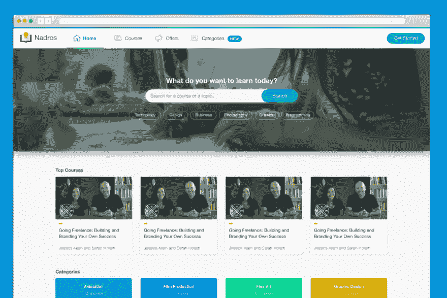
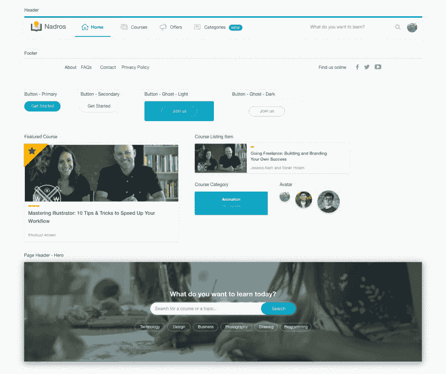

# 从头开始实现用户界面设计的过程

> 原文：<https://dev.to/shadeed/the-process-of-implementing-a-ui-design-from-scratch-4cea>

这篇文章最初是在我的博客上分享的，它有点长，所以我将分享它的介绍，你可以在博客上继续阅读。

在 HTML & CSS 中构建布局有很多方法，每个开发人员都有自己的方法。了解前端开发人员的思维过程是非常有用的，因为它为我们提供了如何解决某些问题的不同视角。

在本文中，我将从一个设计师和一个开发人员的角度出发，深入探讨构建一个名为“Nadros”的项目中的一些组件的过程，并写下我的思考过程。

Nadros 是在线视频课程平台的一个富有想象力的想法。在本文中，我将重点关注头部组件的构建。

## 设计组件

我将所有组件提取到一个页面中，这样我可以一起查看它们。这将很容易发现 UI 元素之间的不一致。此外，同时拥有所有这些组件可以带来统一一些 UI 组件的方法，或者创建各种特定的组件。

继续阅读我的[博客](https://ishadeed.com/article/building-ui-design-scratch/)

请让我知道你的想法！