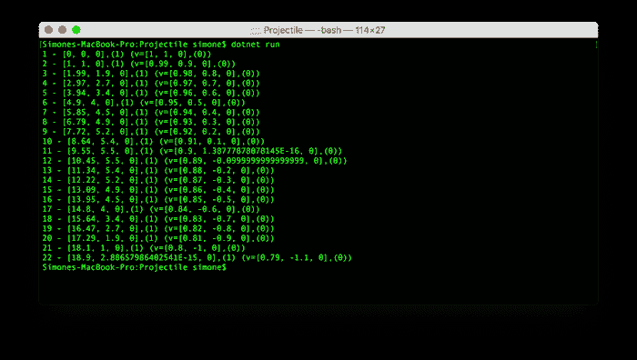
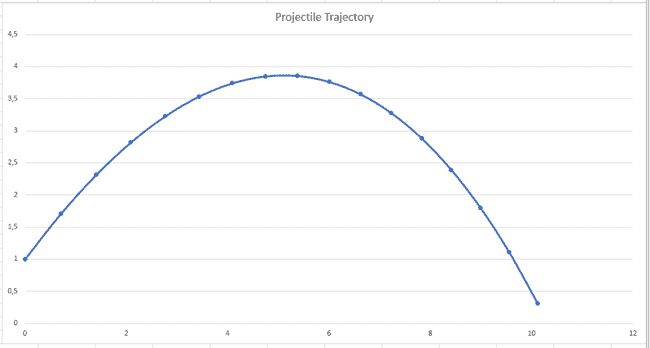

# 光线跟踪器挑战——实现图元和向量代数运算

> 原文：<https://dev.to/simonech/the-ray-tracer-challenge-implementing-primitives-and-vector-algebra-operations-23ed>

建立项目后，在这篇文章中，我开始实现[光线追踪挑战书](https://amzn.to/2Elaxkr)第一章的代码，它主要关注于定义图元(点和矢量)，以及矢量代数运算，如加法、减法以及点积和叉积。和一个简单的弹道问题来实施所有的操作。

如果你想知道更多，你可以在我的介绍文章中阅读[关于这个“挑战”的动机。](http://codeclimber.net.nz/archive/2019/05/22/raytracer-challenge-netcore-intro/)

## 遇到的挑战

起初，这看起来是一个简单的任务:编写一些方法来执行简单的加法、减法和其他一些基本公式有多难？

但事实并非如此。

### “重新学习”向量代数

第一个主要挑战是“重新学习”向量代数，以及各种运算的意义。对于实现的目的，这本书解释得足够好了，但是我想理解得更多一点，维基百科帮助很大。以下是我找到的一些链接:

*   [欧几里得向量](https://en.wikipedia.org/wiki/Euclidean_vector)
*   [点积](https://en.wikipedia.org/wiki/Dot_product)
*   [叉积](https://en.wikipedia.org/wiki/Cross_product)

### 建模图元

3D 空间中的主要图元是元组(4 个元素)，具有 3 个坐标(`x`、`y`、`z`)和一个值(`w`)，用于标识它是矢量(`w=0`)还是点(`w=1`)。我不知道这是一个标准的方法还是这本书的作者想出来的。此外，在第 1 章中没有解释原因，而是引用后面的章节来更好地理解这种抽象的含义。

为了简化创建点和向量，作为具有正确值`w`的元组，它建议创建工厂方法。

但是这本书使用了伪代码，因此光线跟踪器可以用任何语言实现，包括过程语言和面向对象语言。因此，没有给出关于如何实际实现它的额外建议。

我尝试了几种方法。

#### 继承

由于 C#是一种面向对象的语言，我没有创建工厂方法，而是将原语实现为一个`Tuple`基类，它实现了所有常见的操作，以及两个子类`Point`和`Vector`，它们的构造函数为`w`参数设置了正确的值。

```
public class Tuple
{
    public Tuple(double x, double y, double z, double w)
    {
        X = x;
        Y = y;
        Z = z;
        W = w;
    }

    public double X { get; set; }
    public double Y { get; set; }
    public double Z { get; set; }
    public double W { get; set; }

    public Tuple Add(Tuple other)
    {
        return new Tuple(
            X + other.X,
            Y + other.Y,
            Z + other.Z,
            W + other.W
        );
    }

    // All other operations
    ...
}

public class Point : Tuple
{
    public Point(double x, double y, double z) : base(x, y, z, 1.0f) { }
}

public class Vector : Tuple
{
    public Vector(double x, double y, double z) : base(x, y, z, 0) { }
} 
```

在库的实现中一切都很顺利，但是在第一次练习中事情开始失败。原因是在一个`Vector`上加一个`Point`应该会产生一个`Point`。但是在这个继承方案中，这个添加将创建一个`Tuple`，它不能被转换为`Point`。我花了一段时间才明白，这个问题是没有办法绕过的(这其实就是继承的工作方式)。

一个`Projectile`(这个练习是一个简单的弹道轨迹计算器)被定义为:

```
public Projectile(Point position, Vector velocity)
{
    Position = position;
    Velocity = velocity;
} 
```

当在一个*滴答*之后更新抛射体的位置时，你必须将当前位置加到当前速度上。结果在逻辑上是另一个点(新的`w`是`1+0=1`，但是`Add`方法返回一个新的`Tuple`，并且这个不能在以后被转换为`Point`。

```
public static Projectile Update(Projectile p, Environment e)
{
    return new Projectile(
        p.Position.Add(p.Velocity),
        p.Velocity.Add(e.Gravity).Add(e.Wind)
    );
} 
```

你可以看到我在陷入困境之前走了多远，在我的回购协议上，在 branch[1.2 章](https://github.com/simonech/ray-tracer-challenge-netcore/tree/Chapter-1.2)上。

遗憾的是这并不可行，因为这将允许大部分代码重用，并将点和向量作为两个独立的实体。

#### 内在价值

然后，我开始寻找另一种解决方案，能够保留两个独立的对象，我使用“内部值”方法实现了它们(不确定这是不是正确的名称):`Point`和`Vector`都有一个类型为`Tuple`的“内部值”对象，所有操作都在其上完成。

```
public class Tuple
{
    public Tuple(double x, double y, double z, double w)
    {
        X = x;
        Y = y;
        Z = z;
        W = w;
    }

    public double X { get; set; }
    public double Y { get; set; }
    public double Z { get; set; }
    public double W { get; set; }

    public Tuple Add(Tuple other)
    {
        return new Tuple(
            X + other.X,
            Y + other.Y,
            Z + other.Z,
            W + other.W
        );
    }

    // All other operations
    ...
}

public class Point
{
    private Tuple _innerValue;

    public Tuple InnerValue { get => _innerValue; set => _innerValue = value; }

    public Point(double x, double y, double z)
    {
        InnerValue = new Tuple(x, y, z, 1);
    }

    public Point(Tuple tuple)
    {
        InnerValue = tuple;
    }

    public double X { get => _innerValue.X; set => _innerValue.X = value; }
    public double Y { get => _innerValue.Y; set => _innerValue.Y = value; }
    public double Z { get => _innerValue.Z; set => _innerValue.Z = value; }

    public Point Add(Vector other)
    {
        return new Point(InnerValue.Add(other.InnerValue));
    }
    // All other operations
}

public class Vector
{
    private Tuple _innerValue;

    public Tuple InnerValue { get => _innerValue; set => _innerValue = value; }

    public Vector(double x, double y, double z) 
    {
        InnerValue = new Tuple(x, y, z, 0);
    }

    public Vector(Tuple tuple)
    {
        InnerValue = tuple;
    }

    public double X { get => _innerValue.X; set => _innerValue.X = value; }
    public double Y { get => _innerValue.Y; set => _innerValue.Y = value; }
    public double Z { get => _innerValue.Z; set => _innerValue.Z = value; }

    public Vector Add(Vector other)
    {
        return new Vector(InnerValue.Add(other.InnerValue));
    }

    public Vector Add(Point other)
    {
        return new Vector(InnerValue.Add(other.InnerValue));
    }

    //All other operations

} 
```

这种方法是可行的，但是，与前面的方法不同，我必须重新实现所有方法，并且将操作的逻辑委托给`Tuple`。这种方法的优点是可以限制运算(例如，不能添加 2 个点，或从向量中减去一个点)并指定正确的返回类型(两个向量的和是一个向量，但点和向量的和是一个点)。

这种做法可行，但感觉不对。代码重复太多。

您可以看到这是如何在分支[内部元素](https://github.com/simonech/ray-tracer-challenge-netcore/tree/inner-element)上实现的。

#### 使用工厂方法

最后，我按照作者的建议尝试使用，我删除了两个类，只保留了`Tuple`，在其中我添加了两个静态工厂方法来设置点(`w=1`)和向量(`w=0`)的`w`参数。缺点是我失去了将一些操作限制为点或向量的可能性，并且我不能仅仅通过阅读代码来容易地理解一个元组是点还是向量。

```
public class Tuple
{
    public static Tuple Point(double x, double y, double z)
    {
        return new Tuple(x, y, z, 1);
    }

    public static Tuple Vector(double x, double y, double z)
    {
        return new Tuple(x, y, z, 0);
    }

    public Tuple(double x, double y, double z, double w)
    {
        X = x;
        Y = y;
        Z = z;
        W = w;
    }

    public double X { get; set; }
    public double Y { get; set; }
    public double Z { get; set; }
    public double W { get; set; }

    public bool IsPoint { get => W == 1; }
    public bool IsVector { get => W == 0; }

    public Tuple Add(Tuple other)
    {
        return new Tuple(
            X + other.X,
            Y + other.Y,
            Z + other.Z,
            W + other.W
        );
    }

//All other operations

} 
```

这本书采用了 TTD 的方法，所以现在有效的数据结构可能需要一些重构来支持新的特性。为此，我最终决定使用作者建议的方法，即使用工厂方法。当概念变得更加清晰时，我可能会在本书的后面部分讨论这个决定。

你可以看到这是如何在分支[工厂方法](https://github.com/simonech/ray-tracer-challenge-netcore/tree/factory-methods)上实现的。

### 使用哪种数据类型

这本书建议使用“原生”浮点数据类型，因为这些值会被大量使用。我决定使用一个`double`，即使一个`float`可能就足够了，以避免大量的造型，因为所有的`System.Math`方法都适用于`Double`类型。而且我很懒，我不想每次当我想指定一个值为文字时都加上`f`(只是`1.7`对`1.7f`)。

### 表演

我已经在这段代码中发现了一些性能问题:每次操作完成时创建一个新的对象将会创建无数的对象，内存也会增加。

此外，使用字段而不是属性，或者使用 struct 而不是类可能会带来一些性能改进。

## 把所有的东西放在一起

如上所述，最后一个练习是关于矢量和物理的“Hello World”练习:以初速度射出的子弹在重力和风的作用下的轨迹。

```
using codeclimber.raytracer;
public class Environment
{
    public Environment(Tuple gravity, Tuple wind)
    {
        Gravity = gravity;
        Wind = wind;
    }

    public Tuple Gravity { get; set; }
    public Tuple Wind { get; set; }
}

public class Projectile
{
    public Projectile(Tuple position, Tuple velocity)
    {
        Position = position;
        Velocity = velocity;
    }

    public Tuple Position { get; set; }
    public Tuple Velocity { get; set; }

    public override string ToString()
    {
        return $"{Position} (v={Velocity})";
    }
}

class Program
{
    static void Main(string[] args)
    {
        var p = new Projectile(Tuple.Point(0, 1, 0), Tuple.Vector(1, 1, 0).Normalize());
        var e = new Environment(Tuple.Vector(0, -0.1, 0), Tuple.Vector(-0.01, 0, 0));
        int i = 0;
        while (p.Position.Y >= 0)
        {
            i++;
            sys.Console.WriteLine($"{i} - {p}");
            p = Update(p, e);
        }
    }

    public static Projectile Update(Projectile p, Environment e)
    {
        return new Projectile(
            p.Position.Add(p.Velocity),
            p.Velocity.Add(e.Gravity).Add(e.Wind)
        );
    }
} 
```

代码非常简单，只需打印出坐标列表。

[](https://res.cloudinary.com/practicaldev/image/fetch/s--GtsqLLMB--/c_limit%2Cf_auto%2Cfl_progressive%2Cq_auto%2Cw_880/http://codeclimber.net.nz/media/1059/3-text-output.png%3Fwidth%3D700)

为了验证我的理解是否正确，我将结果导入 excel 并绘制了一个图表。

[](https://res.cloudinary.com/practicaldev/image/fetch/s--zndnJW3d--/c_limit%2Cf_auto%2Cfl_progressive%2Cq_auto%2Cw_880/http://codeclimber.net.nz/media/1058/3-ballistic-trajectory.png%3Fwidth%3D650)

在我的 GitHub 存储库中，你可以看到练习的[代码，以及输出，包括](https://github.com/simonech/ray-tracer-challenge-netcore/tree/Chapter1-End/Exercises/Chapter%201)[文本](https://github.com/simonech/ray-tracer-challenge-netcore/blob/Chapter1-End/Exercises/Chapter%201/Results/trajectory.txt)和 [Excel](https://github.com/simonech/ray-tracer-challenge-netcore/blob/Chapter1-End/Exercises/Chapter%201/Results/Projectile-trajectory.xlsx) 。

## 结论

基本操作现在已经实现。这本书的下一章是关于实现在磁盘上写图像的代码，以 [PPM 格式](https://en.wikipedia.org/wiki/Netpbm_format)(我认为这是最容易实现的格式)。

你怎么想呢?你认为除了使用两个静态工厂方法之外，还有更优雅的方法来处理`Point`和`Vector`吗？还有别的吗？

我昨天已经在我的 Github 回购上发布了代码，我已经收到了两条评论(作为我的 Github 回购上的问题)。

一个[发现了我犯的一个错误](https://github.com/simonech/ray-tracer-challenge-netcore/issues/2)，另一个发布了[一些很棒的建议](https://github.com/simonech/ray-tracer-challenge-netcore/issues/1)。他建议我可以使用。NET Core 2.1，使用 floats 而不是 double(但是我仍然必须直接输入`f`)。他还建议我使用操作符重载来代替方法`Add`、`Subtract`等等。

在开始无数次调用这些简单的操作之前，我将切换到操作符过载，并做一些性能优化。

[](http://feeds.feedburner.com/~ff/Codeclimber?a=5myDr0taUQ0:Y_DrFr_snQU:V_sGLiPBpWU)[](http://feeds.feedburner.com/~ff/Codeclimber?a=5myDr0taUQ0:Y_DrFr_snQU:G79ilh31hkQ)[](http://feeds.feedburner.com/~ff/Codeclimber?a=5myDr0taUQ0:Y_DrFr_snQU:dnMXMwOfBR0)[](http://feeds.feedburner.com/~ff/Codeclimber?a=5myDr0taUQ0:Y_DrFr_snQU:F7zBnMyn0Lo)
[](https://res.cloudinary.com/practicaldev/image/fetch/s--kU8uvWdq--/c_limit%2Cf_auto%2Cfl_progressive%2Cq_auto%2Cw_880/http://feeds.feedburner.com/%257Er/Codeclimber/%257E4/5myDr0taUQ0)