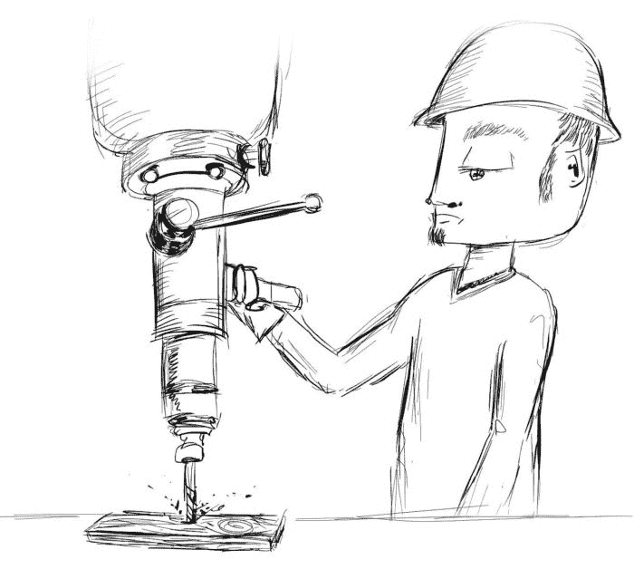

# 问题域作为一级关注点的复兴

> 原文：<https://dev.to/daedtechllc/the-renaissance-of-the-problem-domain-as-a-first-class-concern-1cb9>

嘿，看那个——我又在写博客了！说真的，抱歉打扰了，但是，嘿，生活就是这样。

不过，够了。让我们深入了解一些真实的、软件相关的内容。

## 今天早上，我读了一个有趣(恐怖)的故事

最近，我不再睡眼惺忪地看着手机和邮件开始新的一天，而是开始无组织的阅读和聊天。我随机阅读我的订阅，在闲暇时与人交谈，观看 Youtube 视频，或者进行一些突发奇想的研究。

什么都可以，只要它是:

1.  不是完全没脑子
2.  与我要做的工作没有直接关系

这种做法我怎么推荐都不为过，尤其是对于个体户那一套。它激发了创造力，也让我摆脱了所有通常会让我分心的事情。

但是我跑题了。这个小趣闻的真正意义在于，我今天早上读了鲍伯·马丁叔叔的一篇博客文章。这是一个引人注目的阅读，因为他的帖子通常都是如此，它谈到了最近的波音坠机事件。

不过，有一件事引起了我的注意，它有点偏离叙事，而且在一个相当残酷的故事中相对平淡。

> 相反，程序员必须对他们正在编程的领域有深入的了解。如果你正在编写航空代码，你最好了解很多关于航空的文化、规则和实践。

然后，这个，在结尾:

> 我们必须知道我们编码的业务领域。

哼。

## “手艺”和领域知识之间令人担忧的关系

这就引出了一个问题:这些“做得对”的波音工程师程序员是碰巧拥有航空专业知识，还是他们是碰巧会编程的航空专业人士？如果你发现自己说“两者都有”，我会给你一句我喜欢的来自敏捷世界的俏皮话，它被设计成项目经理的氪石，宣称所有的用户故事都是最高优先级的:

> 如果每件事都是优先的，那么没有什么是优先的，所以我会为你选择。

所以它在这里。如果你说这些波音软件工程师应该既是“程序员”又是“航空专业人员”，首先，他们会为你选择。你认为他们会选择哪一个？我的猜测是“程序员”，因为当他们在 9 到 27 个月内离开波音公司的工作，去创业公司或其他地方编程时，他们将不再是“航空专业人员”

现在，很明显，这个故事的很大一部分是今天的软件开发人员的领域短暂性。但另一部分是对“工艺”的关注

对于长期读者来说，我对手工艺行会隐喻的观点已经不是秘密了。我们[走得太远了](http://feeds.feedblitz.com/~/t/0/0/daedtech/www/~https://daedtech.com/taking-the-guild-metaphor-too-far/)。

软件既不是实践意义上的工艺品，也不是本体论意义上的工艺品。我们开发软件并不是为了让我们的客户享受编写得很好的代码的美学品质，我们也不是为了集体谈判而组建当地的劳工卡特尔，也不是为了在 11 岁时睡在软件工程师的阁楼上向他们学习。

软件作为一种工艺确实是一种氛围。它说，“我关心我写的代码的质量。”

毫无疑问，关心这些是件好事。但是对这种氛围的依赖往往表现为“我首先关心的是我编写的代码的质量，而不是其他问题。”

其他关注，比如说，你在哪个问题领域工作。

> “如果我遵守干净代码原则并关心我的工作，我可以在任何行业或领域做出色的工作。”

## 更大的图景:我们是否以一种有根本缺陷的方式对软件工作进行分类？

当然，对工艺的关注只是这种态度的一个来源——我想到的第一个来源(无疑是因为我在读鲍勃叔叔的博客)。

这也可能发生在黑客文化或创业场景中。

> "无论什么，伙计，飞机或空调，喷气式飞机网站或博彩网站，我只是甩德 codez . "

不管我们对编写软件的态度如何，我们与软件的关系决定了我们在企业中的身份。我们首先是软件{工程师、开发人员等等}，其他一切都是次要的。

毫无疑问，这在几十年前更合理，那时专业软件人员少得多。但是现在，大约有 2000 万软件开发者，所以细分自然会出现。

但是这看起来像什么呢？嗯:

*   反应显影剂
*   嵌入式工程师
*   全栈 web 开发人员
*   。网络程序员

而不是:

*   航空程序员
*   电子商务程序员
*   体育赌博程序员

作为一个集体行业(我可能会越来越多地讨论其合理性)，我们没有按照客户、领域、垂直或任何其他外部可理解的方式进行专业化。相反，我们把注意力集中在学科本身上，通过专注于我们自己的工具，一次又一次地加倍努力。

这种棒球内部的专业化形式是如此的不合适——如此的不透明——以至于整个行业(招聘)已经出现，除了帮助外行人理解我们的工作之外，什么也不做。不太相信？想象一下，告诉你的祖父母你是一名“react 开发人员”，然后想象一下，如果你带一名招聘人员来翻译，对话会不会进行得更好。

## 但是其他学科是跨领域延伸的！

在这一点上，我想你可能有一个可预测和可理解的对位法。言下之意，我要求软件开发，作为一种职业，与建筑师、机械工程师甚至人力资源有所不同。我们难道不是在沿着那些陈旧的痕迹走向一种模式吗？

嗯，是的。而这就是问题的关键，因为软件开发是*前所未有的*。

*   有没有其他职业在短时间内呈指数增长？
*   他们中有谁完全主宰了现代商业吗？
*   它们如此普遍，而且教育/认证门槛如此之低吗？

我可以继续，但希望你能明白。我们正在将历史先例应用于史无前例，我认为现在是我们重新审视这是否有意义的时候了。

建筑师设计建筑，所以你可以根据他们设计的建筑类型对他们进行细分。但是根据谁最终占据了大楼来细分他们是没有意义的，根据他们使用什么样的软件和什么样的铅笔来细分他们是完全荒谬的。

而且，如果你开始审视那些经受住了时间考验的学科，你会发现它们平衡了学科和受益者。例如，所有律师都追求共同的教育和认证，但他们随后用客户的语言营销和分类他们的服务:

*   离婚律师帮助人们离婚。
*   刑事辩护律师帮助人们进行刑事辩护。
*   专利律师的帮助——好了，你明白了。

请注意，他们不会把自己标榜为“普莱西诉弗格森律师”，然后让你来判断这是否意味着他们可以帮助你处理种族歧视的民权案件。

## 我希望看到选择问题领域的人数增加

如果你希望我有什么宏伟的计划来补救这一切，那么我会让你失望。我的目标更多的是“思考的食粮”。我没有重新定义软件专业的脚本，也没有足够大的肥皂箱，即使我有也能工作。

但是我想说的是，我希望看到编程技能/工具/技术不再强调专业，而是重新关注领域。像鲍勃叔叔一样，我认为这将有助于更好的软件，更符合目的。

但我也认为这将有助于引领开发者霸权的愿景。

软件开发人员在公司做出软件开发决策时如此事后诸葛亮的原因之一是，这些公司在我们之上堆积了 7 层管理。为什么？因为我们懒得去学习领域，而是从一个代码库漂流到另一个代码库，完全放弃目的和上下文，让给那些赚更多钱的人。

编程是如此占主导地位——现在无处不在——以至于我认为一个更好的模式可能是标志性的“精通微软 Excel”换句话说，没有人会从一家公司到另一家公司说，“不管是谁，我都做得很好。”相反，他们只是悄悄地使用 Excel 来使自己在实际工作中做得更好。

正如我试图用“效率者”的概念来描述的，软件开发真正的核心价值支柱是通过自动化节省时间。想象一下，如果我们选择一个垂直/领域并学习它，专注于它，成为它的专家，而不是四处游荡为不同的公司调整 ORM，我们会变得多么有效率。

我们会变得更擅长利基和专业化，我们会把自己提升到重要的决策角色。而且，按照鲍勃叔叔的观点，这种增加的代理机构可能会让我们以强有力和极其重要的方式影响世界，使其变得更好。

问题领域作为一级关注点的复兴这篇文章最早出现在 T2 的 DaedTech 上。

