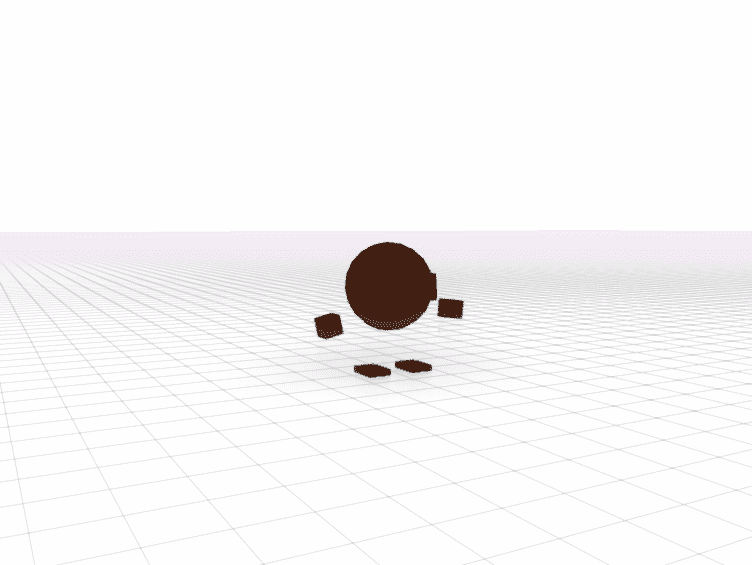
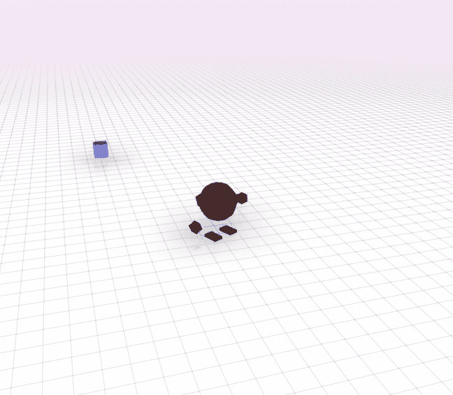
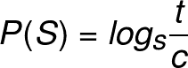

# 我 2018 年第四季度的业绩

> 原文：<https://dev.to/webdva/the-results-of-my-forth-quarter-of-the-year-2018-p6c>

我在 2018 年第四季度参加的活动汇编。

# 值得关注的活动

*   我中止了 [*Pantsu 对 Baka*](https://webdva.itch.io/pantsu-versus-baka) 的项目。作为 *Pantsu 对 Baka* 项目的结果:

    *   我进一步获得了营销和媒体操作的经验。我发现了入站营销和出站营销相结合的策略。
    *   我开始采用为系统创建全面文档的过程，并将其集成到我的启动过程中。
*   我的系统工程和项目管理技能提高了，进入了一个新阶段。

*   我制作了由市场和消费者数据驱动的*万圣节游戏。*

**   我在 *Dev.to* 在线社区平台上推广了我的*如何在 D3.js 中画线*和*如何使用监督学习进行文本分类*教程的净化版，取得了很好的效果。

    *   利用我在上一个季度(2018 年第三季度)获得的营销知识和经验，我在 *Reddit* 社交空间中站稳了脚跟，并开始了一场秘密、缓慢、微妙的 *Reddit* 影响力和存在扩张活动。

    *   我发现，由于一系列认知扭曲和认知偏见，我对营销有一种有害的偏见，然后我开始修改我的启动流程，在当前阶段将更多的精力放在产品工程上。

    *   我实现了我第一个多人游戏的[初始产品发布](https://tibibi.herokuapp.com/)。* 

 *# 联网多人浏览器游戏开发

*   我学习了 socket.io 框架，用于创建需要基于事件的实时双向通信的 web 应用程序，即用于创建联网的多人浏览器游戏。

*   我停用了 socket.io 框架，迁移到 ws Node.js WebSocket 库，同时学习了浏览器原生 WebSocket API。

*   我学习了 JavaScript 中的类型化数组，用于为多人浏览器游戏创建二进制数据协议。

*   我获得了开发简单的多人浏览器游戏服务器技术的能力，并且我现在拥有新开发的多人浏览器游戏服务器技术。

*   利用我新获得的多人浏览器游戏开发技能和知识，我开始进行研究，以便获得开发大型持久多人游戏的方法。

# 3D 游戏开发

*   我获得了使用 Blender 3D 建模和动画工具创建基本和合适的 3D 模型和动画的能力。

*   我开始学习和操作 Babylon.js 3D 游戏开发框架实用程序，并获得了开发 3D 浏览器游戏的能力。

*   我启动了 Gemini 项目来提供开发 3D 多人游戏所需的方法和经验。由于双子座项目最近的进展，我目前拥有新创建的与 3D 游戏开发相关的文档和技术。

*   我用新的命中检测技术为一个 3D 游戏创建了我的第一个有效攻击区域，该技术将用于计划中的 3D 多人游戏的服务器端。在。gif 如下，当玩家进入虚拟目标框的范围并使用攻击时，虚拟目标框改变颜色表示命中。

# 透视系统思维范式

与上一季度(2018 年第三季度)相比，我的努力成功的概率有所增加，这是由任务成功因素预测数学模型的性质决定的

其中 **P(S)** 是努力成功的概率，其中 **s** 是与 *s* > 1 的努力相关联的复杂度的维数， **t** 是努力的特定时间点所经过的时间， **c** 是与 *c* > 0 的努力相关联的所有复杂度的组合值。

除了我的努力成功的概率随着时间的推移缓慢但肯定地增加，我的努力成功的概率随着我的效用因子的成功优化而进一步增加。效用因素，包括正直、力量、勇气和承诺。

# 预测

## 短期

凭借巨大的努力和耐力，我将实现繁荣计划的成功，其目标是在 2020 年之前作为一名独立黑客获得适度的收入。

## 长期

在我成功完成“繁荣计划”后，我将开始长达十年的磨砺，目标是作为一名科技企业家获得更大的回报，就像我在电子游戏中努力获得高分一样，尤其是当我为了获胜而玩游戏时。繁荣计划期间获得的公用事业将用于繁荣后运动的成功。*