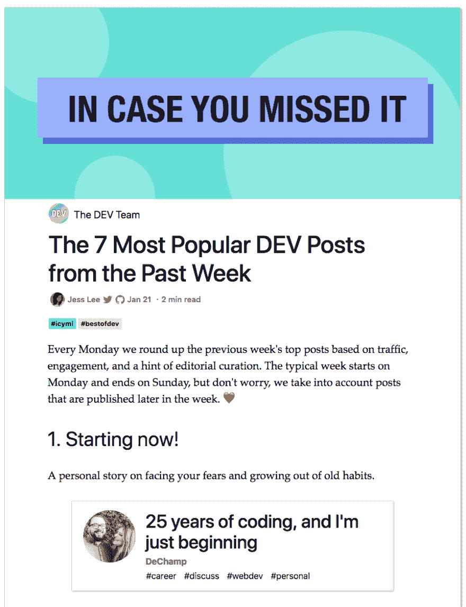
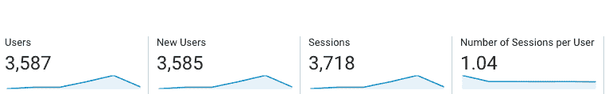
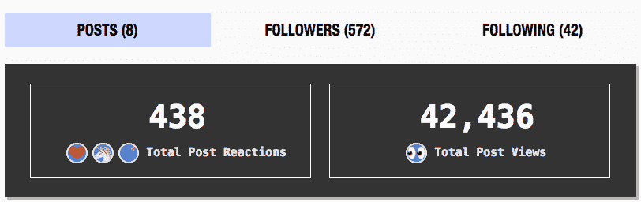
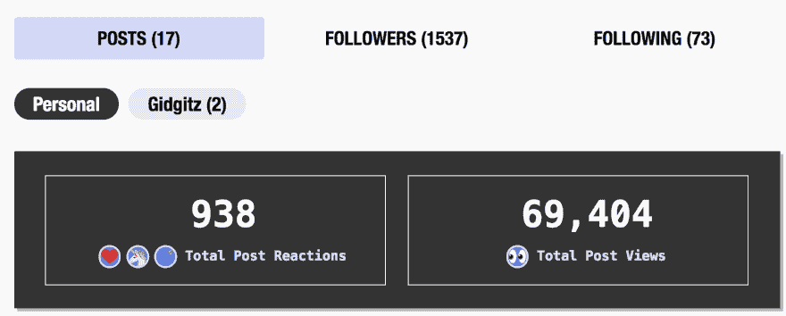

# 作为一名开发人员，为什么要面对自己的恐惧和疑虑。

> 原文：<https://dev.to/dechamp/the-results-of-putting-your-fears-to-the-side-42gg>

## TL；速度三角形定位法(dead reckoning)

我被我的文章 [25 年的编码所得到的回应震惊了，我刚刚开始](https://dev.to/dechamp/25-years-of-coding-and-im-just-beginning-442n)，承认我的恐惧以及我是如何尽我所能克服它们的。那么多伟大的人伸出援手，分享他们相同的故事。这就是为什么你应该站出来冒险。

## 故事

所以我最近贴了一篇文章 [25 年的编码，而我才刚刚开始](https://dev.to/dechamp/25-years-of-coding-and-im-just-beginning-442n)，这篇文章讲述了我是如何编码了 25 年，却没有任何成果。这都是因为我生活在对审判的恐惧中，或者是自我毁灭。

反响很惊人。我简直不敢相信有多少人不仅对它发表了评论，还花时间直接给我发电子邮件，让我知道他们与我的故事有多少关联，以及我是如何激励他们自己做出改变的。

我在情感上非常激动。看到这么多人不仅关注我的故事，而且从中看到了帮助他们前进的信息，这是如此的发自内心。

我尽了最大努力联系你们所有人，所以谢谢你们，如果我错过了你们的回复，请记住这对我意义重大！

所以这里有一些统计数据，因为我愿意冒险，把自己放在那里。

在此之前，我的个人网站从未有过真正的流量。他们会坐在那里收集灰尘，最终我会不再关心他们。

从一篇帖子开始，我被发了 2 次微博(之前从未被发微博，所以对我来说很兴奋)。在短短的 4 天内，我的网站从每天 1 名访客(我自己)增加到 3585 名新用户[【https://gidgitz.com】](https://gidgitz.com)！我收到了 167 颗心，39 只独角兽，82 个书签，获得了超过 150 个新的关注者，我的帖子从 4000 次浏览增加到 42436 次！！！😳😳我收到了 5 封感谢我的私人邮件，还有 2 封在网站上给了我反馈。我在 dev.to 上的个人资料也获得了前 7 名的奖项，有人以此为基础写了一整篇文章！[回复:编码 25 年](https://www.pskirko.com/2019/01/20/re-25-years-of-coding/#comment-14)

说说看到这一切时的一种势不可挡的感觉。最重要的是知道我自己的奋斗和谈论它，帮助了别人。❤️

所以说了这么多，你需要以此为例，说明为什么不把自己逼入恐惧的角落是如此重要。把你自己放出去。

**更新！**

所以已经过了几个星期，我获得了更多的牵引力。看到面对恐惧和怀疑的结果真是太棒了！

## 动机

我喜欢伊洛娜对此的评论。看看她的帖子！[克服恐惧](https://dev.to/ilonacodes/overcome-fear-15if)

## 要采取的步骤

它只需迈出一小步开始，然后一小步接着一小步前进。

这里有一个快速列表，你可以做些什么来帮助你克服恐惧。

*   从评论开始。对某人的推文、帖子、文章、图片或你使用的任何东西发表评论。只是评论，如果是一个“感谢分享”的事件。这让你知道成为某事的一部分是可以的。

*   写一篇简单的博客，一篇文章，一条评论。或者分享你的想法或经历，比如你和你的狗的照片。不管话题是什么，总会有人和你有关系，你就可以开始发展一个社区。

*   如果你是一名开发人员或设计师，那么就创造一些小的东西并与他人分享！

*   阅读/查看其他人的帖子和评论，并与他人分享！

*   提醒自己，即使你帮助或影响了一个人，这也是分享你的想法/想法/观点/感受等的足够理由。

*   现在就做！不要给自己一个“我会等到”的借口，因为这会让你继续拖延。你现在可以开始评论这篇文章，并向我问好！或者分享我的东西，这将是非常感谢。或者叫我帮你！

-说吧