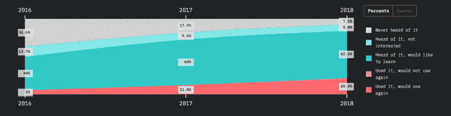
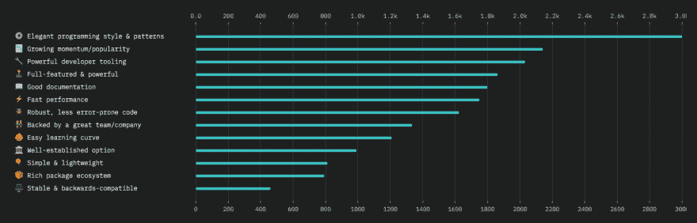
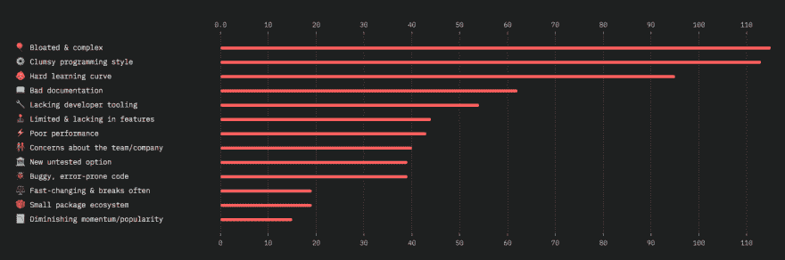
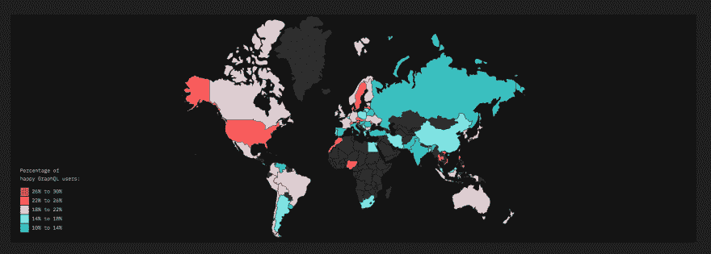
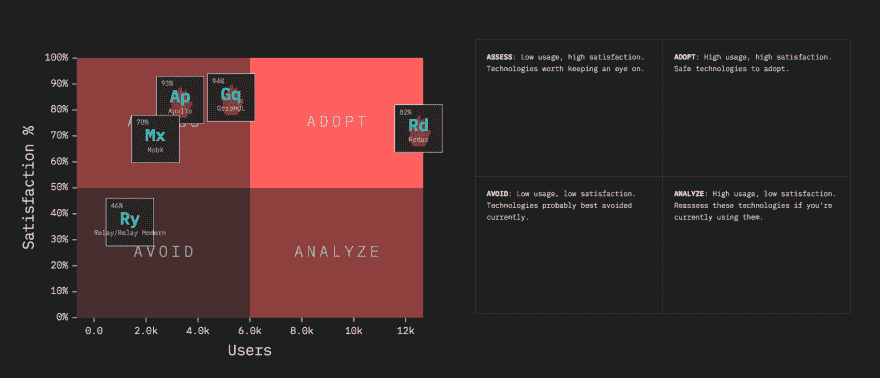

# GraphQL 的状态

> 原文：<https://dev.to/graphqleditor/the-state-of-graphql-jdo>

JavaScript 的状态(State of JavaScript)是由[萨查·格雷夫](https://twitter.com/sachagreif)、[拉斐尔·本尼特](https://twitter.com/benitteraphael)、&、T6】迈克尔·朗博创建并维护的一项调查。该调查收集了超过 20，000 名开发人员的数据，他们被问及关于前端框架、库和我们最感兴趣的部分的问题...数据层，当然包括 GraphQL 及其衍生产品，如 Apollo 或 Relay。

#### 数据图层报表

数据层将所有用于传输和管理数据的技术重新组合在一起。这是一个很大的范畴，许多方法竞相让一个棘手的问题变得更容易解决。用户被问及对这些技术的经验和知识，如 [Redux](https://redux.js.org/) 、 [Apollo](https://www.apollographql.com/) 、 [MobX](https://mobx.js.org/) 、[Relay](https://facebook.github.io/relay/)&[graph QL](http://graphqleditor.com)。让我们来看看去年(2018 年)调查的回复:

#### GraphQL 的流行度

正如你在下面的图表中看到的(希望如此)，只有 7.1%的受访者从未听说过 GraphQL(相比之下，36 .2016 年为%, 2017 年为 17.9%)。62.5%的人表示他们希望学习 GraphQL， **20.4%的人使用过它，并将再次使用**(与 2017 年相比增长了一倍)，只有 1.3%的人已经尝试过，但不会再次使用。

##### 来源:【stateofjs.com】T2

#### graph QL 最喜欢的方面

当被问及 GraphQL 最受欢迎的方面时，声称他们“使用过并将再次使用”的开发人员选择了下面的前 3 名:

*   优雅的编程风格和模式
*   日益普及
*   强大的工具(即 [GraphQL 编辑器](https://graphqleditor.com/)

##### 来源:【stateofjs.com】T2

#### graph QL 最不喜欢的方面

当被问及 GraphQL 最不喜欢的方面时，声称他们“使用过并且不会再使用”的开发人员选择了:

*   高复杂性
*   笨拙的编程风格，
*   艰难的学习曲线

##### 来源:【stateofjs.com】T2

#### GraphQL 用法

调查显示 **20.3%的受访者已经使用过 GraphQL** ，并将在未来的项目中再次使用。下图是享受 [GraphQL](https://graphql.org/) 的用户分布。比率最高的国家用红色显示，比率较低的国家用蓝色显示。少于 20 个答复者的国家被省略。

##### 来源:【stateofjs.com】T2

#### 摘要

在分析了超过 20 000 份调查报告后，作者将它们放入一个象限图中，其中有四组:

| 建议 | 技术 |
| --- | --- |
| **采用** | [Redux](https://redux.js.org/)——它有非常高的使用&满意率，这使它成为一项可以采用的安全技术。 |
| **评估** | [GraphQL](https://graphql.org/) 、 [Apollo](https://www.apollographql.com/) 、[MobX](https://mobx.js.org/)——他们满意度很高，但使用率还是比较低。这些是值得关注的技术，因为它们可能很快会转变成大玩家。 |
| **避开** | [Relay](https://facebook.github.io/relay/)——使用率低，加上满意度低，使得 Relay 成为一种应该避免的技术(至少现在是这样)。 |
| **分析** | 非高使用率，尽管满意度低，如果被使用，你应该考虑重新评估。 |

##### 来源:【stateofjs.com】T2