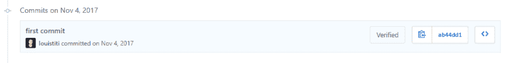
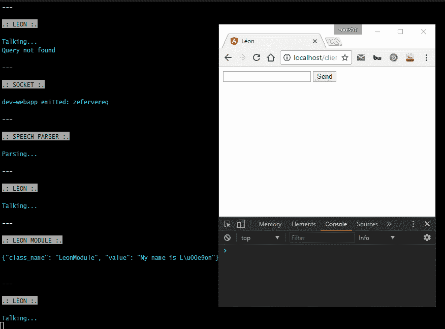
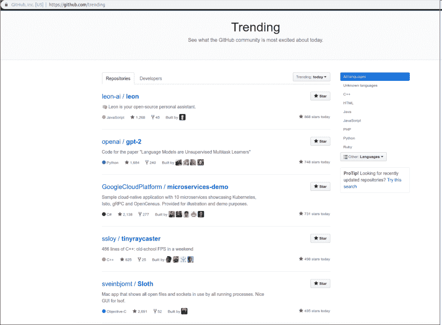
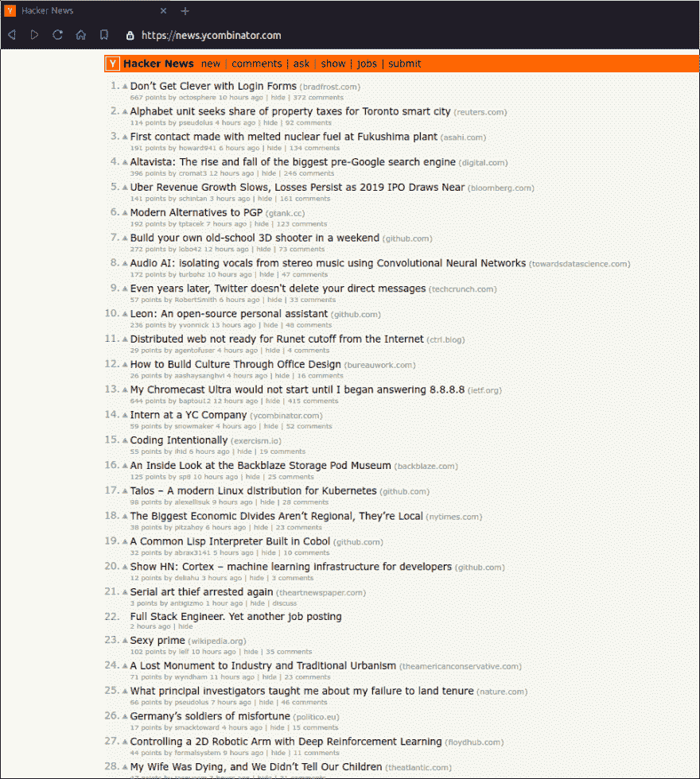

# 里昂背后的故事

> 原文：<https://dev.to/louistiti/the-story-behind-leon-25o9>

*这篇文章最初发表在[原创博客](https://blog.getleon.ai/the-story-behind-leon/)上。*

**大揭秘**:我从来没有看过电影*莱昂:职业*(至少现在还没有)。

## 我是谁

👋大家好，我叫[路易斯·格雷纳德](https://twitter.com/louistiti_fr)，我出生于 90 年代的法国山区。我目前住在中国深圳，在一家名为 [NOA 实验室](https://www.noa-labs.com)的大公司工作。

我从小就喜欢做东西，我的 GAN356 Air SM，我真的相信[开源](https://github.com/louistiti)。

## 莱昂是谁

让我用几句话给你解释一下。

Leon 是一个开源的个人助理，可以生活在你的服务器上。你要他做什么他就做什么。

你可以和他说话，他也可以和你说话。你也可以给他发短信，他也可以给你发短信。如果你愿意，Leon 可以通过离线的方式与你交流，保护你的隐私。

## 为什么是“莱昂”

莱昂作为一个名字很容易记住，而且无论是哪种语言都更容易发音(英语中的*莱昂*，法语中的*莱昂*，中文中的*莱昂*，西班牙语中的*莱昂*，等等)。).此外， *Leon* 是从 *Leo* 创造出来的，意思是*狮子*，那是我的星座。

## 时间轴

**2016 年底***——*让我们回到 2016 年底。脸书首席执行官马克·扎克伯格为[发布了一份笔记](https://www.facebook.com/notes/mark-zuckerberg/building-jarvis/10154361492931634/)和[一段关于他 2016 年个人挑战的视频](https://www.facebook.com/zuck/videos/10103351034741311/)。我对通过声音与科技系统互动的想法感到非常兴奋。当然，Siri 等虚拟助手在那个时候已经存在，但阅读和看到扎克的助手这一事实让我渴望了解更多。

几天后，我坐上了回我亲爱的法国家乡的火车。我迅速抓起我的笔记本电脑，开始在一个 HTML 文件中编写概念证明。我的第一个动机是了解语音到文本和文本到语音在 web 开发中是如何工作的，所以我很自然地实现了 [Web Speech API](https://developer.mozilla.org/en-US/docs/Web/API/Web_Speech_API) ，几个小时后我就完成了我的 PoC。

【2017 年初*——*几个月后，我在去德国慕尼黑参加一个家庭活动的路上，我想做的不仅仅是一个简单的网络演讲 PoC。对我的日常生活有帮助的东西。我记得第一个特色创意是一个*金融追踪器*，我想它可以这么说:

```
Leon, how much money did I spend in restaurants in 2016 
```

Enter fullscreen mode Exit fullscreen mode

并通过语音和文本回复我一些细节。于是我抓起手机，开始写一些功能创意。

**2017 年年中***——*2017 年 6 月底，我搬到了中国，开始了我在这里的全职工作。手表是时钟，只有在 10 月，我决定制定一个计划，除了我的工作，妥善处理利昂。我于 2017 年 11 月 4 日提交了一个私人存储库。

[](https://res.cloudinary.com/practicaldev/image/fetch/s--5cKt4z_f--/c_limit%2Cf_auto%2Cfl_progressive%2Cq_auto%2Cw_880/https://blog.getleon.img/20190217/first_commit.png)

几个星期后，我在想，如果利昂帮助了我，那么它也可能帮助其他人。所以我决定创建一个可模块化的架构，用一个模块从 YouTube 下载视频并保存在设备上。我想要那个模块，因为那时我住的地方离我的工作地点有 1 小时的路程，我需要坐地铁，所以我可以在那段时间看/听技术视频和播客。

**2018 年初***——*2018 年 1 月 7 日，我通过设置[这张](https://trello.com/c/wt8W83AV/85-%F0%9F%93%9D-open-source)等卡片，创建了[莱昂的路线图](https://roadmap.getleon.ai)，并开始记录自己关于开源生态系统的经历*(我强烈推荐你[开源指南](https://opensource.guide/) )* 。在那个时候，里昂看起来是这样的:

[](https://res.cloudinary.com/practicaldev/image/fetch/s--h5HxfP_---/c_limit%2Cf_auto%2Cfl_progressive%2Cq_66%2Cw_880/https://blog.getleon.img/20190217/beginning.gif)

【2018 年 3 月*——*然后个人问题出来了，我两个月没有在 Leon 上工作。只是在 2018 年 3 月，我想测试一下 Leon 是否不仅对我有意思，对其他人也有意思。所以我做了一些关于 Reddit 的研究，它到底是如何工作的，规则等等。而我最后会制作一个调侃视频，发布到几个子编辑上，比如 [/r/Python](https://www.reddit.com/r/Python/comments/85axig/im_building_l%C3%A9on_an_opensource_personal_assistant/) 、 [/r/javascript](https://www.reddit.com/r/javascript/comments/85aso8/teasing_im_building_l%C3%A9on_an_opensource_personal/) 等。我收到了大量的反馈，因为我在 Google Drive 上发布了视频，视频在短时间内达到了允许的最大浏览量，所以我需要迅速在 YouTube 上发布[视频。那时，Leon 还在使用 Web Speech API，所以我通过实现你在第一版中知道的东西进行了重构。](https://www.youtube.com/watch?v=1B7JMBPZ0qI)

**2018 年年中——现在***——*我们现在是 2018 年 8 月，在这里，由于其他个人问题，我决定休息一下。然后就是从 2018 年 11 月我追上 Leon 一直到上映🎉。

如果我把我花在 Leon 的`1.0.0-beta.0`发布上的工作时间加起来。结果是 **11 个月**，包括:周末，工作日的清晨(早上 6 点到 8 点)，在开始我可爱的全职工作之前，以及一天结束后的健身房。当然，这个结果也包括离开电脑的时间。这个数字代表了整个时间线，而不是我纯粹为里昂工作的具体时间。私有存储库上的提交数量是 438。

## 感谢

请稍候！这还没有结束，我只是想感谢现在，因为我认为这是更准确的写在上面的部分。

我用这几行字来热烈感谢我的:

*   家人支持我关于里昂的长篇大论，并看到我取消了一些家庭活动。
*   可爱的女朋友给了我这样的能量和动力。
*   朋友们谁建议的想法，并相信利昂从他的早期。

💙

## 一周后

我在 2019 年 2 月 10 日发布了 Leon 的`1.0.0-beta.0`版本。今天我们已经比发布晚了一周。请让我分享一下这一周发生的事情，但在此之前...让我告诉你，你居然 **A.W.E.S.O.M.E！**

里昂受到了很好的欢迎，所有这些都证明里昂有潜力，有很多事情要做。我的朋友们，这是一个惊人的冒险是从这里开始的！

以下是最初发布的一些数据:

1.  **24 小时后***——*莱昂获得了他的第一个 100 颗 GitHub 星，并出现在 GitHub JavaScript 趋势页面上。
2.  **48 小时后***——*莱昂到达 GitHub 星 200 颗。
3.  **4 天后***——*里昂有 400 多颗 GitHub 星。
4.  **5 天后***——*有人在知名黑客新闻上发表了 Leon，反响不错。这使得莱昂登上了头版，在几个小时内排在第三位，然后一整天排在第十位。
5.  **6 天后***——*莱昂的知识库被排在 GitHub 主趋势页面的第一位。
6.  **7 天后(今天)***——*昂星超过 1.7k。

[](https://res.cloudinary.com/practicaldev/image/fetch/s--yMScgvU7--/c_limit%2Cf_auto%2Cfl_progressive%2Cq_auto%2Cw_880/https://blog.getleon.img/20190217/leon_gh_trending.png)

[](https://res.cloudinary.com/practicaldev/image/fetch/s--6nT4m9WJ--/c_limit%2Cf_auto%2Cfl_progressive%2Cq_auto%2Cw_880/https://blog.getleon.img/20190217/leon_hn.png)

## 接下来是什么

上面的数字很有希望，非常好，感谢你们所有人对这个项目的支持。然而，还有很多[即将到来](https://roadmap.getleon.ai)，这第一次发布是莱昂的基础。

我已经设定了[的下一个里程碑](https://github.com/leon-ai/leon/milestone/1)，也就是`1.0.0-beta.1`版本。现在，里昂需要长大，他只有一周大。我指望你为 T4 做出贡献。

**让我们一起教育和建设里昂**。

干杯🍻,

路易。

## 传话&敬请期待

👉分享这篇[博文](https://twitter.com/intent/tweet?source=webclient&original_referer=https://blog.getleon.ai/the-story-behind-leon&text=The%20Story%20Behind%20Leon&url=https://blog.getleon.ai/the-story-behind-leon&via=louistiti_fr)。

👉关注我 [@louistiti_fr](https://twitter.com/louistiti_fr) 。

👉订阅[简讯](https://getleon.ai)。