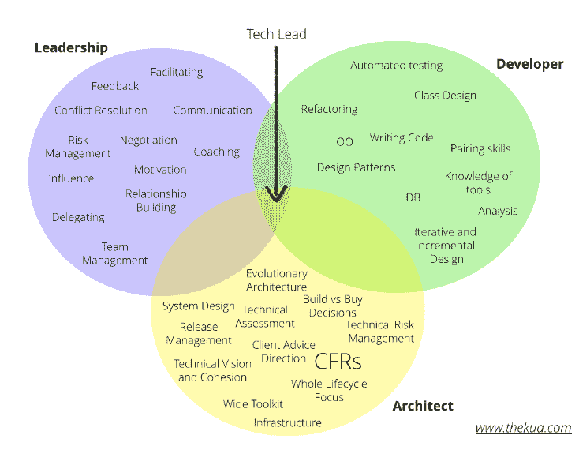

# 技术领先

> 原文：<https://dev.to/kosenshou/the-tech-lead-32ko>

[https://www . code mentor . io/npostolovski/8-tips-for-be-a-good-tech-lead-ke 35g 7 em 8 # 2-don-code-full-time-but-don-stop-coding-completely](https://www.codementor.io/npostolovski/8-tips-for-being-a-good-tech-lead-ke35g7em8#2-dont-code-full-time-but-dont-stop-coding-completely)

人们经常成为技术领导，因为他们是团队中富有成效的成员，能够异常快速地生产出高质量的代码。趋势是以同样的方式操作技术领导的角色，没有意识到你可能以团队的生产力为代价最大化你个人的生产力。

