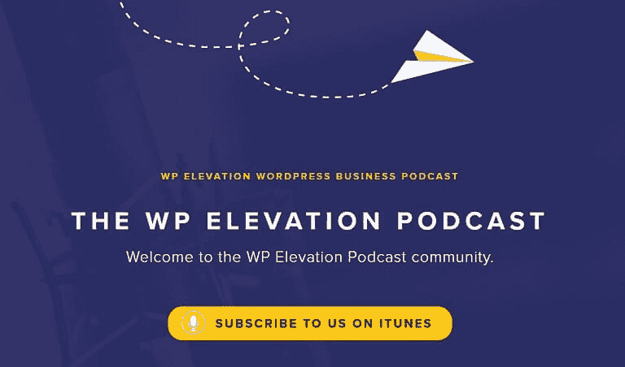
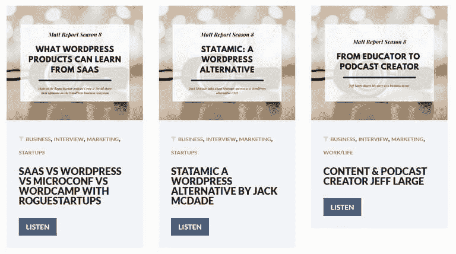
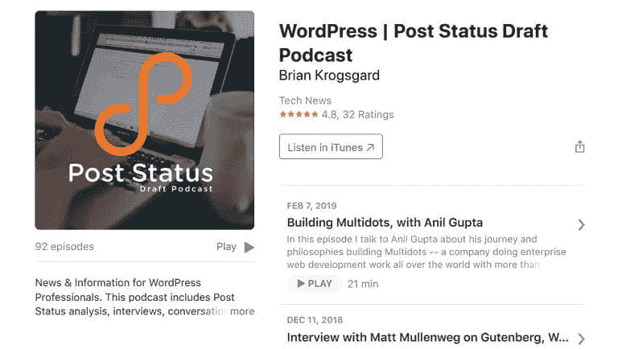
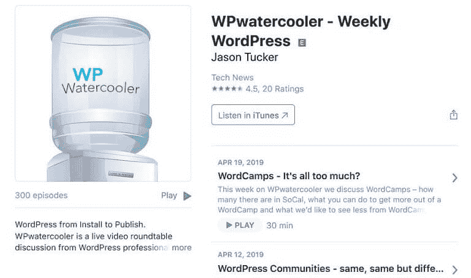
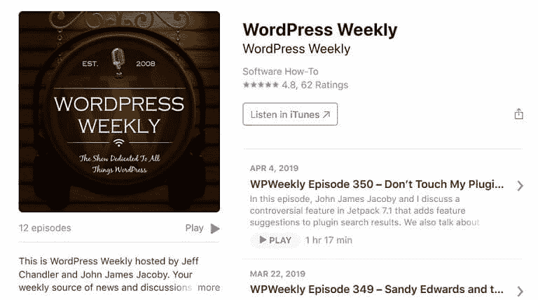
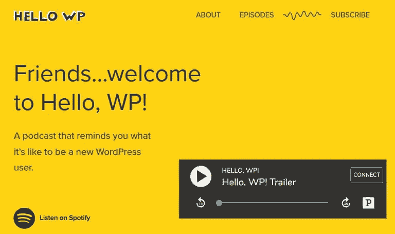
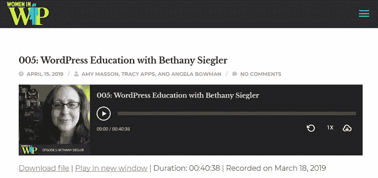

# 2019 年十大最有前途的 WordPress 播客

> 原文：<https://dev.to/bitofwp/the-top-10-most-promising-wordpress-podcasts-for-2019-3m8>

成为一个狂热的 WordPress 用户仅仅是一个开始。毕竟，总有突发新闻、更新、趋势设计、编码技术、工具以及更多需要学习的东西。

但是在工作和娱乐之间，你如何在不花费大量时间的情况下跟上进度呢？

答案是 **WordPress 播客**。

播客于 2005 年在 iTunes 上推出，已经走过了漫长的道路。事实上，目前有[超过 70 万个播客](https://www.podcastinsights.com/podcast-statistics/)和 2900 万集供人们收听；这些数字还在继续上升。

人们喜欢听播客，因为在听他们感兴趣的东西时，他们可以灵活地做其他事情。

说到 WordPress 播客，开发者、设计者和用户都有需要的东西。但是仅仅因为播客让你更容易跟上 WordPress 的世界，并不意味着你会自动知道该看哪个。

这就是我们来帮你的原因。我们已经收集了 2019 年**十大最有前途的 WordPress 播客**，因此你可以缩小搜索范围，找到适合你需求的播客，并立即开始收听。

## 1。 [WP 仰角](https://www.wpelevation.com/podcast/?cookieUUID=ddf6a843-16e4-457e-8b90-c538e300664d)

WP Elevation 不仅将主要主持人 Troy Dean 带到演讲者面前，分享他对扩大在线业务、创建高水平目标和感恩的见解，还邀请了其他多位主持人进行交流，并添加不同的观点。

这个播客被分成几个简单的部分，所以你可以准确地找到你想要的东西。这些部分包括流程、获得客户、经常性收入、增长、技术和平衡。

最近的事件包括:

*   [Keith Perhac 计算你的销售线索的实际价值](https://www.wpelevation.com/2019/04/keith-perhac-value-of-your-leads/)
*   [巨大的支持和内容帮助 Kinsta 与 Brian Jackson 一起成长](https://www.wpelevation.com/2019/04/kinsta-great-support-content/)
*   [克里斯·马乐揭示了帮助你获得合适客户的 4 个故事](https://www.wpelevation.com/2019/04/chris-lema-get-the-right-clients/)

## 2。[厨房水槽 WP](https://kitchensinkwp.com/)

亚当·席尔瓦是 WordPress 的长期用户，他希望与他人分享 WordPress 及其社区的价值。他的专题从事件综述到插件评论，从自由职业者的商业建议到在线创业。

他还采访了 WordPress 行业的知名人士，与听众分享他们的见解。所有技能水平和兴趣的 WordPress 用户都会从这个每周播客中有所收获。

最近的事件包括:

*   [播客 E269–如何&为什么选择利基](https://kitchensinkwp.com/podcast-e269-how-why-to-pick-a-niche/)
*   播客 E268——你应该签 NDA 吗？
*   [播客 E267–来自罗利的新 WordCamper 访谈](https://kitchensinkwp.com/podcast-e267-new-wordcamper-interview-from-raleigh/)

## 3。[马特报道](https://mattreport.com/all-episodes/)

Matt 报告没有关注与 WordPress 相关的 web 开发工具、流程或编码技巧，而是关注于让真实的人了解他们如何比以往更好地运营他们的 WordPress 业务。

你可以期待定期的嘉宾演讲者在你听的每一集里分享可行的建议和实用的技巧。最棒的是，WordPress 开发者、设计师、作家、顾问和店主都可以通过收听和观看下一期 Matt 报告来学习新的东西。

最近的事件包括:

*   [SaaS vs WordPress vs MicroConf vs word camp with rogue startups](https://mattreport.com/saas-vs-wordpress-vs-microconf-vs-wordcamp-with-roguestartups/)
*   杰克·麦克达德的 WordPress 替代品
*   [内容&播客创作者杰夫·拉奇](https://mattreport.com/content-podcast-creator-jeff-large/)

## 4。[岗位状态草稿](https://podcasts.apple.com/us/podcast/wordpress-post-status-draft-podcast/id976403008?mt=2)

Post Status Draft 最初是一个有用的 WordPress 资源的聚合站点。然后它变成了一个博客，发布原创的、与 WordPress 相关的内容。之后，Post Status Draft 变成了一个播客，每月发布 1-2 个新的播客，提供新闻、技巧、工具和采访供人们收听。

这个 WordPress 播客的巧妙之处在于它同时处理了 WordPress 的开发和商业方面。事实上，这是唯一一个仍然讨论 WordPress 所有事情的播客。

最近的事件包括:

*   [与阿尼尔·古普塔一起建造多点建筑](https://podcasts.apple.com/us/podcast/building-multidots-with-anil-gupta/id976403008?i=1000429404695)
*   [就古腾堡、WordPress 和未来采访马特·莫楞威格](https://podcasts.apple.com/us/podcast/interview-matt-mullenweg-on-gutenberg-wordpress-future/id976403008?i=1000425654993)
*   [电子商务商家的考虑因素，电子商务燃料公司的 Andrew you derian](https://podcasts.apple.com/us/podcast/considerations-for-ecommerce-merchants-andrew-youderian/id976403008?i=1000417169588)

## 5。[机构开拓者](https://agencytrailblazer.com/category/podcast/)

这个很酷的 WordPress 播客旨在为 WordPress 开发者和代理商建立一个稳固的社区。专注于重要的主题，如有效的客户管理，更大的收入和更好的商业实践，机构开拓者的主持人希望在建立你的 WordPress 机构时帮助你成功。

除此之外，他们还想确保你的公司不仅继续发展，而且还有剩余的时间与朋友和家人共度。

最近的事件包括:

*   [如何改变你的代理机构](https://agencytrailblazer.com/podcast/how-to-pivot-your-agency/)
*   [如何获得更多曝光](https://agencytrailblazer.com/podcast/how-to-get-more-exposure/)
*   [演讲者简介:你的事](https://agencytrailblazer.com/podcast/speaker-profile-the-business-of-you/)

## 6。[水冷器](https://podcasts.apple.com/us/podcast/wpwatercooler/id566009415?mt=2)

WPwatercooler 是最古老和最受尊敬的 WordPress 播客之一。它包括每周播出的现场直播和预先录制的内容，由 Jason Tucker 领导，他是一个成功的网络服务公司老板，喜欢使用 WordPress。

在剧集中，WordPress 爱好者谈论新闻、现实生活中的应用和成功，甚至是 WordPress 的技术方面，这是许多播客不做的。杰森也喜欢采访 WordPress 的高层领导，了解他们对 WordPress 正在改变商业和我们生活的感受。

最近的事件包括:

*   词汇营——太多了？
*   [WordPress 社区——相同，相同但不同](https://podcasts.apple.com/us/podcast/wordpress-communities-same-same-but-different/id566009415?i=1000434801333)
*   [在 WordPress 讨论艰难的一周](https://podcasts.apple.com/us/podcast/discussing-a-hard-week-in-wordpress/id566009415?i=1000434251699)

## 7。 [WordPress 周刊](https://podcasts.apple.com/us/podcast/wordpress-weekly/id694849738?mt=2)

WP 酒馆的杰夫·钱德勒和约翰·詹姆斯·雅各比为你带来 WordPress 周刊。这个播客是 WordPress 新闻、任何与 WordPress 核心或 Automattic 相关的内容以及营销主题的重要来源。每一集都是现场录制的，所以流程是有机的，很容易跟上。

WordPress 周刊的主持人旨在向人们展示如何利用客户忠诚度和 WordPress CMS 的技术知识来创建一个可识别的品牌。此外，他们喜欢分享领导力如何影响企业的生产力。

最近的事件包括:

*   [WPWeekly 第 350 集-不要碰我的插件搜索结果](https://podcasts.apple.com/us/podcast/wpweekly-episode-350-dont-touch-my-plugin-search-results/id694849738?i=1000434179253)
*   [WPWeekly 第 349 集–桑迪·爱德华兹和儿童活动工作组倡议](https://podcasts.apple.com/us/podcast/wpweekly-episode-349-sandy-edwards-kids-event-working/id694849738?i=1000432943001)
*   [WPWeekly 第 348 集–RIP Alex，脸书版主，和更短的发布周期](https://podcasts.apple.com/us/podcast/wpweekly-episode-348-rip-alex-facebook-moderators-shorter/id694849738?i=1000431328382)

## 8。[你好，WP！](https://hellowp.world/)

WP 你好！是一个新的 WordPress 播客，为你提供与 WordPress 相关的所有内容。由 Dailey 兄弟，Micah 和 Josh 主持，剧集揭示了 Micah ( *一个新的 WordPress 用户*)如何学习基础知识以及 WordPress 社区是什么。

问题是，尽管 Micah 是一个新用户，但有经验的 WordPress 开发者可以从收听中获益良多。这些对话提醒人们作为 WordPress 空间的初学者是怎样的，以及今天的情况有多么不同。

最近的事件包括:

*   你好，WordPress！
*   你好，古腾堡！
*   你好，SEO！

## 9。[WP 中的女性](https://womeninwp.com/podcast/)

重要的是要记住 WordPress 是一个多元化的社区，其中也包括有影响力的女性！这就是为什么 WP 中的女性是今年 WordPress 播客的一部分。

一般来说，主持播客的女性并不多，但这个播客每两月播出一集，内容是关于在 WordPress 社区写博客、设计、开发和营销的女性，以及她们如何在商业和个人生活中使用 WordPress。

最近的事件包括:

*   [005:贝瑟尼·西格勒的 WordPress 教育](https://womeninwp.com/podcast-download/223/005-wordpress-education-with-bethany-siegler.mp3?ref=new_window)
*   [004:Felicia cebal los-marro quin 的内容创作](https://womeninwp.com/podcast/004-content-creation-with-felicia-ceballos-marroquin/)
*   [003:Miriam Schwab 的无服务器托管和更多内容](https://womeninwp.com/podcast/episode-3-serverless-hosting-and-more-with-miriam-schwab/)

## 10。 [WP 圆桌](http://wproundtable.com/)

WP 圆桌会议是一个独特的 WordPress 播客，包括 WordPress 专家和嘉宾的圆桌会议或小组讨论，涉及开发、托管、主题、性能和商业等主题。

他们有一个广泛的受访者阵容，以及一个方便的时间表，如果你想找一个特别的人，你可以查看一下。此外，WP 圆桌会议自 2014 年以来一直在播放播客，所以你永远不会缺少听的材料。

最近的事件包括:

*   [74:Sunny Ratilal–轻松的数字下载](http://wproundtable.com/74-sunny-ratilal-easy-digital-downloads/)
*   [HOA 73:Shayda Torabi–WP 引擎](http://wproundtable.com/hoa-73-shayda-torabi-wp-engine/)
*   [HOA 72:汤姆·哈里根–艾黎互动](http://wproundtable.com/hoa-72-tom-harrigan-alley-interactive/)

现在你知道了！今年最有前途的 WordPress 播客来看看。

无论你是想提高你的开发技能，了解最新的 WordPress 新闻，还是想找到新的方法来获得更多的客户并通过你的在线商店赚更多的钱，有一个播客正等着你点击播放。不要担心，你可以随身携带你的 WordPress 播客，这样你就可以及时了解 WordPress 的所有信息，同时完成你需要做的其他事情。

*Dan LeFebvre 在 Unsplash 上的专题照片*

帖子【2019 年十大最有前途的 WordPress 播客首先出现在由 BitofWP 提供的 [WordPress 支持服务上。](https://bitofwp.com)