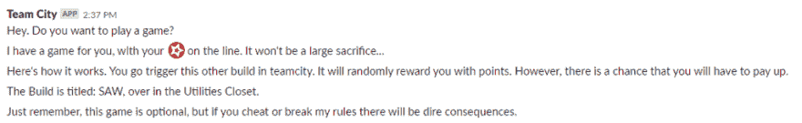
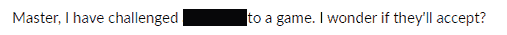
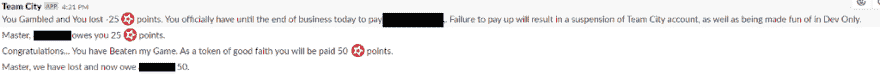
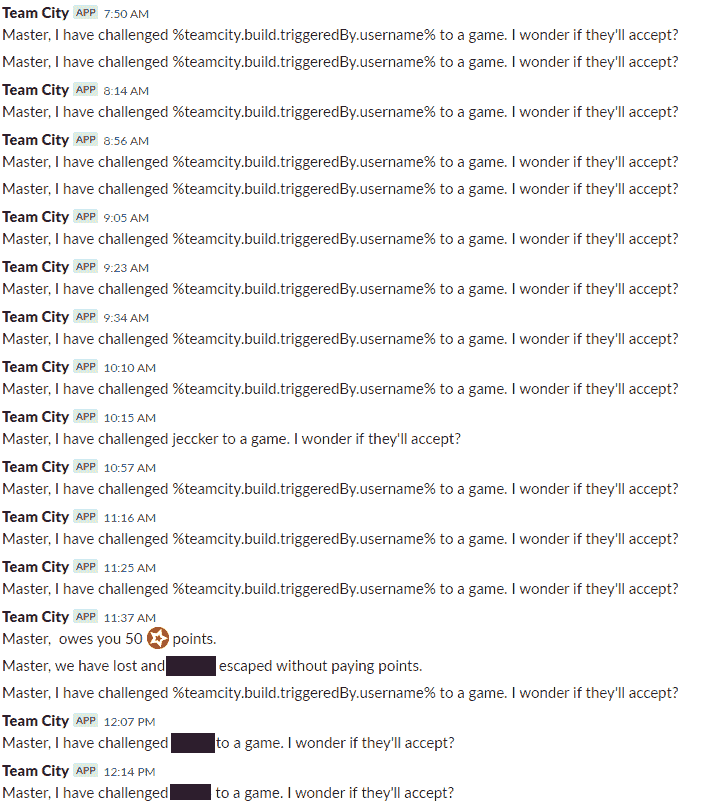

# 拼图机器人的悲剧

> 原文：<https://dev.to/dealeron/the-tragedy-of-the-jigsaw-bot-3n75>

我们的故事从 3 月 25 日开始。我正在处理一张已经放在我面前一两周的罚单，是关于我们的构建服务器( [Team City](https://www.jetbrains.com/teamcity/) )没有向人们发送任何电子邮件。构建服务器软件的官方支持团队花了很长时间才回复我，我已经尝试了所有我能想到的方法。不想让这件事暂时不被触及，我决定想出一个计划。

> *“如果我们在私聊中通过 slack 直接向用户发送构建失败的通知，而不是电子邮件，会怎么样？无论如何，我的大多数队友都不喜欢电子邮件，这将使我在将整个 CI/CD 管道与聊天客户端集成的目标上更进一步。”*

在一周的空闲时间里，我尝试了一些构建服务器的插件。一切似乎都无法正常工作，服务器日志也没有明确指出我有问题，或者它试图使用我配置的闪亮的新工具。然而，在支持人员的帮助下，我学会了如何正确地启用日志记录。显然，我错过了几个[范围](https://api.slack.com/scopes)让机器人在我的 slackbot 频道中与我交谈。

我一直在编写 PowerShell 给自己发送简单的消息，这样我就可以测试机器人的权限。事实证明，有很多关于 [Slackbots](https://api.slack.com/bot-users) 的文档，但是我没有看到一个统一的指南，以我正在寻找的方式在一个地方设置你想要的所有权限范围，也就是以一种让我可以理解的方式解释它们的东西。我知道你可以把机器人聊天发送到一个频道，但私人用户是另一回事，而且(对我来说)这样做没有直接的逻辑。

通常，公共/私有频道只需要一个 [**传入 webhook**](https://api.slack.com/incoming-webhooks) 用于作用域，以及一个传入 webhook URL 以便发布到频道。但是，一个人的私人 slackbot 频道是他们独有的。我最终授予 bot 的作用域有: **incoming-webhook、** **channels:write、** **chat:write:bot、** **groups:write、******users:read:users:read:email**。** 

```
**$stuff** = “_I have the shiniest meat bicycle_!”

**Invoke-RestMethod** -Method POST -Uri “https://slack.com/api/chat.postMessage?token=xoxb-SUPER\_LONG\_TOKEN&channel=SlackUserID&text= **$stuff**" -ContentType “application/json” 
```

“我有一辆最闪亮的自行车！”—_ 是我在 slackbot 频道上从我自己的机器人上看到的第一个东西(在我看来，测试消息应该很有趣，所以我使用了 [Borderlands 2 引号](http://orcz.com/Category:Borderlands_2_Quotes))。不久之后，我开始用 urlencoding 发送 URL 和半复杂的文本结构，然后是 JSON 对象。_ 成功！

然而，这仅仅是开始。这将是一项重大的任务，而且会极大地破坏我的乐趣，让我的开发伙伴们通过一个半复杂的过程来获得我需要的 slack 令牌，然后将它记录在某个数据库或文件中。下一个合乎逻辑的步骤是告诉我的脚本我的电子邮件地址，让它从那里算出其余的，然后通过这种方式发送消息。对我来说，好消息是 Team City 有一个内置的变量，我一直要求每个在服务器上注册的人使用他们的工作电子邮件，这样他们就可以在构建失败时收到电子邮件。

```
**$who** = “%teamcity.build.triggeredBy.username%”

**$targetUser** = **Invoke-RestMethod** -Method POST -Uri “https://slack.com/api/users.lookupByEmail?email= **$who@emaildomain.com** &token=xoxb-super\_long\_token" -ContentType ‘application/x-www-form-urlencoded’ | **ConvertTo-Json**

( **$targetUser** -split “`r`n”) | **ForEach-Object** {
**$userID** = **Select-string** -InputObject $\_ -Pattern ‘“id”: ‘
 if( **$userID** ){

**Write-Output** “FOUND”
**$cleanID** = **$userID** -Replace ‘“id”:’, “” -replace ‘“‘, “” -replace ‘,’, “”

**$cleanID** = **$cleanID**.trim()
 }
} 
```

上面我正在做一些清理工作。来自 API 的响应是一个 JSON 对象，为了查找来自 Slack 的字符串 ID，我需要解析它。一旦我抓取了一个有*【id】:“MY _ ID”的行，我就去掉多余的我不需要的东西，只剩下我的目标 ID 作为一个字符串。*

不到一个小时，我就把它设置好了，这样，如果我给它我的电子邮件，它就会在 slack 中查找我的 userID，清除它从返回的 JSON 中获得的令牌，然后通过 api 调用把它发送回 Slack，给私人用户发送一条消息。很简单，对吧？

现在是星期五，我的工作周还剩半个下午，这时我突然意识到—

*   ***今年 4 月 1 日是星期一。*** 我可以恶作剧开发团队，在每个触发的构建上随机挑战他们玩俄罗斯轮盘游戏。如果我取当前时间，去掉分钟的最后一位数字，并在一个开关中使用，我将生成一个相当公平的轮盘赌。*这方面的一个例子是:假设现在是下午 1:25，我们获取时间的最后一位数字 5，并基于此生成一个结果。按照我下面的逻辑，1:25 触发的构建不会给用户带来任何好处，但是 1:29 触发的构建会给他们带来 200 分，1:23 触发的构建会让他们损失 100 分。*

```
**$a** = Get-Date
**$array** = [int[]](($a.Minute -split ‘’) -ne ‘’)
**$yei** = 0
switch( **$array** [-1]){
 0 { **$yei** =0}
 1 { **$yei** =-25}
 2 { **$yei** =50}
 3 { **$yei** =-100}
 4 { **$yei** =100}
 5 { **$yei** =0}
 6 { **$yei** =25}
 7 { **$yei** =-50}
 8 { **$yei** =0}
 9 { **$yei** =200}
default { **$yei** =”ID:10-T Error”}
} 
```

*   这将是一个理想的方式来测试作为一个概念的构建通知程序，并把它变成一个真正的东西，如果它的工作。我已经很好地解决了如何在系统中查找用户，并验证他们对以前项目中的某些服务器运行特定构建/执行脚本的权限。
*   完成这项工作的所有零件都在这里，只需要有人来组装拼图。如果我加倍下注，我可以给它一个拼图的味道和感觉，但如果他们不感兴趣或没有时间，我不会公开迫使他们玩我的游戏。我开始喜欢恶作剧，同时也变得有用。

到 COB 那天，我已经测试了竖锯机器人并开始工作。整个过程是这样的:

1.  一个用户触发了一个构建，然后他们被随机地挑战一个游戏。
2.  我在白名单和黑名单中查找用户。如果用户在被选中进行挑战时没有被列入白名单或黑名单，那么他们将直接在 Slack 中由 Team City build 服务器发出挑战。他们将被指示(如果他们想的话)通过使用页面底部的 SAW build 来玩游戏，在为实用程序保留的部分。
3.  Team City 通过允许该用户玩游戏来更新白名单。
4.  Team City 给 **me** 发消息，所以我有一个记录，一场比赛要来了，应该准备给他们送分。
5.  用户玩游戏。基于另一个基于时间的轮盘赌，就像上面显示的那样，他们被给予或惩罚一个微小的，任意数量的点。任何被发现试图玩游戏而没有被白名单邀请的用户都会被列入黑名单，并在他们团队的所有人面前被嘲笑。一旦用户完成游戏，他们也会被列入黑名单，不能再玩，以保持游戏简单，防止每个人都赢太多。如果 RNG 引擎对开发者不够慷慨，到周中也没有很多玩家，我的计划是清除黑名单，让他们再试一次，为了好玩。

<figure>[](https://res.cloudinary.com/practicaldev/image/fetch/s--1kaPwD93--/c_limit%2Cf_auto%2Cfl_progressive%2Cq_auto%2Cw_880/https://thepracticaldev.s3.amazonaws.com/i/vj3tfsmiiwwx1uzxsx2l.png) 

<figcaption>这里的挑战信息被放置在一个轻微延迟的计时器上，所以你不会一下子得到它们，试图让机器人感觉像生命一样。这是用户在他们的收件箱中会得到什么的一个例子。</figcaption>

</figure>

<figure>[](https://res.cloudinary.com/practicaldev/image/fetch/s--HIbKcEcS--/c_limit%2Cf_auto%2Cfl_progressive%2Cq_auto%2Cw_880/https://thepracticaldev.s3.amazonaws.com/i/ip01e3l3e8tb0btl917d.png) 

<figcaption>这是我在我个人的 Slackbot 频道中所期待看到的。</figcaption>

</figure>

<figure>[](https://res.cloudinary.com/practicaldev/image/fetch/s--QI9wcUBn--/c_limit%2Cf_auto%2Cfl_progressive%2Cq_auto%2Cw_880/https://thepracticaldev.s3.amazonaws.com/i/py4pyuxrew9uzz227swe.png) 

<figcaption>这有几个测试游戏输赢的例子。用户会收到一条消息，告诉我他们赢得了什么或者必须做什么，而我会收到一条消息，告诉我应该付款或者必须付款。</figcaption>

</figure>

这个计划不会出错的，对吧？

riiiiiitt…

<figure>[](https://res.cloudinary.com/practicaldev/image/fetch/s--ueo-2MLC--/c_limit%2Cf_auto%2Cfl_progressive%2Cq_auto%2Cw_880/https://thepracticaldev.s3.amazonaws.com/i/3z00qb8415ia9ii7caty.png) 

<figcaption>可怜的竖锯，他不知道自己在和谁说话。%teamcity.build.triggeredby%只会是一个他会生气，会被触发的名字。不过，我确实找到了打败我的游戏的用户，并给了他 100 分，只因为他帮我修复了漏洞。</figcaption>

</figure>

到了星期一，我的 slackbot 频道几乎完全失控了。事实证明，除非用户单击旁边的按钮**【RUN】**或 **[…]** 来启动构建，否则它会在执行查找时将默认服务帐户名设置为% teamcity . build . triggered by . username %系统变量值。Slack 会尝试查找这个无效用户，然后什么也不给我发送。我对发生的事情一无所知。直到那个星期的星期二，我才发现一个真正的用户被贴上了构建触发者的标签。到那时，我已经收到了大约 100 条聊天消息，说% teamcity . build . triggered by . username %已经接受了游戏挑战。很有帮助。*非常有用。*

还记得我之前提到的白名单/黑名单功能吗？它的唯一目的是成为一个构建工件，它是所有其他被挑战的用户的组合，并随着时间的推移将他们的名字添加到其中。当用户受到挑战时，他们会被列入白名单，永远不会再被打扰，直到他们开始玩游戏。白名单功能对任何人都不起作用，所以 Matt 在周中找到我，说他在多个数据库上运行一系列数据库更改时，每 5 分钟就要接受一次游戏挑战。虽然他并不生气(实际上他有点被逗乐了)，但他确实问我是否可以在我寻找一种方法让 Jigsawbot 不要对他偏心的时候关掉它。

哦，我有没有提到几乎每个人都觉得这很烦人，并认为这是一些社会工程骗局？几乎每个和我交谈过的人都认为这是一个社会工程骗局，或者只是我在混日子，没有人向我或我的团队报告，除了 4 个用户主动联系我，因为他们只是觉得好玩才问的。在这些开发人员中，有一半的人甚至对玩游戏有点兴趣，并且这样做了(对此我按照游戏规则给予了奖励)。至少我们 IT 部门的反钓鱼培训没有输给我的开发者朋友。

一切都进行得如此顺利。

所以我开始练习，在经历了一些令人毛骨悚然的时刻后，我意识到我的错误在哪里，并让它离开可怜的马特。

我正在做的事情的伪代码:

```
If (we should challenge the user) {
 challenge the user;
 if (not on whitelist and not on blacklist) {whitelist them;}
} 
```

我应该做的是:

```
if (we should challenge the user){
 if (not on whitelist and not on blacklist){
 challenge the user;
 whitelist them;
 }
} 
```

这在我的测试中从未出现过，因为我会在受到挑战后直接玩游戏。我没有一个测试用例场景来充分涵盖“我需要在播放之前一次运行 5 个不同的构建来触发它”的实例，并且我的代码行为中的差距直到它被“世界”看到时才变得明显。

有了正确的逻辑，我能够解决我的问题，马特终于得到了一些安宁。然而，我并不满意。如果我想把它变成一个可用于构建错误的 bot 脚本，我需要理解构建软件是如何从 Git 获得 VCS 变化的，以了解用户是谁。

随着我一周的悲伤和失败的恶作剧即将结束，我开始努力从 Git 中获取用户名，这样我就可以将它推断到我的脚本中，这样循环就完成了。通过将一些 git 命令传输到一个文件中，并在后来加入一些 regex，我已经编写了一些东西，可以可靠地接收用户名的电子邮件，或者接收希望在提交时签名自己的名字和姓氏的用户的电子邮件，并可以准确地将其报告给脚本，这样我就可以做我上面描述的所有有趣的事情，而不用担心传入一个错误的用户名，因为系统的默认设置对于整个脚本的使用是无效的。

这个蛋糕的糖衣是我在做这个的时候让插件工作了(你知道，就是这个插件开启了整个该死的旅程)。具有讽刺意味的是，如果我不完全重做我们所有的构建并把它们送回黑暗时代，这个脚本对我来说就没有用。

然而，如果我需要迁移到另一个构建软件，那里插件较少，UI 不太友好，更多的是命令行驱动，我有一个脚本可以发送私人消息。这是:**