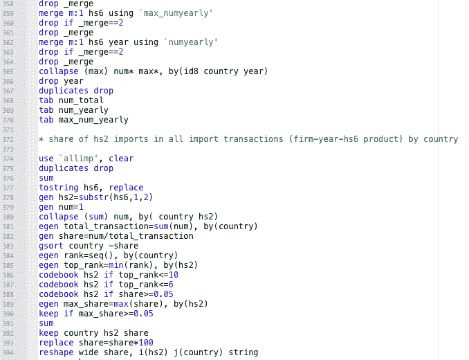
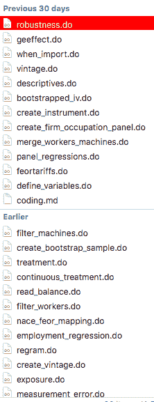
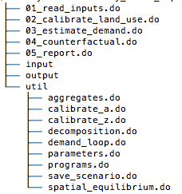

# 特百惠编码法

> 原文：<https://dev.to/korenmiklos/the-tupperware-approach-to-coding-1g74>

编码就像超跑。这是一项艰巨的任务。如果你不想发疯，你必须把它分成更小的块。午饭前，我会完成这个功能。在下一个救护站，我必须重新装满我的水瓶。

将问题分成许多小的、可管理的部分是处理复杂问题的一种方法。但是如果你把问题分成太小的块，你会以太多的块结束。你会再次感到不知所措。

多层嵌套结构通常很有帮助。当跑极限时，我喜欢将比赛分成三部分，三部分在急救站之间，事实上，我经常只关注单次呼吸。对于编码，有库，模块，类，函数，单语句。

> 如果你在少量和少量之间进行优化，一个树形结构可以有效地组织你必须保存在大脑中的信息。

也许最著名的例子是我们如何看待时间。时间自然是模块化的。一个月大概有 30 天，一年有 12 个月。(我们很幸运有这样的安排。一个土星年大约需要 25，000 个土星日。)这样，我们既可以有*小*，又可以有*少*。我可以为今天做计划。这周的。我可以估计一个项目需要多少周时间。我可以选择明年要做的项目。

注意我是如何在多个抽象层次上上下移动的。当我制定今天的计划时，我不会停下来思考这些活动如何影响我今年的目标。(也许我应该。)当我在未来几周安排不同的项目时，我不会停下来考虑是在上午还是下午做。我只是假设我的日常计划会符合。

另一个众所周知的例子是大多数操作系统上的文件夹结构。(最早提到文件夹层次结构是在 1958 年[和 1965 年](https://www.computer.org/csdl/proceedings/afips/1958/5053/00/50530059.pdf)[的](https://multicians.org/fjcc4.html)。)我可以将一个文件夹放在另一个文件夹中，直到任意深度。这样，我可以在我当前的文件夹中快速浏览并有一个了解。如果我需要更多的细节，我会深入挖掘里面的文件夹。

> 就像一个结构化的日历和一个漂亮的文件夹结构一样，一个结构良好的程序有助于组织你的想法。

我写过剧本，尤其是在我职业生涯的早期，这些剧本一次完成了所有的事情。数千行代码，逐行执行。稍后浏览并试图编辑这些脚本就像一个超级跑步者的噩梦。

 
后来，我犯了太多的错误。在一个研究项目中，我可以很容易地组织 20-30 个 do 文件。回想起来，这让我恶心。

 
那么什么是正确的抽象层次呢？什么是足够小？多少才算少？

> 你的每一大块都应该足够小，可以放在你的脑袋里。

您不应该通过查看另一段代码来了解当前函数的功能。通常，这意味着每个函数只有几行代码，每个模块只有几个函数。面向对象语言在设计上是模块化的，但是你可以把简单的 Stata 脚本分成许多小的部分。

> 并且你不应该在任何一层中引用超过 6-8 个其他块。

再多你就会迷路。有 10 个或更多的脚本需要查看和运行，这很好地表明您想要引入额外的层。这些脚本可以按功能区分吗？他们多久被叫一次？他们需要什么样的投入？任何能让你更有条理的事情。

 
用你培育日历的爱来培育你的代码。