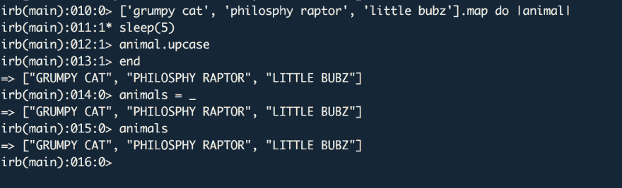

# IRB 中有用且隐藏的' _ '命令

> 原文：<https://dev.to/edwinthinks/the-useful--hidden--command-in-ruby-dlo>

## 简介(TLDR 八九)

作为一名开发人员，我一直在寻找工具和技巧，让我在从事项目时更有效率。因此，我采用了一些鲜为人知的 ruby 交互式 shell 命令。其中之一是下划线或`_`。我发现这个命令在应用时非常有用，可以提高你的工作效率！

下划线只是为您提供了控制台中最后一次评估的返回值。我发现这在我忘记分配代码块的输出或者当我通过 Rails 执行一个我不想再运行的查询时特别有用。让我告诉你我的意思:

## 示例用例

上面是详细描述一个示例用例的屏幕截图。在那个例子中，我用 5 秒钟的停顿(模拟一个缓慢的操作)评估了一个代码块，没有把它赋给变量 animal。没什么好担心的，你可以使用下划线来避免再次执行代码！

另一个可能从使用`_`方法中获益的常见情况是在 Rails 中运行查询...但是忘记给变量赋值了！

## 结论

当您在 ruby 交互式 shell 中工作时，下划线是一个有用的工具。重新运行缓慢的代码看起来并不需要很多时间……但它确实是累积起来的！

还有哪些隐藏的红宝石把戏？如果你知道任何人并且有慈善的心情，请评论这篇文章。