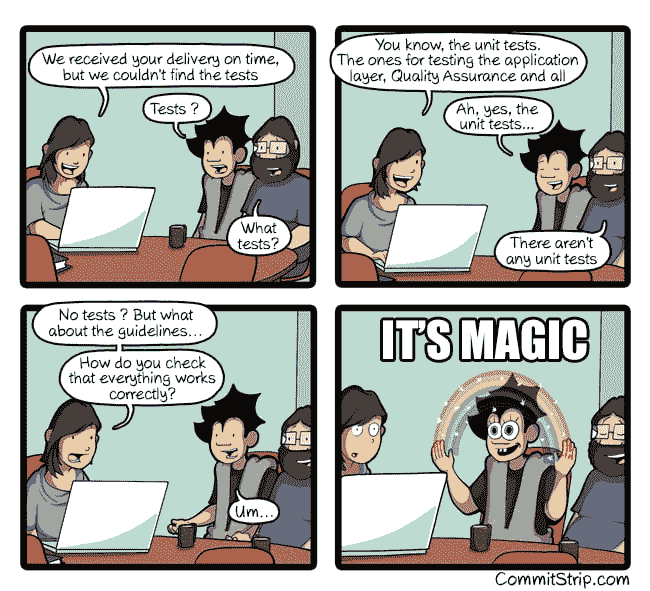

# 单元测试或集成测试的价值

> 原文：<https://dev.to/lgraziani2712/the-value-of-unit-or-integration-testing-56i0>

comic by CommitStrip:[http://www . CommitStrip . com/en/2017/02/08/where-s-the-tests/](http://www.commitstrip.com/en/2017/02/08/where-are-the-tests/)

**TL；DR** :至少尝试为你的核心流程编写单元/集成测试。你未来的自己会感谢你。

* * *

几天前，我不得不重构一个股票系统中的两个流程:销售和采购。这两种方法至少有一个共同点:它们通过 id 列表查询产品列表。两者使用相同的数据，除了销售使用`sale_price`(别名为`unit_price`)和采购使用`unit_price`。两者都管理一个“单价”，一个作为销售的单价，另一个作为采购的单价。

销售过程是我写的，购买过程是我的一个队友写的，所以，即使他们有相同的步骤，两个过程也有不同的方式。这是正常的。直到我们写了代码，我们才知道它们有什么共同点。

这些过程极其重要和敏感，因为它们是系统的核心，管理资金。因此，我们决定为他们的每个约束添加单元和集成测试。

因为这个决定，*甚至*当我的不习惯写测试的队友不想“浪费”时间写测试时，今天我可以重构两个过程并防止一个危险的错误出现:

当在一个方法中重构这个公共步骤时，我决定查询销售和购买过程所需的每个属性，这意味着现在两者都可以访问`sale_price`和`unit_price`属性。但是我不记得在销售过程中，总属性是用旧的`sale_price`别名`unit_price`计算的。有了这一改变，一切仍然运行良好，但是总数没有用`sale_price`乘以产品的数量，而是用*实际值* `unit_price`。

只是因为快照测试警告我存在差异，所以我可以捕捉到错误。只是因为我们决定在我们的过程中添加测试，而不是让用户抓住我们，用一切手段。

我希望这次经历能激励你去写测试！

感谢您的阅读！