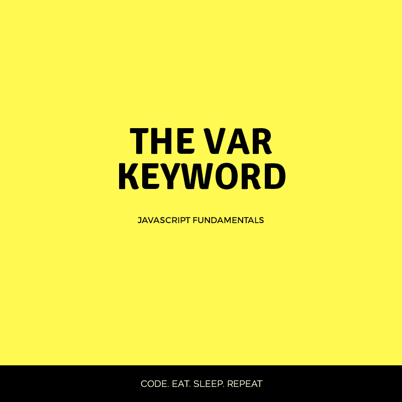

# var 关键字

> 原文：<https://dev.to/runosaduwa/the-var-keyword-5gpm>

[](https://res.cloudinary.com/practicaldev/image/fetch/s--lNcYJQJZ--/c_limit%2Cf_auto%2Cfl_progressive%2Cq_auto%2Cw_880/https://thepracticaldev.s3.amazonaws.com/i/j29y0qb9yuq0koky66zs.png)

在 ES6 之前，JavaScript 中的所有变量都用 var 关键字声明。这个关键字使我们的变量有了一个函数范围。

让我们通过下面的代码片段更好地理解这一点:

```
 function SayName(){
   var name = "Tega";
   }

console.log(name)//Undefined 
```

控制台打印出`undefined`是因为`SayName`函数内的变量`name`是**而不是`SayName`函数外可见的**。

在另一个不是功能块的块中，行为完全不同。例如，看看在 if 块中会发生什么。

```
 if(true){
   var name = "Tega";
   }

console.log(name)//Tega 
```

控制台打印`Tega`。

考虑这两个例子的结果，很明显，用关键字`var`声明的变量，当它们出现在一个函数块中时，只有局部作用域**和**。

**这是一种不好的行为**
这是一种不好的行为，在 JavaScript 程序员中引起了很大的挫败感。在 ES6 之前，JavaScript 有函数作用域，但是*块作用域*在大多数编程语言中更常见。在 ES6 中，`let`和`const`关键字被引入来允许我们声明块范围的变量，这是一种安全的行为。

感谢您的阅读！
编码快乐！❤