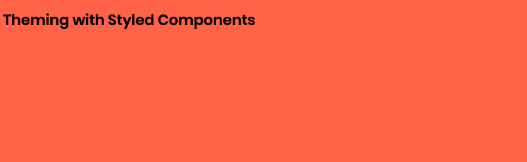
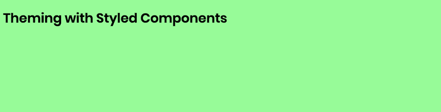

# 使用样式化组件进行主题化

> 原文：<https://dev.to/mikewheaton/theming-with-styled-components-19ce>

这篇文章涵盖了创建一个[风格的组件](https://www.styled-components.com/)主题的基础。

主题包含颜色、字体、阴影、文本大小和其他您想要一致使用的视觉元素的定义。对主题的更改会在任何地方反映出来，您甚至可以在运行时修改它，以提供像黑暗模式切换这样的功能。

在本教程中，我将使用 [CodeSandbox](https://codesandbox.io/) 。这是我创建简单的概念验证应用程序，可以很容易地分享。你可以和我一起编码，或者如果你愿意，可以跳到[的最终应用](https://codesandbox.io/s/jjxrwl48xw)。

我们开始吧！

## 项目设置

使用带有 create-react-app 的 React 模板在 [CodeSandbox](https://codesandbox.io/) 上创建一个新应用。

这个模板附带了一些我们不需要的样板文件。删除`styles.css`文件并从`index.js`中移除其导入，然后用“使用样式化组件进行主题化”替换标题。

点击“添加依赖关系”按钮，搜索`styled-components`。就这样，我们准备在我们的应用程序中使用样式化的组件。

## 全局样式

样式组件是用来给组件添加样式的。但是，有些情况下需要定义适用于整个应用程序而不是特定组件的全局 CSS 样式。这些包括定义自定义字体和样式化`html`和`body`元素。

虽然我们可以在常规的 CSS 文件中添加这些样式，但是我们会错过在中心位置定义视觉语言的好处。幸运的是，Styled Components 提供了一个`createGlobalStyle`函数，可以为我们的应用程序添加全局样式。让我们创建一个负责添加这些样式的组件。

创建一个新文件，`GlobalStyles.js`。

```
import { createGlobalStyle } from 'styled-components';

const GlobalStyles = createGlobalStyle`
  @import url('https://fonts.googleapis.com/css?family=Poppins:400,600');

  body {
    background-color: tomato;
    font-family: Poppins, sans-serif;
  }
`;

export default GlobalStyles; 
```

这将创建一个全局样式，定义一个自定义字体，将其应用于正文，并将背景色设置为可爱的红色。

要应用这些样式，编辑`App.js`来添加我们的新组件。

```
import GlobalStyles from './GlobalStyles';

function App() {
  return (
    <div className="App">
      <GlobalStyles />
      <h1>Theming with Styled Components</h1>
    </div>
  );
} 
```

成功！字体正在使用，我们的背景非常非常红。

[](https://res.cloudinary.com/practicaldev/image/fetch/s--kn-GLw5h--/c_limit%2Cf_auto%2Cfl_progressive%2Cq_auto%2Cw_880/https://wheaton.design/static/9260791668a6ab63ef71f60df1089b50/47573/global-styles.png) 

<figcaption>红色背景、Poppins 字体</figcaption>

的页面截图

我们有了一个好的开始。但是我们的全局样式包含硬编码的值，我们无法与其他组件共享或轻松更新这些值。让我们创建一个主题来保存这些值。

## 创建主题

主题是一个 JavaScript 对象，我们所有的组件都可以通过 prop 访问它。对其结构没有要求或限制；我们可以在里面放任何东西。

让我们添加一个`theme.js`来保存这个对象，因为它会随着时间的推移而增长。

```
const theme = {
  fontSource: 'https://fonts.googleapis.com/css?family=Poppins:400,600',
  fontFamily: 'Poppins, sans-serif',
  backgroundColor: 'tomato',
};

export default theme; 
```

这个对象有我们的字体源、字体系列名称和背景颜色的字符串。我们的下一步将是更新`GlobalStyles`组件来使用这些值。

## 使主题可用

我们有一个主题，但是像 GlobalStyles 这样的组件如何访问它呢？虽然标准的 import 语句可以共享这些值，但它不允许我们在运行时更新它们来启用类似黑暗模式的功能。

这就是`ThemeProvider`的用武之地。它是一个包装器组件，将主题道具传递给其中的所有组件。

```
import { ThemeProvider } from 'styled-components';

import GlobalStyles from './GlobalStyles';
import theme from './theme';

function App() {
  return (
    <ThemeProvider theme={theme}>
      <div className="App">
        <GlobalStyles />
        <h1>Theming with Styled Components</h1>
      </div>
    </ThemeProvider>
  );
} 
```

我们已经导入了`ThemeProvider`，将它包装在整个应用程序中，并将我们的主题对象传递给它。我们所有的组件现在都可以访问一个`theme`道具。

现在让我们来测试它的工作情况。

## 在组件中使用主题

让我们更新`GlobalStyles`来使用主题。记住样式化的组件使用[模板字符串](https://developer.mozilla.org/en-US/docs/Web/JavaScript/Reference/Template_literals)。这意味着我们可以随时使用`${}`将 JavaScript 表达式嵌入到字符串中。

在这个表达式中，我们将调用一个接收属性的函数。然后，我们可以使用隐式 return 发回一个字符串，该字符串将被插入到样式中。看起来像`${props => props.theme.red}`。

让我们更新`GlobalStyles.js`来使用主题变量，而不是硬编码的值。

```
const GlobalStyles = createGlobalStyle`
  @import url('${props => props.theme.fontSource}');

  body {
    background-color: ${props => props.theme.backgroundColor};
    font-family: ${props => props.theme.fontFamily};
  }
`; 
```

保存它...看起来一样。这是意料之中的，因为我们的主题与之前的值相匹配。让我们修改一下主题，将`backgroundColor`设置为`palegreen`。

[](https://res.cloudinary.com/practicaldev/image/fetch/s--KO0Mh9s8--/c_limit%2Cf_auto%2Cfl_progressive%2Cq_auto%2Cw_880/https://wheaton.design/static/02587dcb37766b86ffa6c7cc34a48142/47573/theme-applied.png) 

<figcaption>早先的页面截图，现在用绿色背景</figcaption>

我们走吧！我们现在有了一个主题，可用于我们应用程序中的所有样式组件。

虽然现在功能有限，但您可以看到如何扩展它，以包括完整的调色板、字体系列和大小等。

因为在运行时解释的是 CSS-in-JS，我们可以在任何时候修改主题对象，并看到这些变化立即反映在我们的应用程序中。

## 下一步

*   向主题添加一个`textColor`属性，并将其用于标题。
*   不是`backgroundColor`总是返回同一个字符串，而是修改成随机返回两种颜色之一的函数。
*   创建第二个名为`darkTheme`的主题对象，并添加一个在它和默认主题之间切换的开关。
*   查看[抛光](https://polished.js.org/)，这是一组可用于解决常见布局问题、处理颜色等的函数。