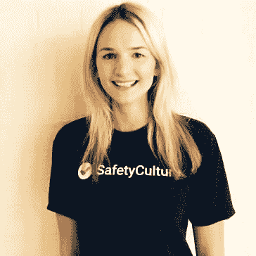

# 科技招聘人员在你的简历和第一次面试中寻找的东西

> 原文：<https://dev.to/geshan/things-tech-recruiters-look-for-in-your-resume-and-the-first-interview-5bmb>

你是否曾经申请了许多适合你经验和技能的技术工作，但却没有回音？是不是感觉自己在往黑洞里投简历？那么这是你绝对必须读的东西。在这篇文章中，澳大利亚悉尼的三位科技招聘人员回答了他们对简历/候选人简介的要求。在进行第一次面试时，他们也会公开他们评估的前三件事。

> # After you know what technology recruiters are looking for, you can modify your resume to get an interview.

 ](https://res.cloudinary.com/practicaldev/image/fetch/s--qIgiqisC--/c_limit%2Cf_auto%2Cfl_progressive%2Cq_auto%2Cw_880/https://cdn-images-1.medium.com/max/8000/1%2AFKeBFln4uOW3qXx8FrLvJA.jpeg) *图片来自*

2019 年开始不到 3 周，我看到了许多新的技术角色。你也可以通读[获得技术工作的实用步骤](https://geshan.com.np/blog/2018/09/7-practical-steps-to-land-your-first-tech-job/)，在求职中获得竞争优势。我还整理了一份提供工作签证担保的 T2 公司名单。当然，这在很大程度上取决于角色和候选人。

## 简历的目的

你简历的目的是什么？在我看来，你简历的主要目的是让你获得第一次面试机会。

> # *So, elaborate your resume to cater to your audience well. Next, it's up to you to prove that you are qualified for the second interview until you get a job opportunity.*

对于初步审查，你可以通过[CVCompiler.com](https://cvcompiler.com/)运行你的简历(有免费或付费版本)。我发现它对科技相关的简历很有帮助。

## 初次面试

技术招聘人员的初步筛选面试通常通过电话或音频/视频会议进行。这有助于筛选出不符合最佳文化的候选人，甚至是像“候选人英语说得好吗？”。

> # *The first interview is usually short and has no technical content.*

这就像漏斗的入口，通过最初的面试并不困难。

## 招聘人员找什么？

我问了澳大利亚悉尼的三位内部技术招聘人员以下三个简单的问题:

1.  你通常一天要看多少份简历/候选人简介？

2.  你在申请技术职位的简历中寻找的是什么？

3.  在进行第一次面试时，你对候选人的三大评价是什么？

请继续阅读，了解他们作为内部技术招聘人员对技术招聘的看法:

## 答案

我向 clostanbridge(安全文化)、James Richardson (Quantium)和 Kevin Yoon (SiteMinder)提出了上述 3 个问题。以下是他们的回答:

## clostanbridge(安全文化)寻求技术和软技能

clostanbridge 已经为[安全文化](https://safetyculture.com/)工作了将近两年。她目前是那里的人才招聘经理。安全文化的使命是“通过创新、低成本的移动优先产品，帮助世界各地的公司实现更安全、更高质量的工作场所。”

> # *Up to now, the safety culture has many [open roles](https://safetyculture.com/jobs/) .*

它在世界各地有 5 个办事处，其中两个在澳大利亚。克洛以如下方式表达了她对上述问题的观点:

### 你通常一天要看多少份简历/候选人简介？

这可能因我手头的工作数量而异，但平均每天大约有 10 个。

### 你在申请技术职位的简历中会寻找哪些东西？

教育、寿命和职业发展是我关注的重点。我还会调查候选人是否**曾为某产品/SaaS 公司**工作过。这有助于我评估他们习惯于迭代，持续集成(CI)和**专注于质量，而不是受预算或时间的限制。**

有跨职能团队工作经验者优先。他们不需要拥有所有这些东西，但是对其中大部分的评分将保证他们有面试的机会。语法/拼写错误也是一个大问题。

### 在进行第一次面试时，你对候选人的评价最高的 3 件事是什么？

1.  沟通能力:这不仅仅是说英语的能力，能够向一个非技术人员解释专业术语也会给应聘者加分。

2.  对他们手艺的热情和兴趣:我会检查他们是否有副业。在空闲时间学习新的东西会得到更好的评价。他们问的问题向我暗示了他们对自己工作的热情。

3.  **他们对我们正在解决的问题有多感兴趣**:我也会评估他们是只是想要一份“工作”还是真的想为这家公司工作。这也包括对他们在工作中获得的学习机会感到兴奋。

她在第一次面试中对简历和候选人的要求非常精确。

## James Richardson (Quantium)寻求与 JD 和 aptitude 保持一致

詹姆士和[量子](https://www.quantium.com/)在一起已经快两年半了。目前，他是 Quantium 的“首席招聘业务合作伙伴”，也是 [Node Sydney Meetup](https://www.meetup.com/node-sydney/) 的联合组织者。Quantium 是一家在多个领域工作的咨询公司，拥有多种产品，专注于数据科学和人工智能。Quantium 在澳大利亚有 4 个办事处，在世界各地共有 9 个办事处。

> # *They are also looking for talented scientific and technological talents like you in [.](https://www.quantium.com/careers/)*

詹姆斯对上述问题的回答如下:

### 你通常一天要看多少份简历/候选人简介？

真的各不相同。在高峰期，我可能每天要筛选 50-250 个，这取决于我的角色。对于面向软件的角色，这些数字急剧减少。从我目前的数据来看，**一个经常被宣传的后端角色每周会吸引大约 40 份申请**，周二会有一个高峰。

### 你在申请技术职位的简历中会寻找哪些东西？

这完全取决于空缺的性质。**我倾向于“尽可能”与 JD 保持一致**。JD 上的愿望列表通常只是一个“愿望列表”。我会专注于职位的核心。一般来说，我在寻找以下东西:*在澳大利亚工作的权利:**如果这是一个我们可以赞助/调动的角色，那么我通常会直接跳过这个。**

*   科技行业的经验:**大量新人会申请高级/领导职位，我通常会把他们推荐给我们的毕业生。**如果他们有一些经验，我会将他们登记在潜在未来候选人下，以获得更初级的职位。我关注他们以前交付的内容。

*   最后一家公司:这有助于提升候选人的排名。任何在顶级工程公司工作的人都会受到很多关注。最好的第一阶段评估信任度是让另一家声誉好的公司进行评估。如果我发现一个候选人在一家工程信誉很好的公司工作，这将会给我很高的信心。

*   技术相关性:我会检查他们是否在我们使用的技术堆栈中工作过？例如函数式编程与 web 开发。如果没有重要的附带项目/开源工作，很难为一个申请后端 Scala 功能角色的 JS dev 辩护(是的，这种情况会发生)。

*   面对面:我认识他们还是见过他们也很重要。如果我认识他们公司的人，那也会有所帮助。我在聚会上见过他们吗？

### 在进行第一次面试时，你对一名候选人的前 3 项评价是什么？

1.  态度:积极的态度总是会给人留下好印象。

2.  能力:候选人对概念和流程的理解程度。我没有检查代码的技能，但他们应该有能力很好地编码。

3.  沟通:我会评估与候选人交谈的难易程度。他们理解新事物的能力也很重要。另一个决定性因素是，我会不会很高兴见到这位候选人本人？

他补充道:“本质上，成为一名内部招聘人员关乎可信度。我们喜欢雇人，这是我们工作的动力。为了取得成功，我们还需要建立内部信誉。“我必须补充一点，他的回答相当详细:)尤其是第二个问题。

## 尹凯文看重经验和改变的能力

在过去的 4 个月里，Kevin 一直在 [SiteMinder](https://www.siteminder.com/) 公司工作，担任“人才获取领导—技术&产品”。SiteMinder 是一家从事酒店行业的 SaaS 公司，专注于在线预订及相关业务。

> # *They have business in [five continents](https://www.siteminder.com/contact/) and are recruiting a number of [positions](https://www.siteminder.com/jobs/) . It also includes some technical roles.*

凯文以如下方式分享了他的观点:

### 你通常一天要看多少份简历/候选人简介？

我查看了一夜之间所有申请者和推荐人的简历。这个**在每天 20 到 50 份简历**之间变化，取决于我们在内部公开广告和宣布的职位数量。

### 你在申请技术职位的简历中会寻找哪些东西？

首先，将**与工作描述和工作简报**进行匹配。对于中高级工程师，我关注的是最近 **3 到 5 年的工作经验**以及在此期间任何相关的个人项目或计划。

参加任何指导或黑客马拉松都是好迹象。如果候选人在集会或会议上做过演讲，那也是一个加分项。我也寻找过去 3 到 5 年的教练经验。我评估候选人使用的实际技术堆栈及其使用的环境。

我深入了解了候选人如何利用可用的工具构建解决方案。候选人在项目中作为个人贡献者或在团队中的角色也很重要。**在每个角色/项目中使用的技术的变化**也引起了我的注意。

### 在进行第一次面试时，你对候选人的评价最高的 3 件事是什么？

1.  我会根据他们在各自职位上获得的薪酬，寻找他们做出改变的**动机**。除了钱之外，我还试图引出激励他们做出改变的因素。

2.  我也寻找候选人处理快速变化和对他们技能的批评的能力。

3.  最后，我试图从他们的经理那里了解他们的**期望。我还打算评估能让他们发挥出最佳表现的环境。**

凯文直截了当，简明扼要地表达了自己的观点。他强调了一些你在申请技术职位时通常会忽略的事情。在下一次面试中，准备好解释你换工作的动机。

## 结论

我想感谢所有 3 个内部技术招聘人员的时间和他们提供的宝贵信息。希望你已经从上面的回答中提炼出了“内幕”。现在，我认为你应该开始编辑你的简历，提及影响，并把它变成获得更多面试机会的工具。

> # *Similarly, you can make full preparations for the first interview and be successful.*

祝你在澳大利亚找工作一切顺利！

分享一下你在澳洲找工作的想法和经验。你找到了让你事业高升的角色了吗？

PS:我可能会做这个的第二部分:)

* * *

*最初发表于[geshan.com.np](https://geshan.com.np/blog/2019/01/things-tech-recruiters-look-for/)。*