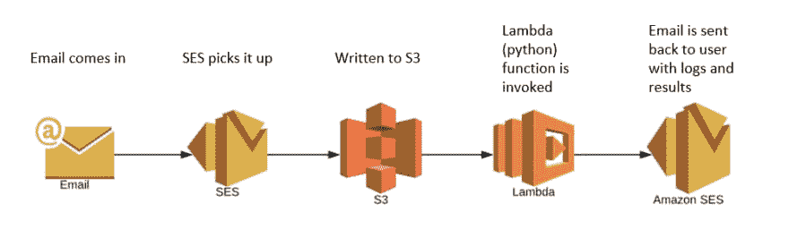
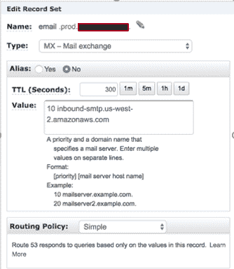
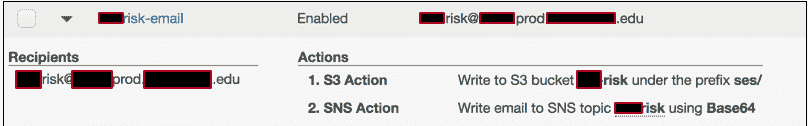
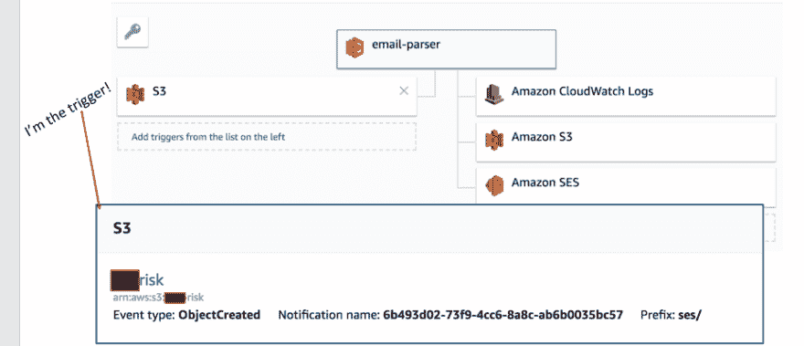
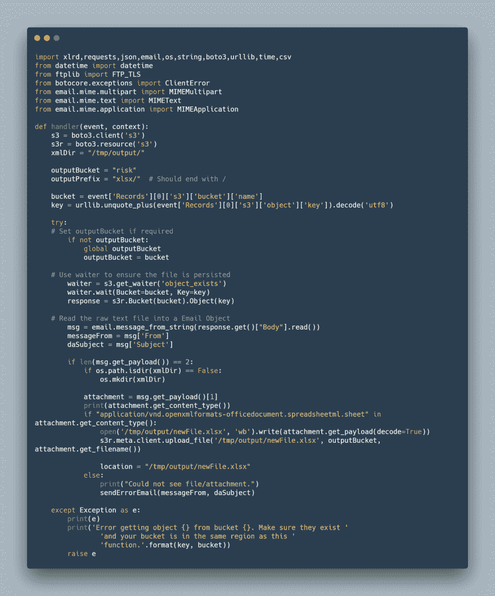

# 超越灯堆的思考

> 原文：<https://dev.to/tportela1/thinking-beyond-the-lamp-stack-3m6m>

你好。有几个人联系我，让我写一篇关于我完成的一个项目的帖子。这是那个帖子。

我最近有一个项目，我需要接受 excel 表格形式的用户输入，解析行和单元格，并将响应提交给第三方系统，同时为原始提交者生成日志。

嗯。

我立刻想到了一个传统的 LAMP (Linux，Apache，MySQL，PHP)栈网站，用户在那里登录，上传他们的表单，结果就出现在那里。

让我的用户经历这些额外的步骤似乎很麻烦。想想我要写的文档..

相反，我有不同的想法。工作环境中的大多数人都使用电子邮件。我如何利用这一点？

AWS 的 SES(简单电子邮件服务)、S3 和 Lambda。

我创建了一个部门邮箱，用于接收用户发来的带有附件的电子邮件，就像[risk@company.org](mailto:risk@company.org)一样简单，某些主题或短语会触发邮件规则，将电子邮件重定向到...aws-risk@email.prod.aws.edu[(详见下一段)。](mailto:aws-risk@email.prod.aws.edu)

为此，我利用 Amazon Web Services Route 53 创建了一个 DNS MX 记录——我将它命名为 email.prod.aws.edu。注意:在这个场景中，aws.edu 是 Route 53 中的注册域。

使用简单的电子邮件服务，我能够配置[aws-risk@email.prod.aws.edu](mailto:aws-risk@email.prod.aws.edu)在电子邮件到达时，立即将其内容保存到 S3 桶中。

这里是你们熟悉 Lambda 和 AWS 的人会“啊啊”的地方。Lambda 函数的触发器之一就是这个——一个在 S3 创建的对象！

“lambda 函数的一小段，用于检查在 S3 编写的项”

我能够用 Python 编写所有代码，解析工作表中的行和单元格，将内容发送到第三方系统，并通过 SES 将日志发送回用户。通过那个λ函数，那个令人敬畏的 S3 桶，当然，还有节目的主角，SES。