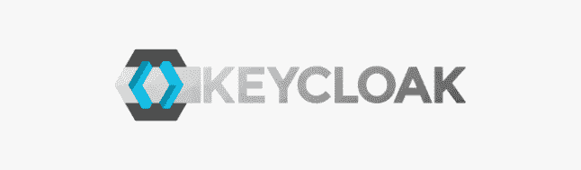

# 这就是为什么我用奇洛克？

> 原文：<https://dev.to/chokri/this-is-why-i-use-keycloak-2a2b>

大家好！今天，我将向您解释如何在保护您的 web 服务时节省时间。

作为开发人员，我总是在开始新项目时考虑用户注册、电子邮件确认和多重角色和访问的认证。对于一个自由职业者来说，这是一个巨大的任务，他想专注于项目的主要任务，暂时把这些事情放在一边。

当我开始一个 PHP 项目时，我总是使用由 [CakeDC](https://cakedc.com) 制作的[用户](https://github.com/cakedc/users)插件。这个工具很神奇，让我们可以轻松设置社交网站的登录/注册，比如 Twitter、Google 和脸书。

但是，Node JS 项目呢？我使用 Passport JS，这是一个很棒的软件包，可以保护我们的应用程序。

最近我在一个大项目中工作，我学到了很多关于我们如何识别用户以及用户如何从任何身份提供商登录的东西。

什么是 KeyCloak？

这是一个由 Red Hat 创建的 Java 解决方案，用于管理认证和授权。我们可以在不同的 Java 服务器上运行它，比如 Tomcat、JBoss 和 Jelly..我们可以像 MySQL、PostGres 或 Oracle 数据库一样配置它的数据源。它也支持 H2 数据库系统。

KeyCloak 支持 OpenID-Connect、Oauth 和 SAML 协议。它的主要功能是同时在许多应用程序中提供单点登录。比如说；当你连接到 Youtube 时，你也同时连接到 Gmail，对吗？但是，当你连接到其他应用程序，如 adsense，你不会自动连接。

想想看，当我们登录 Youtube 时，我们被重定向到谷歌帐户页面，而不是 Youtube 登录页面，这意味着谷歌帐户是所有谷歌产品的身份服务器。

假设您正在创建一个基于微服务架构的 web 应用程序。如何让用户注册不同的服务？

**许多领域同时出现**

想象一下，Google 上提供了一个新的应用程序，例如:GPizza Eat，如果我有一个 Google 帐户，我可以访问这个新应用程序吗？不幸的是没有。我必须订阅这个应用程序，因为同样的技术，当我们给外部谷歌应用程序访问我们的电子邮件地址。

因此，每个应用程序都可以驻留在不同的服务器上，用不同的语言编写。这些应用程序有不同的用户列表。

在 KeyCloak 中，这些不同应用程序被称为领域，每个领域都包含其用户并提供不同的客户端(应用程序)

KeyCloak 必须安装在高可用性系统中，比如 Kubernetes，Docker Swarm。它必须在 HTTPS 服务器下运行，在这种情况下，我建议安装 Nginx，并配置它将代理 443 端口改为 8443 端口。

这就是我使用 KeyCloak 的原因？最早出现在 [C.Khalifa](https://khalifa.tn) 上。