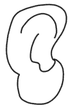
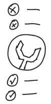
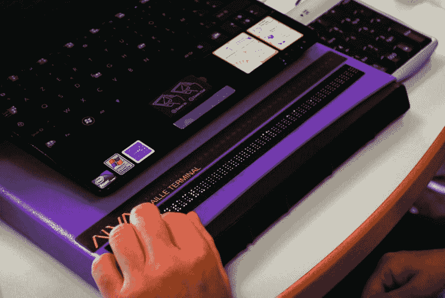

# 可访问性的三个测试

> 原文：<https://dev.to/conw_y/three-tests-for-accessibility-1hep>

有很多很好的理由让我们的软件应用变得可访问。但是为了实现这个目标，我们必须进行严格的可访问性测试。

这看起来是一个巨大的挑战:考虑到良好的可访问性有如此多的标准，并且应用程序本身在许多方面可能是复杂的，我们如何验证应用程序的所有部分都是可访问的？

由于无障碍是一个发展和演变的领域，我们不能假装有一个银弹或一个明确的答案。然而，我认为我们尽最大努力是值得的。

如果我们能够进行少量的测试，涵盖可访问性的最基本和最重要的基础，然后在应用程序的所有屏幕和组件上运行这些测试，那么我们至少可以说我们已经做出了重大的努力，最多可以说我们已经消除了产品可访问性的所有最明显和最重要的障碍。

## 检测原理

许多可访问性建议来源于 WCAG 指南，该指南基于 T2 的四项原则:

*   **可感知的** -信息和用户界面组件必须以用户能够感知的方式呈现给用户。

*   **可操作** -用户界面组件和导航必须可操作。

*   **可理解** -信息和用户界面的操作必须是可理解的。

*   **健壮** -内容必须足够健壮，能够被各种各样的用户代理可靠地解释，包括辅助技术。

我问了每个原则的一个基本问题:**什么样的测试可以验证这个原则得到了遵循？**

以下是我得出的答案:

*   **仅屏幕阅读器**。如果我可以完全通过屏幕阅读器收听应用程序来使用它，那么这个应用程序至少基本上是“以用户可以理解的方式呈现给用户”并且是“可以理解的”。

*   **纯键盘**。如果我可以只用一个键盘就完全使用这个应用程序，那么这个应用程序至少基本上可以通过一系列辅助技术来“操作”，这些技术通过与键盘相同的输入来操作。

*   **自动化测试**如果应用程序通过了自动化测试，使用适当的 WCAG 合规性测试工具，那么它可能足够“健壮”,可以被各种用户代理解释，并且满足“可感知”和“可操作”的某些基本技术标准。

## 三项测试

三个答案导致三个基本测试:

### 测试 1:仅屏幕阅读器

尝试使用应用程序，仅依靠**听到语音单词**。打开屏幕阅读器，然后关闭或离开屏幕。您可以使用键盘根据需要提供输入。

这将测试应用程序的结构是否能够通过另一种非视觉辅助技术(屏幕阅读器)有效地“呈现”给我。如果可以，那么它很可能在其他非视觉辅助技术上工作得一样好，这些技术依赖于屏幕阅读器所依赖的相同信息。

工具:

*   [画外音](https://help.apple.com/voiceover/mac/10.14/)(内置于 MacOS 和 iOS)
*   [对讲](https://support.google.com/accessibility/android/answer/6283677?hl=en-GB)(安卓内置)
*   [讲述者](https://support.microsoft.com/en-us/help/22798/windows-10-complete-guide-to-narrator)(内置于 Windows 10+)
*   [NVDA](https://www.nvaccess.org/) (其他版本的 Windows)
*   ChromeVox (所有操作系统上的 Chrome 浏览器)

### 测试 2:仅键盘

尝试使用应用程序，仅依靠**键盘输入**。将鼠标放好或断开连接，或者停用触控板。

这将测试应用程序是否可以通过一系列辅助技术“操作”,这些技术的操作类似于键盘。例如，语音识别工具或盲文键盘，它们解释信号的方式类似于键盘解释某些击键的方式。

工具:

*   只有你的键盘！

### 测试 3:自动化测试

在您的应用程序上运行自动化测试工具，分析输出并解决所有检测到的主要错误。

对于测试 1 和测试 2 无法捕捉到的一切，自动化测试工具可以提供一些覆盖面。当然，自动化工具只是一个软件，并不能取代有意识的、专注的人类注意力。然而，它可以捕捉到由于人为错误而可能被人忽略的明显错误。它还可以在很短的时间内彻底覆盖许多区域，而人类可能需要更长的时间。

工具:

*   [WAVE](https://wave.webaim.org/) by WebAIM(各大操作系统)。该工具分析任何网页，并提供详细的报告，涵盖整个 WCAG 规范，并突出错误。

## 手工测试的好处

您会注意到三个测试中有两个是完全手动的，并且不依赖于自动化工具。虽然手动测试比运行自动化工具更难，但我认为它提供了两个关键优势:

### 1。它揭示了任何自动化工具都无法捕捉的错误

通过实际尝试使用我们的界面，我们得到了这个问题的丰富的、定性的答案:“这有多有用？”。我们可以直接观察到界面什么时候是困难的，麻烦的，不清楚的，或者不可用的。我们也可以直接观察界面什么时候工作流畅，什么时候好用。

一个网页可能有完美的结构内容，语义 HTML 的正确使用和所有非文本内容的替代文本。但是，如果用户为了注册电子邮件提醒而不得不听完 3 分钟的音频，该怎么办呢？

这只是交互设计和/或代码中错误的一个例子，自动化测试工具通常不会发现这些错误。

通过像用户那样实际使用应用程序，我们可以直接识别自动化工具无法检测到的问题。

当然，我们自己手动测试应用程序不会像观察其他人尝试使用它那样给我们提供那么多信息。然而，它可能会揭示最大和最明显的可访问性问题，给我们一个机会来更快地解决它们。

### 2。它让我们站在用户的角度考虑问题

手工测试鼓励我们与用户产生共鸣。这种换位思考的心态是良好可用性的重要组成部分，因为它影响我们如何构建、构建什么以及我们优先考虑什么。

## 玩好辅助技术

在可用性测试期间，我从观察大量用户中学到的一个教训是**用户非常依赖辅助技术，独立于特定的应用程序**。

许多可访问性启示，从导航表单到与导航交互，都已经内置到屏幕阅读器和输入设备中，并且在不断改进和创新。

*   屏幕阅读器在解释界面和文本方面变得更好。
*   输入设备得到改进，以提供更精确和易于使用的启示；市场上出现了新的输入设备。
*   浏览器和操作系统正在改善用户体验中可访问性功能的集成。

我们应该**专注于确保我们的应用程序能够很好地与辅助技术配合**，而不是试图预测并在我们的应用程序中直接实现每一个可以想到的辅助功能。

我们应该简单地公开正确的结构和数据，让辅助技术从那里接手。例如，在富 web 应用程序中，这意味着使用正确标记的表单元素来标记字段和捕获表单输入。

## 结论

与其不堪重负而放弃可访问性，我们是否可以花些时间进行基本测试，让辅助技术来做大部分繁重的工作，从而更好地为用户服务？我觉得答案是肯定的！

通过简单而彻底的测试，并根据需要进行修正，我们将会很好地开发出为所有用户服务的产品。