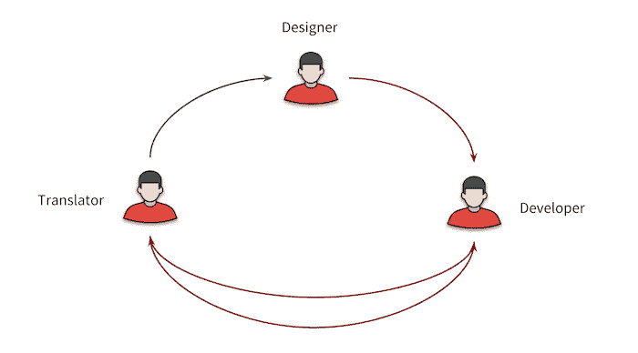

# 命名 i18n 转换键的三种方法

> 原文：<https://dev.to/omaiboroda/three-ways-to-name-i18n-translation-keys-2fed>

团队要么从一开始就进行应用程序的国际化，要么在交付主要语言之后进行。通常，翻译流程如下所示:

[](https://res.cloudinary.com/practicaldev/image/fetch/s--CtyObERt--/c_limit%2Cf_auto%2Cfl_progressive%2Cq_auto%2Cw_880/https://i.imgur.com/zbnBkXs.png)

<figcaption>Translation flow</figcaption>

从开发人员的角度来看，它包含 3 个步骤:

1.  从设计中接收内容，创建关键字并填充初始“en”翻译；
2.  向翻译者宣布密钥；
3.  偶尔获取最新的翻译。

创建翻译键很容易，但是很难做到

*   让翻译人员明白它们的意思；
*   让开发人员明白它们的含义；
*   在源文件中看起来不错；
*   避免翻译文件和源之间的频繁上下文切换；
*   帮助开发人员将代码块与页面上的“物理”表示进行映射。

已经有由 [Phraseapp](https://phraseapp.com/blog/posts/ruby-lessons-learned-naming-and-managing-rails-i18n-keys/) 和 [MDN](https://developer.mozilla.org/en-US/docs/Mozilla/Localization/Localization_content_best_practices) 编写的很好的 i18n 指南，但是它们没有回答我们应该如何命名翻译键本身。

为了从实现中抽象出来，我们同意翻译函数`t`，它接受一个翻译关键字并返回消息:

```
t('things') // => "How things work" 
```

### 选项 1 -有趣

您可能只有自定义的键，没有默认值。例如:

```
t('landing_page.how_things_work') // => "How things work" 
```

至于最初的翻译，需要将最初的消息添加到翻译文件中。

**优点**

*   在源文件中不占用太多空间
*   给译者足够的语境
*   随时准备随着时间而改变

**缺点**

*   如果关键字太普通，很难跟踪页面上显示的源和实际位置之间的关系
*   要设置初始消息，您需要从源文件切换到翻译文件

### 选项 2 -防弹

您可以同时指定- translation 键和默认消息:

```
t({
  key: 'landing_page.how_things_work', 
  defaultMessage: "Things explained"
}) // => "How things work" 
```

**优点**

*   灵活-你可以改变你的默认信息，不用担心它会引起问题；
*   你有一个来源和实际的视觉表现之间的联系。

**缺点**

*   可能会面临短键重复，例如`t({ key: 'general.errors.empty', defaultMessage: 'empty'})`；
*   用 id 和消息增加源的大小。

### 选项 3——直截了当。

您可以使用与英文邮件相同的文本:

```
t('How things work') // => "How things work" 
```

通过这种方式，我们消除了维护默认消息和为它们创建密钥的必要性。

**优点**

*   开发者维护单个实体；
*   让译者立即清楚应该翻译什么；
*   您可以将它们用作默认邮件。

**缺点**

*   为译者增加更多的上下文是值得的。这可以是对源代码文件名的提示(如。po 格式)或上下文编辑器；
*   有时你不得不翻译整段文字，这使得关键词太长；
*   需要额外的解决方案，为那些英语单词，有多重含义，即*哭*。

正如你可能已经理解的，没有 100%正确的定义翻译键，应该根据你的项目规模、你改变翻译的频率和团队偏好来做出决定。

在当前项目中，为了简单、易于维护和减少上下文切换，我们决定尝试“#3 简单明了”的方法。

但是怎么煮 i18n 钥匙呢？