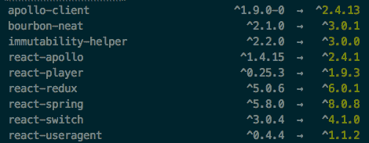

# TIL 关于自动碰撞 NPM 版本

> 原文：<https://dev.to/erinbush/til-about-automatically-bumping-npm-versions-4ca8>

需要更新一堆包吗？它们都有相似的范围*或名称吗？

`npm-check-updates`检查 package.json 文件中列出的软件包，并打印出可以更新到最新版本的软件包列表。

要安装:

```
npm install -g npm-check-updates 
```

然后，在您的项目文件夹中运行它:

```
ncu 
```

你会得到一些类似这样的输出:
[](https://res.cloudinary.com/practicaldev/image/fetch/s--SJBPdjTm--/c_limit%2Cf_auto%2Cfl_progressive%2Cq_auto%2Cw_880/https://thepracticaldev.s3.amazonaws.com/i/cj8dzofzcldlaeuki1ka.png)

如果你想让它自动升级你的 package.json 文件中的版本，你可以传入更新参数:

```
ncu -u 
```

如果您只是对某个范围或包感到好奇，您也可以用 regex 字符串运行它:

```
ncu '/^@npm.*$/' -u 
```

记住之后运行`npm install`来实际安装软件包，因为 npm-check-updates 只会更新您的`package.json`文件。

很快，你就为自己节省了一些非常繁琐的文件修改！

* * *

*PS:如果您需要按组织对包进行分组，npm 中的[范围非常有用。在下面的示例中,“npm”是范围。](https://docs.npmjs.com/about-scopes) 

```
@npm/package-name 
```

* * *

这篇文章最初发表在[我的博客](https://erinbush.postach.io/post/til-about-npm-check-updates)上