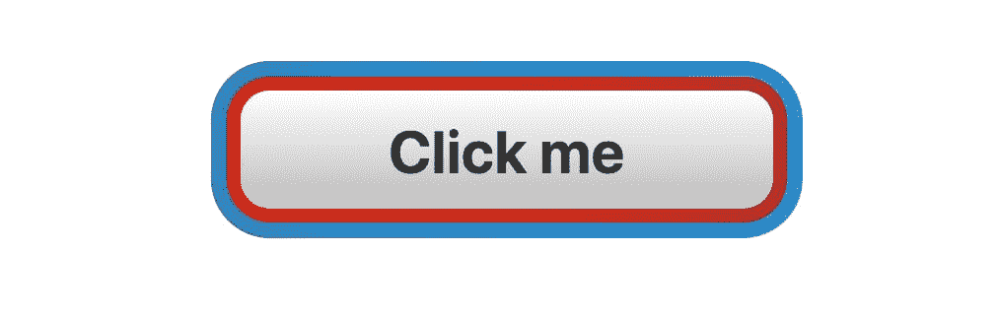

# 倾斜:背景剪辑可以为每个背景渐变单独配置

> 原文：<https://dev.to/stefanjudis/til-background-clip-is-configurable-for-every-background-gradient-separately-1c1>

今天，我看了一个由[安娜·都铎](https://twitter.com/anatudor)创作的密码本。[克里斯·科伊尔](https://twitter.com/chriscoyier)在一篇关于[新的 CSS-tricks 重新设计](https://css-tricks.com/design-v17/)的文章中介绍了这支笔，以解释他们如何创建一个特定的 UI 元素。

[](//images.ctfassets.net/f20lfrunubsq/6ZSY3CiSNPO39mGh5ce44o/e47cbe5fd4f05ac371683cb4ce9beca8/one-element.jpg)

我认为上述元素的迷人之处在于 Ana 只用了一个 HTML 元素来创建它。

```
<!-- this is all the markup 😲 -->
<nav id="css"></nav> 
```

Enter fullscreen mode Exit fullscreen mode

我创建了一个新的笔，并开始重新构建相同的 UI 元素，以了解 Ana 是如何构建它的。构建这个元素的代码有 40 行长，但是大部分魔法都发生在后台属性内部。

```
#css {
  // ...
  background: 
    linear-gradient(#333, #222) padding-box, 
    linear-gradient(90deg, #db1d60, #ed4f32) 
      0/ 50% no-repeat border-box, 
    linear-gradient(-90deg, #eb7d01, #ed4f32 .5*65vw, rgba(#ed4f32, 0)) 
      100% 101%/ 65% 75% no-repeat border-box;
} 
```

Enter fullscreen mode Exit fullscreen mode

这些线条很难理解，不可避免地要花一点时间(对我来说是多花一点时间)来理解里面发生了什么，但让我立即感到惊讶的是第一个梯度定义。

```
linear-gradient(#333, #222) padding-box 
```

Enter fullscreen mode Exit fullscreen mode

等一下。你能为背景属性中的每一个渐变定义背景剪辑吗？

事实证明你可以！

*(...我觉得我更明白了所有这些创意开发人员是如何用“一些渐变”制作出令人印象深刻的艺术品的*

您可以使用带有不同渐变和背景剪辑的 background 属性来创建彩色边框。通过组合使用`border-box`、`padding-box`和`content-box`，你甚至可以在没有任何伪元素的情况下设计两种不同的边框。🎉

```
#css {
  /* padding defines the width of the red gradient background (2) */
  padding: .25em;

  /* border-width defines the width the blue gradient background (3) */
  border: .25em solid transparent;

  background: 
    /* (1) most inner gradient */
    linear-gradient(to bottom, #fff, #bbb) content-box,
    /* (2) red gradient */
    linear-gradient(to right, #e94332, #a91302) padding-box,
    /* (3) blue gradient */
    linear-gradient(to right, #0867a6, #4aa9e8) border-box;
} 
```

Enter fullscreen mode Exit fullscreen mode

[](//images.ctfassets.net/f20lfrunubsq/2Mqbhl8isIyqkLKov0DHgy/15153527c812f956fea85b0e1b27439e/button.jpg)

如果你想知道更多关于背景剪辑属性，`content-box`或`padding-box`——Ana Tudor 写了[一篇关于 CSS 的大文章——tricks](https://css-tricks.com/the-backgound-clip-property-and-use-cases/)正是关于这个主题。

此外，如果你对如何创建渐变边框感兴趣，最近有一篇文章发表在了这个主题上。

尽情享受吧！