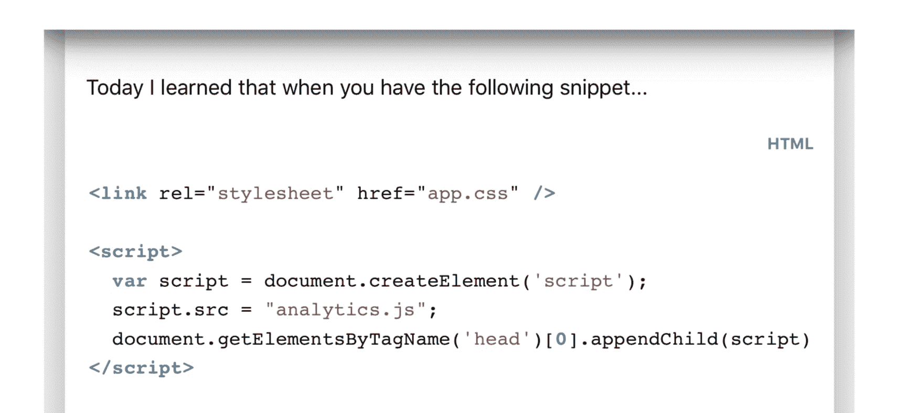
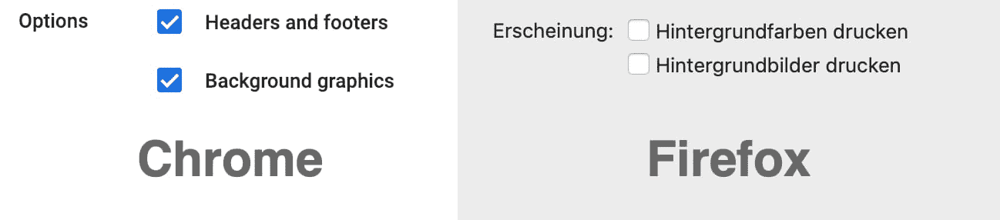
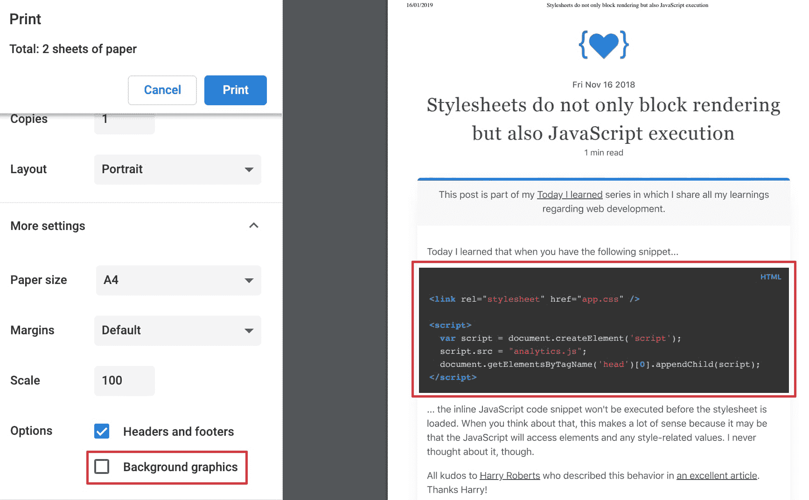

# TIL: `color-adjust '胜过有关后台打印的用户代理设置

> 原文：<https://dev.to/stefanjudis/til-color-adjust-trumps-user-agent-setting-about-background-printing-573l>

我们来谈谈印刷品，好吗？:D

我很少打印东西(我没有打印机)，但是最近我发现了一个我以前从未听说过的 CSS 属性。

以下是您将在 MDN 上找到的关于该酒店的信息。

> CSS 属性设置用户代理可以做什么来优化元素在输出设备上的外观。默认情况下，允许浏览器根据输出设备的类型和功能对元素的外观进行任何必要和谨慎的调整。

我觉得这很有趣，于是打开我的网站，看看印刷版本会是什么样子。

我发现 Firefox 确实把包含的代码块的颜色改成了白底黑字。它颠倒了颜色。

## 浏览器具有控制背景颜色和图像打印的配置选项

事实证明，您可以在特定的浏览器对话框中控制打印行为。Chrome 在“更多设置”下包含一个隐藏设置“打印背景图形”，可以控制我的黑暗代码块的行为。

Firefox 甚至走得更远，让你决定是否想要图形或背景颜色有单独的选项。

(不知什么原因，我的机器上的 Firefox 更喜欢德语...)

有了这些选项，用户可以在打印网站时选择退出“昂贵的打印操作”以节省一些墨水。

## `color-adjust`胜过一切

CSS 属性`color-adjust`(在 Firefox 中受支持，在 Chrome、Safari 和 Opera 中带有前缀(`-webkit-print-color-adjust`)允许您明确定义不希望用户代理弄乱您的颜色——即使是打印也不行。

它接受值`economy`(默认值)和`exact`。例如，如果选择设置`exact`，无论设置或不设置什么配置选项，我的文章中的代码块的黑色背景都会被打印出来。

我认为在某些情况下，即使在打印时保留背景色和图像也是有意义的——让我们看看这个 CSS 属性对我这个没有打印机的人有什么价值！🙈