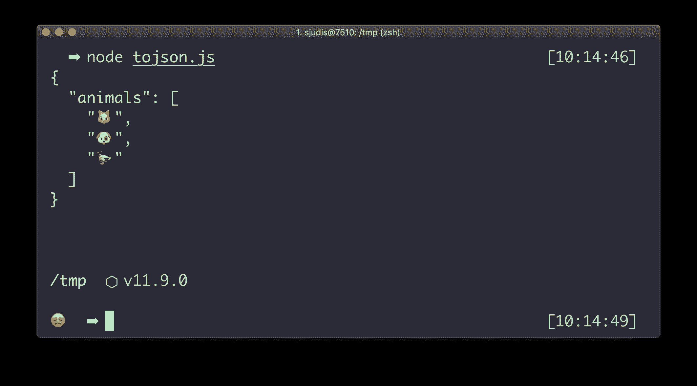

# TIL: JSON.stringify 考虑了 toJSON 方法

> 原文：<https://dev.to/stefanjudis/til-json-stringify-takes-tojson-methods-into-consideration-389>

我正在阅读[瓦列里·卡尔波夫](http://thecodebarbarian.com/the-80-20-guide-to-json-stringify-in-javascript.html)的`JSON.stringify`关于的这篇伟大的文章，这时我发现了一些我以前不知道的东西。

您可以使用`JSON.stringify`来序列化对象，并将它们存储在`localStorage`中。原来，`JSON.stringify`检查要序列化的对象是否包含一个`toJSON`方法。如果是，它将使用此方法来计算序列化的结果。

```
const zoo = {
  animals: {
    list: ['cat', 'dog', 'duck'],
    // toJSON will be called by JSON.stringify
    toJSON: () => {
      return ['🐱', '🐶', '🦆']
    }
  }
}

console.log(JSON.stringify(zoo, null, 2)); 
```

Enter fullscreen mode Exit fullscreen mode

通过包含一个`toJSON`方法，您可以操纵应该进入序列化的数据。例如，您可以使用此功能来清理日志，并且不在数据库中存储敏感信息。很可爱。👌

[](//images.ctfassets.net/f20lfrunubsq/6L35ZznZmar8feyRjVpm3N/dfaede58c11d8d930ab38b608600bcd1/Screenshot_2019-06-04_at_10.14.56.png)

如果你想了解更多，你可以查看 MDN 或者看一看由 T4 写的探索 JavaScript 的章节。