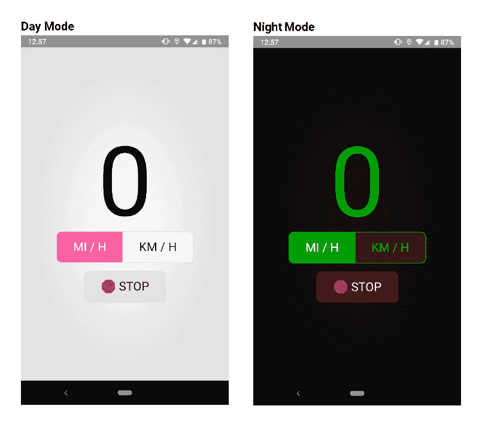

# 微型 pwa 和为什么我一直在建造它们

> 原文：<https://dev.to/justinribeiro/tiny-pwas-and-why-i-keep-building-them-3k4j>

我并没有打算开发微小的渐进式网络应用程序。嗯，那不是真的；我开始构建 pwa 来解决我生活中的特殊问题，但最终都很小。然后就变得好玩了。

你看我的车，一辆 2005 年的普锐斯，在仪表板上有一个可怕的小故障，仪表板就是不工作。没有速度计，没有油量计，什么都没有。我可以通过做一些焊接工作来修复它，但这需要我拆掉仪表板，这相当耗时。

我的孩子也有一个特殊的问题；他们喜欢在黑暗中睡觉，但非常渴望莫妮卡或我给他们朗读。很多。他们正处于哈利波特阶段，这意味着你正在*阅读*。这是一项严肃的工作，充满了乐趣。他们喜欢我做的小阅读灯，这意味着他们每天都会失踪。

以上两种情况都会让人说“肯定有一个这样的应用程序！”快速浏览可以看到带有广告和 30MB 下载重量的速度计应用程序，以及带有 5MB 广告的简单屏幕灯。

我集体叹了口气。在我看来没有一个是合理的。也许我脾气不好。可能我已经不太相信应用商店里的东西了。这是一个混合的包。

这让我陷入了困惑:我要多快才能像 PWAs 一样构建这类应用程序？我在 web 平台上有足够的 API surface 吗？

对于速度计，我们可以看看[地理定位 API](https://developer.mozilla.org/en-US/docs/Web/API/Geolocation) 。地理定位 API 有一个位置接口，其中包含一个坐标对象 coords。这个坐标接口不仅包含您可能期望的内容(纬度、经度)，还包含一个称为速度的属性，它表示为设备速度，单位为米每秒。Android 上的 Chrome 不费吹灰之力就返回了这个道具，在这一点上，它只是一个做 mph/kmh 转换的快速数学问题。

[](https://res.cloudinary.com/practicaldev/image/fetch/s--dmJ4o4s3--/c_limit%2Cf_auto%2Cfl_progressive%2Cq_auto%2Cw_880/https://storage.googleapis.com/jdr-public-imgs/blog/20190131-car-dashboard-pwa.jpg)

也就是说，车速表和阅读灯都有问题；我们如何保持屏幕打开？幸运的是，有一个新的 API 可以使用，叫做 WakeLock API。

[唤醒锁 API](https://www.w3.org/TR/wake-lock/) 允许我们防止我们的设备进入省电模式，并且通常使用简单的一点代码来防止屏幕关闭:

```
const startWakeLock = () =\> { try { navigator.getWakeLock("screen").then((wakeLock) =\> { appOpts.wakeLock = wakeLock.createRequest(); }); } catch(error) { // no experimental wake lock api build } } 
```

现在，这个 API 可能会发生变化([欢迎评论](https://github.com/w3c/wake-lock/issues))，因为我们仍在尝试整理权限模型的外观。你也可以读一读皮特·莱佩奇最近写的一篇关于此事的文章， *[我醒了！使用唤醒锁 API](https://developers.google.com/web/updates/2018/12/wakelock)* 保持清醒。但是，当在 Chrome 中翻转标志时，API 按预期工作，给了我构建所述 PWAs 的能力。

沿着这些思路，chrome://flags # enable-generic-sensor-extra-classes 后面的实验性 [AmbientLightSensor API](https://developer.mozilla.org/en-US/docs/Web/API/AmbientLightSensor) 也允许我检测外面什么时候是黑暗的，允许我用很少的代码工作就有一个合适的低光风格:

```
const startAmbientSensor = () =\> { if ('AmbientLightSensor' in window) { navigator.permissions.query({ name: 'ambient-light-sensor' }) .then(result =\> { if (result.state === 'denied') { return; } const sensor = new AmbientLightSensor({frequency: 0.25}); sensor.addEventListener('reading', () =\> { if (sensor['illuminance'] \< 3 && !appOpts.dom.body.classList.contains('dark')) { appOpts.dom.body.classList.toggle('dark'); } else if (sensor['illuminance'] \> 3 && appOpts.dom.body.classList.contains('dark')) { appOpts.dom.body.classList.toggle('dark'); }; }); sensor.start(); }); } } 
```

最终结果是，基于我们的流明平滑切换，非常令人愉快:

[](https://res.cloudinary.com/practicaldev/image/fetch/s--yx_XDXta--/c_limit%2Cf_auto%2Cfl_progressive%2Cq_auto%2Cw_880/https://storage.googleapis.com/jdr-public-imgs/blog/20190131-day-night-mode.png)

最终结果[速度表 pwa](https://speedometer.pwa.run/) 小得惊人；速度表只有 1.7KB，阅读灯 800B。服务工作者也很小，因为它不需要太努力地工作，因为我们除了版本索引文件之外，大部分时间不处理任何东西。你可以在 Github 上抢着看一下源代码:[justinribeiro/speedometer-pwa](https://github.com/justinribeiro/speedometer-pwa)。

[屏幕阅读灯](https://readinglight.pwa.run/)同样尺寸较小，在 Github 上也有:[justinribeiro/reading light-pwa](https://github.com/justinribeiro/readinglight-pwa)。

这两个小小的 PWA 实际上只是我小小的 PWA 的一小部分；我已经开始做各种各样的了。把它们都写下来，然后推送到 Github，嗯，我还在努力。今天是假期，去告我吧。:-)

与此同时，尝试一些新的网络平台 API，让小小的 PWA 写点东西。你可能会从中找到一些乐趣！🎉