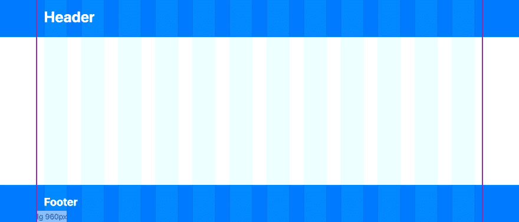
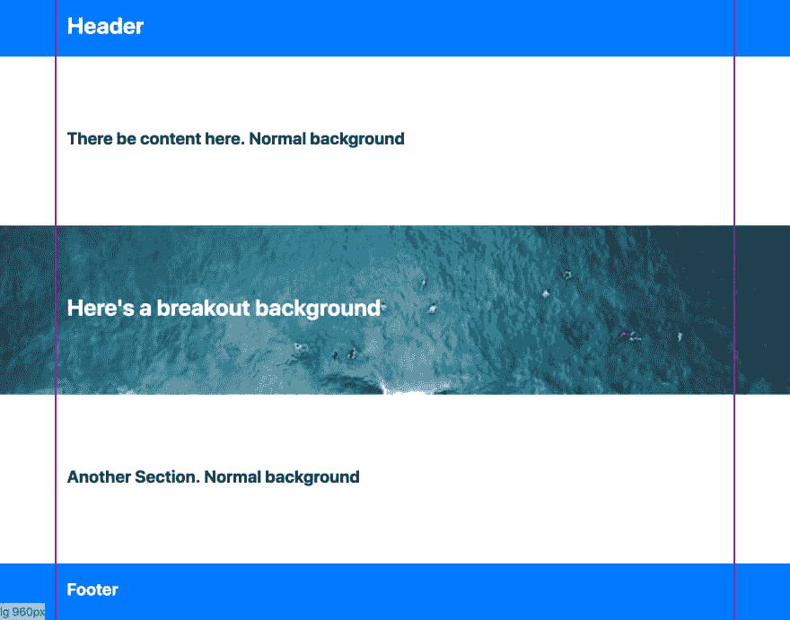
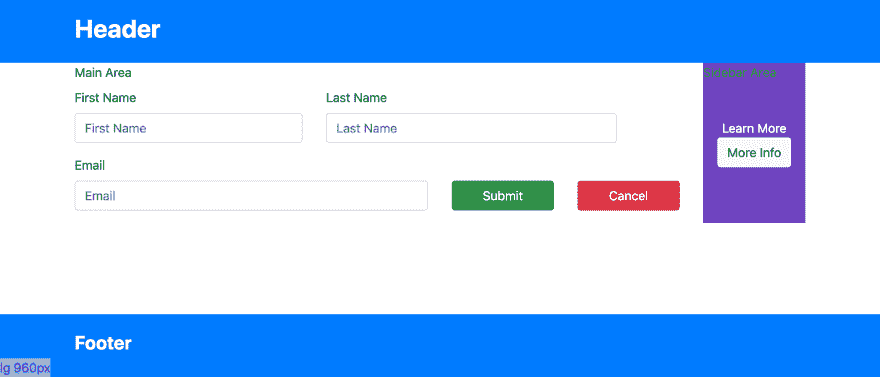
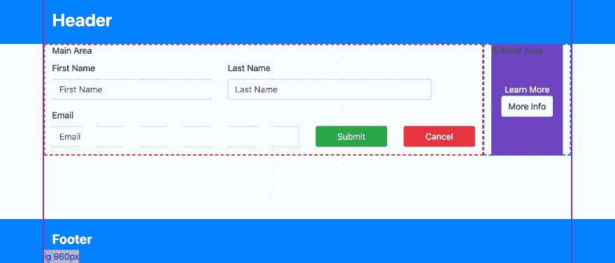
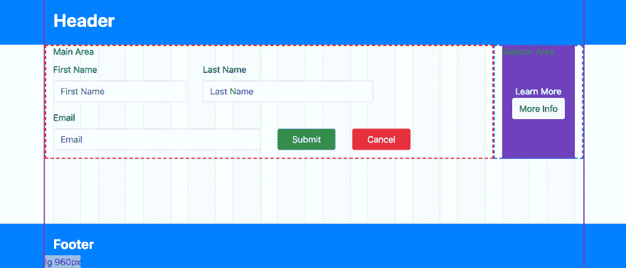
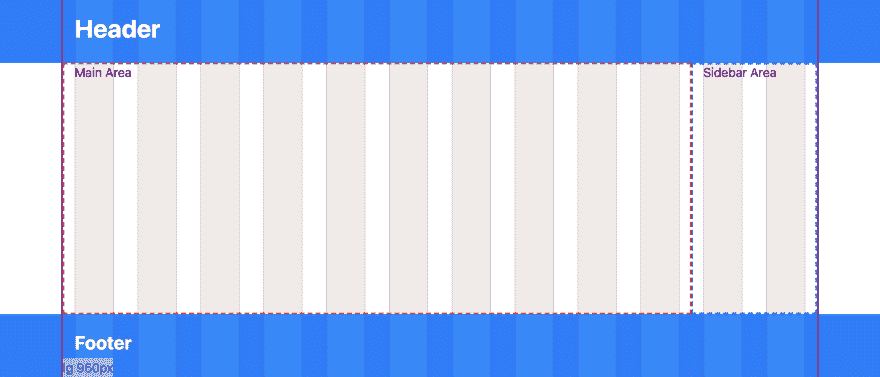

# 使用 CSS 网格的提示

> 原文：<https://dev.to/pauldmooney/tips-for-working-with-css-grids-5ab3>

## 网格概述

在网站中创建响应式布局的常见做法是使用网格。网格是设计人员和开发人员使用的工具，用于帮助布局页面，对齐页面内的元素，并帮助定义这些元素在不同屏幕尺寸下应占页面的多少。

一个非常常见的实现是 12 列网格，它通常用于帮助沿“列”水平排列元素。它们由三个要素组成:

1.  一个网格容器，它定义了站点的左右边界(或宽度)。
2.  一行，用于布置网格单元格，并负责在单元格不合适时换行。
3.  一个单元格，占用一行空间。大多数时候，单元格占据了网格宽度的十二分之一，这就是我们得到 12 列效果的原因。

[ ](https://res.cloudinary.com/practicaldev/image/fetch/s--buhxfMb7--/c_limit%2Cf_auto%2Cfl_progressive%2Cq_auto%2Cw_880/https://thepracticaldev.s3.amazonaws.com/i/ekk6oq4rgdap0cx7dtm8.png) *洋红色轮廓显示网格容器的边框。半透明条表示网格中单元格将与之对齐的列。*

这在流行的 CSS 框架中以某种形式出现，如 [Bootstrap](https://getbootstrap.com/docs/4.0/layout/grid/) 或 [Foundation XY Grid](https://foundation.zurb.com/sites/docs/xy-grid.html) ，但如果你的浏览器支持，也可以在原生 CSS-grid 中实现。所有这些系统都能够创建 12 列网格之外的其他类型的布局，但出于此目的使用它们仍然是一种流行的选择。

使用这样的网格系统并不完全是小事，有些事情并不直观，或者需要一些变通方法。以下是使用网格的一些提示。

*这篇文章将集中在用 [Sass](https://sass-lang.com/) 在 Bootstrap 中实现技巧，尽管这些概念也可以应用于其他系统。*

## 突破背景

一个常见的网站设计特征是背景一直延伸到视窗的左右边缘，而网站的主要元素仍然限制在网格内。我们称之为“突破背景”。

[ ](https://res.cloudinary.com/practicaldev/image/fetch/s--uiFIha5y--/c_limit%2Cf_auto%2Cfl_progressive%2Cq_auto%2Cw_880/https://thepracticaldev.s3.amazonaws.com/i/5a04jhgm2stzm43e25r0.png) *在这个设计中，页面的几个部分有超出网格容器的背景(洋红色轮廓)*

简单的解决方案是创建一个全宽的 div，给它一个背景样式，然后在这个 div 中放一个网格容器。冲洗并重复这一过程的每一部分，需要突破背景。这可能行得通，但很难看。为了支持样式，html 的结构已经妥协了，这可能会对你如何编写你的站点设置一些严格的限制。

我们的目标是，我们希望整个网站有一个单一的网格容器，并且仍然有这些突破背景。我们可以完全用 CSS 来实现这一点，而不用弄乱我们的 html 结构。

诀窍是，我们在希望有突破背景的元素上使用一个伪元素，然后给它分配一些背景样式。然后，我们将伪元素扩展到视口的边缘。

首先，我们从一个类开始，它有一个伪元素，位于 Z 轴上其父元素的内容之后:

```
// Apply this class to elements which should have breakout backgrounds
.breakout-background {
  position: relative;
  z-index: 0; // establish stacking context for breakout

  // Breakout background pseudo element
  &:before {
    content:'';
    position: absolute;
    top:0;
    height: 100%;
    width: 100vw; // Takes up 100% of the viewport width
    z-index: -1; // pseudo element is behind its parent
    background-color: blue;
  } 
```

棘手的部分是水平定位元素，使它的`left`值位于视窗的最左侧。我们希望它向左移动半个视口宽度，但是由于它是从网格容器的左侧开始移动的，我们必须考虑网格容器的大小。所以在它向左移动了半个视窗宽度后，它需要再向右移动半个网格容器宽度:

```
 left: calc(-100vw / 2 + #{$container-max-width} / 2); 
```

现在我们必须弄清楚网格容器的宽度是多少。在 Bootstrap 中，每个断点都有不同的宽度，所以我们需要每个断点的左边位置也不同。我们可以通过循环 Bootstrap 提供的可用断点来实现这一点:

```
@each $breakpoint, $container-max-width in $container-max-widths {
  @include media-breakpoint-up($breakpoint, $grid-breakpoints) {
    left: calc(-100vw / 2 + #{$container-max-width} / 2)
  }
} 
```

我们最终的输出如下所示:

```
@import '~bootstrap/scss/variables';
@import '~bootstrap/scss/bootstrap-grid';
@import '~bootstrap/scss/mixins';

// Apply this class to elements which should have breakout backgrounds
.breakout-background {
  position: relative; // establish breakout positioning ancestor
  z-index: 0; // establish stacking context for breakout

  // Breakout background pseudo element
  &:before {
    content:'';
    position: absolute;
    height: 100%;
    top:0;
    width: 100vw; // Takes up 100% of the viewport width
    z-index: -1; // pseudo element is behind its parent
    background-color: blue;

    // Different left position for each breakpoint
    @each $breakpoint, $container-max-width in $container-max-widths {
      @include media-breakpoint-up($breakpoint, $grid-breakpoints) {

        // Position -50% of viewport width, then readjust right again half the grid container width
        left: calc(-100vw / 2 + #{$container-max-width} / 2)
      }
    }
  }
} 
```

现在我们可以在任何需要背景突破的地方添加这个类:

```
<div class="row breakout-background different-background">
  <div class="col">
    <h1>Here's a breakout background</h1>
  </div>
</div> 
```

甚至使用 Sass 继承或者通过添加一个简单的修饰符类来覆盖背景样式:

```
.different-background:before {
  background-image: url('./myImage.png');
  background-size: cover;
} 
```

## 嵌套网格与设计器

当设计者创建一个 12 列的网格模型时，它不仅用于总体布局，而且还经常将更多的特定元素与这些网格列对齐。这很好，因为它减少了为各种元素创建自定义宽度的额外工作，这些元素可以以与网格其余部分一致的方式缩小尺寸，并且可能在视觉上更具吸引力。

问题是那些讨厌的设计者不知道你需要如何组织你的页面(他们也不应该知道！).你是在互相嵌套的盒子里构建你的页面，而不是一行一行，这就导致了嵌套网格的问题。

嵌套网格就像它们听起来的那样。嵌套在现有网格单元更深处的网格。

我们举这个例子来说明问题。

一个设计师创建了这样一个实体模型:
[ ](https://res.cloudinary.com/practicaldev/image/fetch/s--wqAuaxK0--/c_limit%2Cf_auto%2Cfl_progressive%2Cq_auto%2Cw_880/https://thepracticaldev.s3.amazonaws.com/i/etihqfr0go3fnz2eslh3.png) *这个设计师是一个慈善案例。他的名字叫保罗。*

这是与设计师的网格覆盖图相同的设计，以显示组件与网格列的对齐以及主区域和侧栏的分离。
[T3】](https://res.cloudinary.com/practicaldev/image/fetch/s--QpRkxPlD--/c_limit%2Cf_auto%2Cfl_progressive%2Cq_auto%2Cw_880/https://thepracticaldev.s3.amazonaws.com/i/h8m9lyiwbun5b0o85sr8.png)

问题是，到了实现设计的时候，我们可能会得到这样的结果:
[ ](https://res.cloudinary.com/practicaldev/image/fetch/s--93pu-ICp--/c_limit%2Cf_auto%2Cfl_progressive%2Cq_auto%2Cw_880/https://thepracticaldev.s3.amazonaws.com/i/8ak2iqz90plr5xqxlcv3.png) *添加了网格覆盖来说明元素的错位*

我们在主区域开始了一个嵌套的网格，它本身被限制在网格中的一个单元格内。现在不再有一组 CSS 类来帮助我们正确地调整元素的大小。网格中的列占其父列的 1/12(或%8.3)。在这种情况下，我们有一个已经占整个网格 10/12(或 83%)的父区域(主区域)。在其中嵌套一个网格，得到的列大约是整个网格容器的 6.9%。它们永远不会与设计者的网格(即整体网格)对齐。

[ ](https://res.cloudinary.com/practicaldev/image/fetch/s--4LWJcPRc--/c_limit%2Cf_auto%2Cfl_progressive%2Cq_auto%2Cw_880/https://thepracticaldev.s3.amazonaws.com/i/ox175i9x50x3ciunnhgj.png) *红色条显示嵌套网格中的列。在它们与整体网格列重叠的地方，它是灰色的。因为它们没有排成一行，所以没有完美的重叠。*

我们需要一组新的 Bootstrap 的`col-*`类，用于整个网格的 10/12 的嵌套网格。幸运的是，Bootstrap 有一些 Sass mixins 来简化这个过程。它附带了一个名为`make-grid-columns`的 mixin，该 mixin 将您希望网格的列数作为参数，然后是一个“中缀”名称到断点的映射。使用现有的来自 Bootstrap 变量的`$grid-breakpoints`地图，我们可以创建十列网格，如下所示:

```
@import '~bootstrap/scss/bootstrap-grid';
@import '~bootstrap/scss/mixins';
@import '~bootstrap/scss/variables';

$breakpointsCustomColumns: (
  xs10: map-get($grid-breakpoints, xs),
  sm10: map-get($grid-breakpoints, sm),
  md10: map-get($grid-breakpoints, md),
  lg10: map-get($grid-breakpoints, lg),
  xl10: map-get($grid-breakpoints, xl),
);

@include make-grid-columns($columns: 10, $breakpoints: $breakpointsCustomColumns ) 
```

这将为`xs`断点产生类`col-xs10-1`、`col-xs10-2`，直到`col-xs10-10`。同样适用于`col-sm10-1`、`col-md10-1`、`col-md10-2`等。对于剩余的断点。断点映射中的键被用作单词`col-`和末尾的列号`col-${infix}-${columnwidth}`之间的“中缀”值。我们现在可以创建 1/10 宽度的网格。在嵌套网格中使用这些新的类可以让我们与整个网格完美地对齐。
[ ](https://res.cloudinary.com/practicaldev/image/fetch/s--q6rJ6eZD--/c_limit%2Cf_auto%2Cfl_progressive%2Cq_auto%2Cw_880/https://thepracticaldev.s3.amazonaws.com/i/c1upuyhvgtp1pnvq8hyl.png) *请注意两个网格列如何完美地重叠蓝色和红色，从而创建灰色条。*

现在我们可以更进一步，为其他嵌套网格宽度创建其他 col-*类:

```
@mixin make-custom-grid-columns($columns) {
  $breakpointsCustomColumns: (
    xs#{$columns}: map-get($grid-breakpoints, xs),
    sm#{$columns}: map-get($grid-breakpoints, sm),
    md#{$columns}: map-get($grid-breakpoints, md),
    lg#{$columns}: map-get($grid-breakpoints, lg),
    xl#{$columns}: map-get($grid-breakpoints, xl),
  );

  @include make-grid-columns($columns: $columns, $breakpoints: $breakpointsCustomColumns )
}

$customColumnCounts: 5,7,8,9,10,11;

@each $customColumn in $customColumnCounts {
  @include make-custom-grid-columns($customColumn);
} 
```

就是这样！我们现在有了其他尺寸的网格列，可以用来将子网格列对齐到设计者正在对齐元素的整个网格。`col-sm5-1`、`col-sm5-2`、`col-md7-5`等。您可能已经注意到，我们跳过了为宽度为 2、3、4 和 6 的轴网创建柱。这是因为它们都被平均分成 12 列，所以默认的 12 列网格可以用于这些情况。

## 格子是给父母的。不适合孩子

这篇技巧更像是使用任何类型的网格系统和基于组件的应用程序框架(如 Angular、React、Vue 或 Web 组件)的通用指南或最佳实践。提示是这样的:组件不应该知道它被放入的网格。

原因是可重用性，以及知道在父组件和子组件之间划一条线。

我在说什么呢？以 12 列网格为例，父组件可能正在使用行设置布局。这很有道理。但是布置单元也应该落在父母的责任上。子组件上不应该有任何显示“我占用了 3 列...有事”。

这里有一个坏习惯的简单例子:

```
 <!-- the Parent component -->
<div>
  <h1>I'm the parent!</h1>
  <div class="row">
    <app-mychild></app-mychild>
  </div>
</div>

<!-- The child component 'app-mychild'. Assumes it needs to take up 6 columns -->
<div class="col-md-6 child-style">
  <h2>I'm the child!</h2>
  <!--  some other important child component stuff here-->
  ...
</div> 
```

这里有一个良好实践的例子:

```
 <!-- the Parent component. Decides how much space to give the child. -->
<div>
  <h1>I'm the parent!</h1>
  <div class="row">
    <div class="col-md-6">
      <app-mychild></app-mychild>
    </div>
  </div>
</div>

<!-- The child component 'app-mychild' -->
<div class="child-style">
  <h2>I'm the child!</h2>
  <!--  some other important child component stuff here-->
  ...
</div> 
```

在上面这个很好的例子中，子元素没有耦合到任何特定的网格布局。它可以在其他需要占用更多或更少空间的地方重用。从布局的角度来看，子组件的责任是要么占据父组件给它的 100%的空间，要么根据场景只占据显示其内容所需的空间。

该规则可能有一些例外，比如子组件只与父组件一起存在，并且永远不会在其他任何地方重用，但通常遵循该规则可能仍然是一个好主意，这样我们就知道在布局责任上的界限在哪里。

这条规则并不意味着一个子组件不能有自己的网格布局，来布局它自己的子组件。只要完全存在于子组件中的网格不会渗透到它自己的子组件中，这就很好。