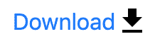

# 网站图标提示

> 原文：<https://dev.to/pauldmooney/tips-for-your-site-s-iconography-5d63>

## 选择你的图标方法

在每个网络应用开发之初，都有图标问题。我们使用哪个图标库？有很多可以选择的:[字体牛逼](https://fontawesome.com/)、[堡垒牛逼](https://fortawesome.com/)、[名词项目](https://thenounproject.com/)、[材质设计图标](https://material.io/tools/icons/)、 [IcoMoon](https://icomoon.io/) 。通常这个选择取决于设计者(如果你有一个的话)，但是作为一个开发者，你的选择是使用 SVG 作为图标还是图标字体。SVG 和图标字体各有利弊，你可以找到更好的文章，比如[这篇](https://css-tricks.com/icon-fonts-vs-svg/)。以下是我的快速对比:

SVG Pros:

*   SVG 通常比字体更清晰。
*   您可以专门挑选并下载您想要的 SVG。
*   对齐 SVG 更简单，也更容易预测，因为它们不容易受到奇怪的字体规则的影响，比如行高，行高会增加不必要的空白。

SVG 缺点:

*   在 CSS 中，不能以所有浏览器都支持的方式对外部 SVG 着色。

图标字体优点:

*   通过设置包含元素的“颜色”属性，可以很容易地对其进行着色。

图标字体缺点:

*   当字体加载时，或者如果加载失败，你会看到这样的方块□或者图标的连字。例如，您将在图标应该出现的地方看到文本“get_app”。
*   由于字体规则的应用，字体图标可能更难对齐(如上所述)。
*   更难对屏幕阅读器隐藏。

简单比较之后，由您决定，但我将使用 SVG 图标，至少在本文的其余部分是这样；)

## 内联 SVG 与外部 SVG

内联 SVG，其中 SVG 定义是 [html 文档](https://css-tricks.com/using-svg/#article-header-id-7)的一部分，而外部 SVG 是下一个选择。

这个选择主要取决于你对图标的看法:图标是你的 web 应用程序风格或主题的一部分吗，是完全由 CSS 控制的吗？或者图标是 web 应用程序组成的一部分，意味着你的 html 有额外的标记来支持图标？

如果你的想法是前者，那么恭喜你做出了正确的选择！或者至少从纯粹主义者的角度来看是这样的，如果你计划将 web 应用程序的主题作为一个独立的问题来处理，这是肯定的。

内联 SVG 仍然很棒，因为您可以灵活地使用 CSS 来选择和着色它们的元素。或者它们可以是动画的，但是今天网络上的很多图标设计是静态的和单色的。如果你不需要彩色的动画图标，那么你就不需要用额外的内嵌 SVG 标记污染你的 HTML，模糊主题和内容结构之间的界限。

## 使用外部 SVG 图标

一般来说，处理 SVG 图标的最佳方式是将它们作为背景图像加载进来。这样屏幕阅读器会避开它们，我们也不需要添加额外的 [ARIA](https://developer.mozilla.org/en-US/docs/Web/Accessibility/ARIA) 属性来说明它们只是表示。

为什么图标演示只有你说？图标本身对屏幕阅读器来说没有任何意义。它意味着用一种速记的方式向视力正常的用户传达(额外的)意思，而不必用文本消耗宝贵的屏幕空间。例如，在一个按钮上有是有用的，但是这个按钮应该已经有 ARIA 属性来描述它的意思。

### SVG 图标作为背景图像

对于我们要添加 SVG 图标的按钮之类的东西，我们将从设置一个可重用的 mixin 开始，它以图标的路径和图标的大小(假设为正方形)作为参数。这个 mixin 将覆盖我们通常应用于每个图标的所有属性:

```
@mixin createIconStyle($path-to-svg, $icon-size) {
  background-image: url('~/../src/#{$path-to-svg}');
  background-repeat: no-repeat;
  background-size: $icon-size auto;
  background-position: center;
  height: $icon-size;
  width: $icon-size;
} 
```

然后我们可以使用 mixin:
为图标设置一个特定的 css 类

```
.download-icon {
  @include createIconStyle('/assets/baseline-get_app-24px.svg', 2rem)
} 
```

*注意:我的例子使用了 [webpack](https://webpack.js.org/) ，这就是为什么它有奇怪的“~/..”添加到图标路径的前面。*

现在我们可以自由地将这个样式类添加到一个下载按钮:

```
<button class="btn btn-primary download-icon" aria-label="Download the thing"></button> 
```

[](https://res.cloudinary.com/practicaldev/image/fetch/s--WEaESQ9C--/c_limit%2Cf_auto%2Cfl_progressive%2Cq_auto%2Cw_880/https://thepracticaldev.s3.amazonaws.com/i/v2movjcnubhug1cmjwy4.png)

*带图标的下载按钮。注意:在这个例子中，我把图标改成了白色，因为默认的蓝底黑字看起来很糟糕。*

#### 图标的数据网址

数据 URL 是将你的 CSS 和图标捆绑到同一个 HTTP 请求中的好方法，尽管有一些好的和一些模糊的理由说明[这样不好](https://github.com/angular/angular-cli/issues/13355#issuecomment-451089973)。如果处理得当，这仍然是一件好事。尤其是如果您还没有使用 HTTP/2 的话。主要关注的是避免重复的数据 URL，否则它很容易使你的 CSS 资产快速膨胀。

有了 Sass，我们可以很容易地通过继承来避免这种重复。假设我们想要制作一个比原来大一倍的`.download-icon-large`，那么我们只需继承原来的并覆盖它的属性。如果这种情况足够常见，就有可能把它混合起来:

```
@mixin overrideIconSize($extends-class, $icon-size) {
  @extend .#{$extends-class};
  background-size: $icon-size auto;
  height: $icon-size;
  width: $icon-size;
}

.download-icon-large {
  @include overrideIconSize(download-icon, 3rem);
} 
```

这将导致 CSS 只包含那个数据 URL 一次:

```
.download-icon, .download-icon-large {
  background-image: url('data:image/svg+xml;utf8, ... ')
} 
```

### SVG 图标作为侧图

图标的一个流行用法是把它们放在链接或按钮的文本旁边，以给出更多的提示，当它被点击时会发生什么。一些例子可能包括菜单项旁边的向下箭头，以暗示它将展开为子菜单。或者文件链接旁边的下载图标，提示它将下载而不是打开。

在这些情况下，开发人员通常会添加额外的标记，通常是以`<i>`标签或者更糟的``标签的形式。呸！请让我们把这些都放在 CSS 中吧！请记住，图标只是演示，没有必要在我们的内容额外标记。这也是[不是`<i>`标签的目的](https://www.w3schools.com/tags/tag_i.asp)和``标签下载图像而不考虑可见性，这是低效的，并且如果下载失败，浏览器的损坏图像图标的显示看起来很糟糕。

因此，在不添加额外标记的情况下，解决方案是使用伪元素。前的[或者](https://developer.mozilla.org/en-US/docs/Web/CSS/::before)后的[都可以。你选择哪一个取决于图标的位置(在左边的图标前，在右边的图标后)，但这并不重要，因为位置可以用其他方式控制。](https://developer.mozilla.org/en-US/docs/Web/CSS/::after)

对于本例，假设我们有一个下载链接，其右侧有一个下载图标，如下所示:

[](https://res.cloudinary.com/practicaldev/image/fetch/s--H2Ve-P2O--/c_limit%2Cf_auto%2Cfl_progressive%2Cq_auto%2Cw_880/https://thepracticaldev.s3.amazonaws.com/i/urkgllm4ou26bijnpkkv.png)

扩展上面的`.download-icon`例子，让我们创建一个 Sass mixin 来创建一个从`.download-icon` :
继承的伪元素

```
@mixin existingIconAfter($extends-class, $icon-size) {
  display: inline-flex;
  align-items: center;
  &:after {
    @extend .#{$extends-class};
    vertical-align: middle;
    display: inline-block;
    background-size: $icon-size auto;
    height: $icon-size;
    width: $icon-size;
    content: '';
  }
} 
```

我们将`display`属性设置为`inline-flex`并将`align-items`设置为`center`，这样我们就可以利用 [Flexbox](https://developer.mozilla.org/en-US/docs/Glossary/Flexbox) 来垂直对齐文本旁边的图标

接下来，我们使用这个 mixin 和现有的`.download-icon`类:
创建一个新类

```
.download-icon-after {
  @include existingIconAfter(download-icon, 1.5rem);
} 
```

然后我们可以添加设置我们的下载链接:

```
<a href="..." class="download-icon-after">
  <span>Download</span>
</a> 
```

包装“下载”文本的这个`<span>`标签是怎么回事？在本例中，它用于定位。在某些浏览器上，Flexbox 不会将文本识别为要应用定位和对齐的项目。这难道不违背我们试图实现的“不要为图标添加额外的标记”的方法吗？也许吧，但不管怎样，我们仍然希望有一种方法将样式规则应用到最终组成这个链接的独立元素，这样我们就可以使用那个`span`来定位链接的文本部分。例如，在水平空间有限的情况下，我们可能希望应用一些规则，使我们的文本可以换行，而图标不会换行。

如果我们的 web 应用程序中有一个单独的主题，我们将能够为这个链接提供不同的外观，例如在文本两侧放置图标，或者在不改变 html 结构的情况下完全删除图标。

### 使用 CSS 遮罩给外部 SVG 图标着色

不幸的是，根据您的需要，对外部 SVG 图标应用颜色是它的弱点。如果你不需要支持 Internet Explorer，那么这里有一个很好的解决方案使用 CSS [掩码](https://developer.mozilla.org/en-US/docs/Web/CSS/mask)，我们将跟随。如果这对你不起作用，那么一个选择可能是通过打开图标 SVG 文件并改变它们的`fill`颜色并保存它们来创建图标 SVG 文件的不同颜色变体，或者这种方法的一些自动化变体。

回到 CSS 遮罩选项。它的要点是，遮罩决定元素的形状，元素的唯一可见部分在遮罩形状内。因此，如果我们设置一个元素的背景颜色为蓝色，并应用一个星形的面具，然后我们得到一个蓝色的星星。不幸的是，由于恒星外部的其余元素变得不可见，我们失去了元素的重要细节。这意味着我们不能使用 SVG 遮罩直接替换按钮上的背景图像，因为预期的轮廓、背景、悬停等，无论什么在遮罩形状之外都是不可见的。那可不行。

我们可以使用伪元素来解决这个问题。如果我们希望按钮上有一个星形图标，我们可以将遮罩应用于按钮内的伪元素，而不是按钮本身。

类似于上面的`createIconStyle` mixin，我们可以从`createMaskStyle`
开始

```
@mixin createMaskStyle($path-to-svg, $icon-size) {
  mask: url('~/../src/#{$path-to-svg}');
  mask-repeat: no-repeat;
  mask-size: $icon-size auto;
  mask-position: center;
  height: $icon-size;
  width: $icon-size;
} 
```

并利用该混合创建一个 css 类

```
.download-mask {
  @include createMaskStyle('/assets/baseline-get_app-24px.svg', 2rem)
} 
```

但是，正如我们所说的，我们通常不希望将这样的样式直接应用到一个元素中。我们想把它应用到一个伪元素上。类似于我们的`createIconAfter` mixin，我们将创建另一个 mixin 来利用这个样式类:

```
@mixin existingMaskAfter($extends-class, $icon-size) {
  display: inline-flex;
  align-items: center;
  &:after {
    @extend .#{$extends-class};
    vertical-align: middle;
    display: inline-block;
    mask-size: $icon-size auto;
    height: $icon-size;
    width: $icon-size;
    content: '';
  }
} 
```

然后，我们可以利用 mixin 来创建样式类，我们可以将这些样式类应用到任何我们想要应用这个伪元素的元素上(如果我们想要的话，还可以重新调整它的大小):

```
.download-mask-after {
  @include existingMaskAfter(download-mask, 1.5rem);
} 
```

现在你可以像这样给一个按钮添加一个图标:

```
<button class="download-mask-after" aria-label="Download Button"></button> 
```

但是等等...我没看到图标！那是因为伪元素没有什么可显示的，所以看起来是不可见的。如果我们给伪元素一些颜色，图标就会出现:

```
button.download-mask-after:after {
  background-color: red;
} 
```

现在我们用 CSS 给 SVG 图标着色！

[](https://res.cloudinary.com/practicaldev/image/fetch/s--7BYadVkq--/c_limit%2Cf_auto%2Cfl_progressive%2Cq_auto%2Cw_880/https://thepracticaldev.s3.amazonaws.com/i/l6uv9ht3dhc4gupj9vl5.png)

*万岁我们有一个红色的下载图标让我们眼睛酸痛！*

### SVG 精灵

在上面的[数据 URL](#data-urls-for-icons)部分，我们谈到了使用数据 URL 作为最小化 http 请求的一种方式，但是它也有缺点，比如需要找到减少数据 URL 重复的方法。如果你想使用上面提到的 CSS Mask 技术来给你的图标着色，并且你有一个 autoprefixer，那么你很可能会得到重复的数据 URL，因为对于每个带有数据 URL 的`mask`属性，至少会有一个带有相同数据 URL 的`-webkit-mask`属性。另一个有助于最小化 http 请求的方法是使用 SVG 精灵。

SVG 精灵只是在一个 SVG 文件中提供所有的 SVG 图标。与传统的 sprite 文件不同，在传统的 sprite 文件中，您需要知道图像在文件中的位置，并使用一些魔法来对齐图像上的背景位置，使用 SVG sprites，您只需通过 URL 的标识符来引用图像。

例如，我创建了一个“sprites.svg”文件，在这个文件中，除了其他图标之外，还有我的“getapp”(下载)图标，这个图标由“getapp”这个名称标识，并作为 URL 片段引用，如下:

```
.download-mask-sprite {
  @include createMaskStyle('/assets/sprites.svg#getapp', 2rem)
} 
```

让 sprites.svg 结构化来实现这一目的需要一些技巧。这里有一个例子:

```


  <defs>
    <style>
    svg.sprites {
      display: inline;
    }
    svg {
      display: none;
    }
    svg:target {
      display: inline;
    }
    </style>
  </defs>

  <!-- Here I've pasted in the original SVG, and wrapped it's path elements in a g tag-->
  
    <g>
      <path d="..."></path>
      <path d="..." fill="none"></path>
    </g>
  

  <!-- Another SVG in the same file referenced via #setttings URL fragment -->
  
    <g>
      <path fill="none" d="..."></path>
      <path d="..."></path>
    </g>
  
 
```

你可以在本文中了解更多信息

从这里开始，由您决定如何将它整合到您的项目中。你自己构建精灵文件吗？或者，您可以使用命令行工具，如 [svg-sprite](https://www.npmjs.com/package/svg-sprite) ，为您构建 sprite 文件。另一个选择是你可以试着让它成为你项目构建的一部分。

#### 着色 SVG 油膏

如果 [CSS 遮罩](#coloring-external-svg-icons-using-css-mask)选项不适合你，那么你可以改变精灵文件中图标的填充颜色。我们可以提高效率，因为每个图标(或者说它的路径)只被定义一次，然后可以利用 SVG 的`<use>`标签和应用不同的填充颜色被多次引用。

首先，所有的图标定义(`<g>`标签)都可以移动到 SVG 的`<defs>`部分，并给出标识符。然后，每个图标的所有不同的颜色变量都是使用``标签和`<use>`标签创建的，这些标签在 CSS 选择器中用来区分它们的颜色，比如 CSS 类名。最后，我们可以在`<defs>`部分使用 CSS 来设置图标的填充颜色，以匹配选择器。

这是上一个例子的迭代:

```


  <defs>
    <style>
    svg.sprites {
      display: inline;
    }
    svg {
      display: none;
    }
    svg:target {
      display: inline;
    }

    <!-- Make SVGs with 'blue' classnames blue -->
    svg.blue use {
      fill: blue;
    }

    </style>

    <!-- Icon definitions -->
    <g id="getapp_icon">
      <path d="..."></path>
      <path d="..." fill="none"></path>
    </g>

    <g id="settings_icon">
      <path fill="none" d="..."></path>
      <path d="..."></path>
    </g>

  </defs>

  
    <use xlink:href="#getapp_icon"/>
  

  
    <use xlink:href="#settings_icon"/>
  

  <!-- Referenced via #getapp_blue. Will display a blue version of the #getapp icon -->
  
    <use xlink:href="#getapp_icon"/>
  

  
    <use xlink:href="#settings_icon"/>
  

 
```

### 总结起来

在你的 web 应用程序中有许多处理图标的方法，甚至有更多的理由去选择不同的方法(字体或 SVG，内联或外部，数据 URL 或精灵，等等)。).这完全取决于你的品味、技术限制和能力。这篇文章的目的是引导你走上一条使用 SVG 图标的特定道路，并概述你可能想这样做的原因。