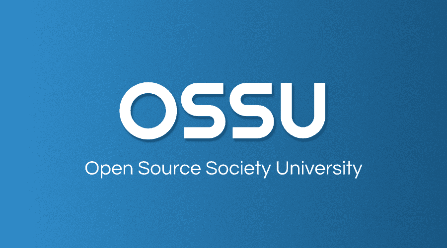

# 今天我完成了 MITx 600 第 1 部分！

> 原文：<https://dev.to/li/today-i-finished-mitx-600-part-1-3b1d>

今晚，我在截止日期前完成了《MITx:计算机科学和使用 Python 编程导论》!(实际上有点过了截止日期)🎉

作为一个没有计算机科学学位的前端开发人员，我总是渴望学习更多关于计算机科学的“真正的东西”。去年我参加了 [HarvardX CS50x](https://www.edx.org/course/cs50s-introduction-to-computer-science) (虽然只是 C 部分)，感觉真的很棒。内容不仅有用，而且引人入胜。

所以今年我决定再次尝试麻省理工学院的这个项目。我再说一遍是因为我其实在学校的时候试过但是做不完(两次！).但是这一次，尽管我现在正在工作，没有太多的时间来做这件事，我仍然能够完成它！(非常感谢女朋友 [@rachel](https://dev.to/rachel) 对我的支持和制作！😄)

为了延续这一成功势头，下周我将开始 MITx 600 课程的第二部分:[计算思维和数据科学简介](https://www.edx.org/course/introduction-to-computational-thinking-and-data-science-2)。

在未来，我希望我的大脑中也能有更多的数学知识。我一直在看从[到这里](https://github.com/ossu/computer-science#core-math)的课程。顺便说一下，这是一个很好的资源，可以让你有一个清晰的计划来逐步学习计算机科学！我真的很感谢将这些放在一起的社区:

##  [奥索](https://github.com/ossu) / [计算机科学](https://github.com/ossu/computer-science)

### 🎓通往计算机科学的免费自学教育之路！

<article class="markdown-body entry-content container-lg" itemprop="text">

### 开源社会大学

通往计算机科学自由自学教育的道路

 

# 内容

*   [总结](https://github.com/ossu/computer-science#summary)
*   [社区](https://github.com/ossu/computer-science#community)
*   [课程表](https://github.com/ossu/computer-science#curriculum)
*   [行为准则](https://github.com/ossu/computer-science#code-of-conduct)
*   [团队](https://github.com/ossu/computer-science#team)

# 摘要

OSSU 的课程是使用在线材料的计算机科学的完整教育，它不仅仅是为了职业培训或职业发展，它是为那些想要在所有计算机学科的基础概念方面有一个适当的、*全面的*基础的人，以及那些有纪律、意志和(最重要的是！)良好的习惯，主要靠自己获得这种教育，但要有来自世界各地的学习者群体的支持。

它是根据本科计算机科学专业的学位要求设计的，减去普通教育(非计算机科学)要求，因为它假设大多数学习本课程的人已经在计算机科学领域之外接受过教育。课程本身是世界上最好的，通常来自哈佛、普林斯顿、麻省理工等等。，但特别选择…

</article>

[View on GitHub](https://github.com/ossu/computer-science)

酷，这就是我想分享的，我希望我们都可以继续学习和享受乐趣！