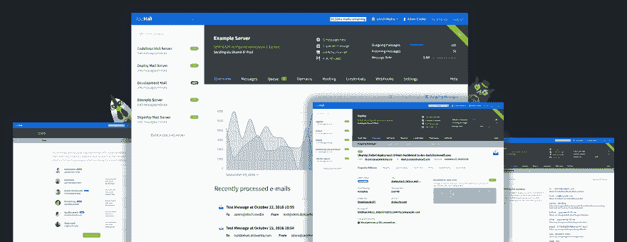
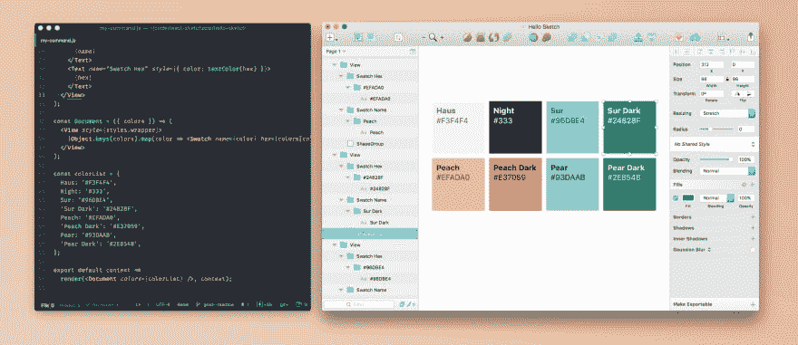
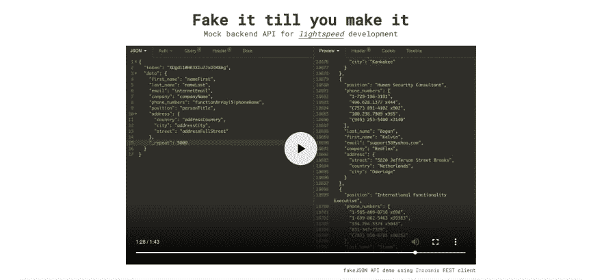
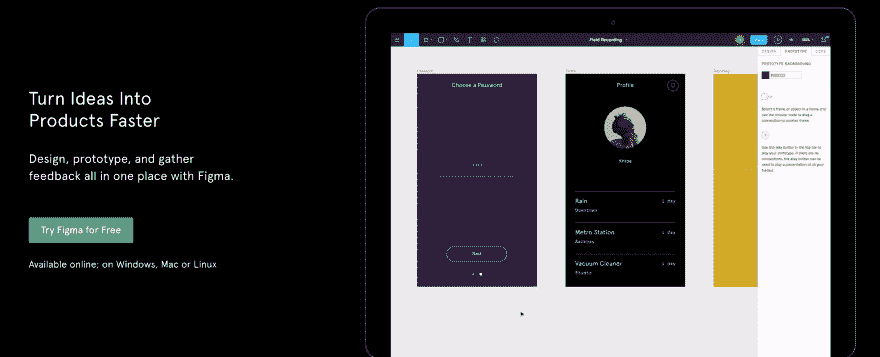
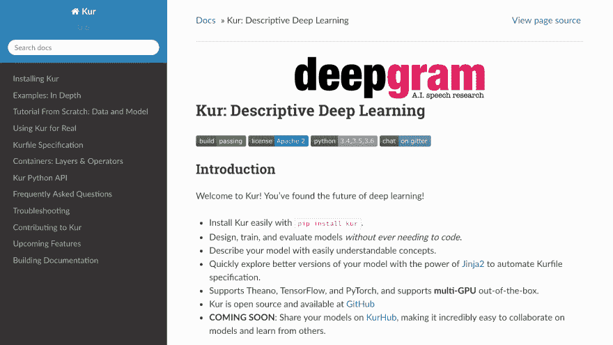
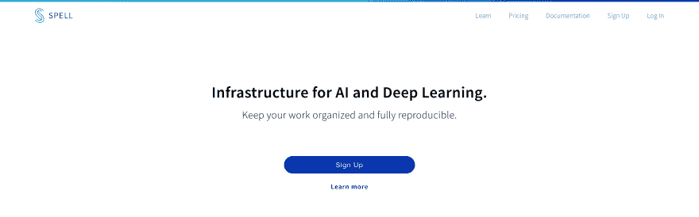

# 开发人员的工具

> 原文：<https://dev.to/sahilrajput/tools-for-developers-gkp>

我发现了一些你可能会感兴趣的工具。这是清单。

### 1。-包包包-包包包包包包包包包包包包包包包包包包包包包包包包包包包包包包包包包包

Taskade 是一种简单的方法，可以列出任务清单，捕捉你的想法，并保持有序。即时共享您的列表，并与您的朋友、家人和队友协作。

***链接:[Taskade](https://www.taskade.com)*T5】**

### 2。邮政的

邮政版是一款开源的全功能邮件服务器，供网站&的网络服务器使用。

***Github: [邮政](https://github.com/atech/postal)*T5】**

### 3。React Sketch.app

**React Sketch.app** 是一个开源库，允许你编写渲染到草图文档的 React 组件。这是一个工具，旨在帮助设计者和工程师在大规模设计系统上架起一座桥梁。
*阅读更多:[此处](https://airbnb.design/painting-with-code/)*

***链接:[React sketch . app](http://airbnb.io/react-sketchapp/)*T5】**

### 4。假的{JSON}

 
它旨在为您的应用程序提供一个随时可用的模拟后端。您可以使用 API 进行前端开发、端到端测试、回归测试、快速原型制作、数据生成等等。使用 API 迭代、更新和刷新您的应用程序，以获得一致和可靠的模拟数据。

***链接:[fake JSON](https://fakejson.com/)*T5】**

### 5 个。你好

**Figma** 是首个基于浏览器的界面设计工具，让团队创建软件变得更加容易。

***链接:[菲格玛](https://www.figma.com/)*T5】**

### 6 个。去吧

 
Kur 是一个开源系统，用于快速构建和应用最新的深度学习模型来解决新的和令人兴奋的问题。Kur 建立在 Keras 之上，为设计和运行深度学习模型提供描述性框架。

***Github:[Kur](https://github.com/deepgram/kur)*T5】**

### 7。邮件降级

 
MailDrop 是 Mailinator 的一个开源、可扩展、高性能版本，是一个“临时收件箱”，当你不想给出你的真实电子邮件地址时，你可以发出它。MailDrop 收件箱被设计成快速和一次性的。

***链接:[MailDrop](https://maildrop.cc/)*T5
***Github:[MailDrop](https://github.com/m242/maildrop)*****

### 8。希兹

 
一个测试响应网站的工具——快疯了。

***链接:【https://sizzy.co/】T2*T5】**

### 9。普罗博特

 
一个用于构建 GitHub 应用的框架，以自动化和改进您的工作流程。GitHub 应用程序可以监听由存储库或组织发送的 webhook 事件。Probot 使用其内部事件发射器根据这些事件执行操作。

***链接:***
***Github:[Probot](https://github.com/probot/probot)***

### 10。拼写

AI 和深度学习的基础设施。
*文档:[拼](https://spell.run/docs/home/)*

***链接:***

### 11。安全副本

这是一个数据恢复工具，它试图从有问题的(即损坏的扇区)源(如软盘驱动器、硬盘分区、CD、磁带设备)中提取尽可能多的数据，而其他工具(如 dd)会因 I/O 错误而失败。

***链接:***