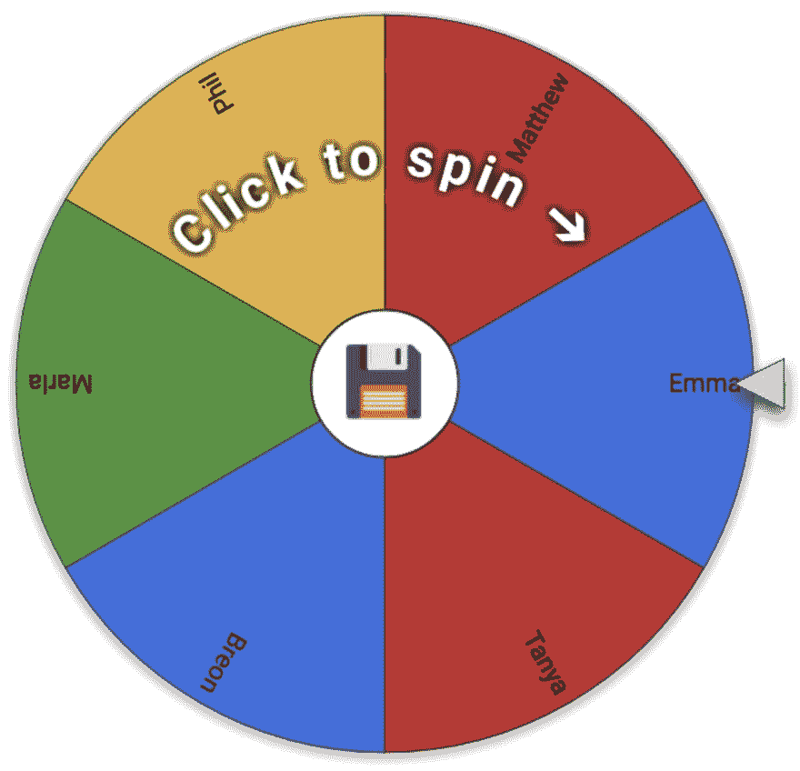

# 有效配对的工具

> 原文：<https://dev.to/circleci/tools-for-effective-pairing-2mkm>

今年我已经做了大约 150 个电话屏幕。[把你的工程组织翻倍](https://circleci.com/blog/how-we-interview-engineers-at-circleci/)意味着要和很多人谈，我是说很多。我和他们谈论他们的工作历史，他们的软件哲学，以及帮助实现高质量软件交付的过程。这经常求助于过程来帮助实现协作编程范例，并最终配对。不可避免地，我会听到这样的话，“但是，你是完全遥远的！”以及“你如何共享键盘？”

这类问题总是让我困惑。我是一个从未在同处一地的团队中工作过的人，我看到过结对在一个大多数人都在偏远地区的工程部门中取得成功。通过我的谈话，很明显，有一批开发人员认为结对是有效的，但是在远程团队中无法实现。因此，我认为分享 CircleCI 的计划和定价团队成功配对的技巧和诀窍是有益的，circle ci 是一个 100%远程团队，几乎 100%的时间都进行配对。

## 工装

作为远程配对的抑制因素，最常提到的是工具。"没有连接到显示器上的两个键盘，你怎么配对？"人们问我。事实证明非常容易。

当我问我们的计划和定价团队什么工具曾经有效时，答案非常简单:主要是屏幕共享，有时是终端共享的 [tmate](https://tmate.io/) 。对于这个问题，我最喜欢的回答是“等等，除了屏幕共享，你还有什么?”？比如全 AR 体验？Lol。”

团队能够有效地配对，一个人编码，而另一个人跟随，给出建议，讨论实现，查找资料，并且是一个参与的副驾驶。屏幕共享是一个非常合适的工具。

Tmate 可以很好地实现远程终端共享，但它对浏览器开发不是很有用，需要每个参与者熟悉其他人的环境，并且排除了使用 IntelliJ 或草书等 ide 的人。因此，虽然它在某些情况下很有用，但是作为一个由 vim、emacs 和草书用户组成的团队，做大量的前端工作，它的效用最终相当有限。

## 配对范例

在工具化之后，我最感兴趣的是使结对最有效的范例。是驾驶员<>导航员吗？一个人写测试，另一个人让他们通过吗？答案再一次比那更简单:*做对双方都有意义的事情。*

很多时候，只是一次交谈。两个忙碌的队友之间关于最佳前进路径、命名函数的最有利方式、是否重构的争论。有时这对搭档做 TDD，有时不做。有时一个人开车，而另一个人导航，有时这更像是一个学习机会，因为更有经验的人带着另一个人参观代码库，帮助他们获得上下文和熟悉度。这是关于什么最适合特定的一对。

总的来说，在我收到的所有回答中，我始终认为只有一点:这是关于参与度的。结对不是一个人编码，而另一个人浏览 Reddit，或者回应 Slack。它是关于两个人一起合作解决问题。只要这两个人都致力于解决这个问题，他们所使用的特定范例就远没有他们所创造的协作环境重要。

然而，即使我们有良好的意愿，有一个高度积极的团队来配对和创造一个协作的环境，我们仍然经历了一些困难和问题，迫使我们提出创造性的解决方案。

## 异步配对

在完全远程的组织中，配对的最大障碍之一是处理时区。在大约 6 个月的时间里，Plans 团队让人们处于 UTC+7、UTC+8 和 UTC-9 时区，总共有 17 个小时的时差。然而，该团队仍然设法配对。他们是怎么做到的？

每天，团队都会在我们在美国的队友和我们在东京的队友之间进行交接。这两个人会在西海岸一天的最后几个小时里配对，把上下文转移到我们的日本同事身上。交接完成后，他会继续工作，推起他的树枝，并在最后留下详细的笔记。第二天早上，这两个人会从他停下的地方继续工作。

这种实践允许团队继续保持高度协作的范例，甚至跨越海洋。

## 配对随机化

团队经历的一个问题是团队中不均衡的配对。这是由于不知道谁可以自由配对，以及“配对婚姻”，即两个人一张接一张地连续配对。为了防止这种情况，研究小组实施了配对随机化。

每天开始时，在站立时，团队通过各种过程(如自动脚本和“幸运轮”)随机挑选配对团队遵循一些约束，以确保这不会造成干扰:

*   每张票至少要有一个人保持一致，所以上下文会从一天延续到下一天。
*   如果有一个好的理由不改变这一对，团队就不改变。这方面的一个例子是研究票，其中某些人有必要的背景来完成任务。

然后，两人一组协调制定一个对他们来说有意义的时间表。这降低了结对的障碍，并增加了团队间的知识共享。

这也有一些有趣的副作用，比如团队使用的配对脚本，如下图所示:

## 结论

成为一个远程工程组织并不意味着你必须是一个人单独工作的组织。配对在远程环境中与在同处一地的环境中一样有效，并且具有同处一地的配对所没有的一些额外的好处，例如对抗社会孤立。最后，如果你想做点什么，只需要接受和一些创造性的思考。如果你想让*远程配对*工作，希望这些实践能给你提供一个有用的跳板。