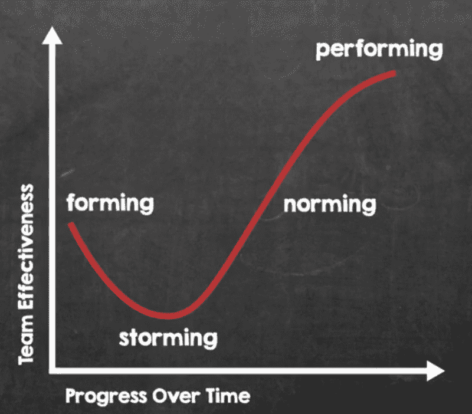
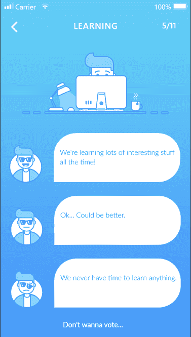
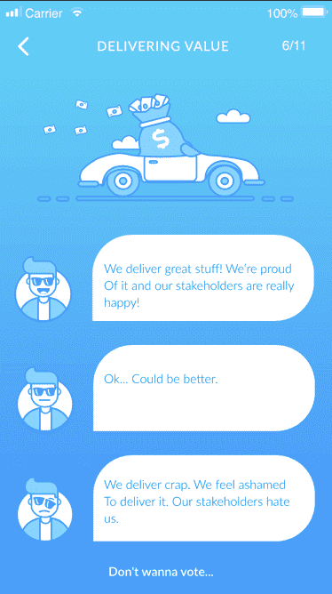
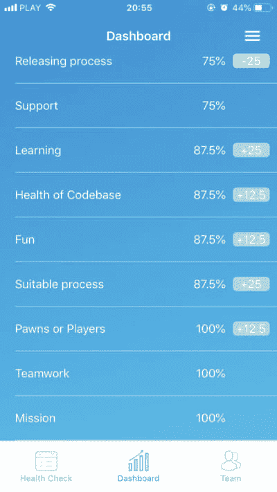
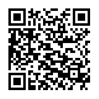
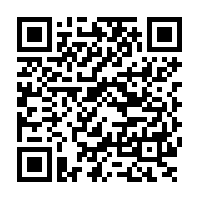
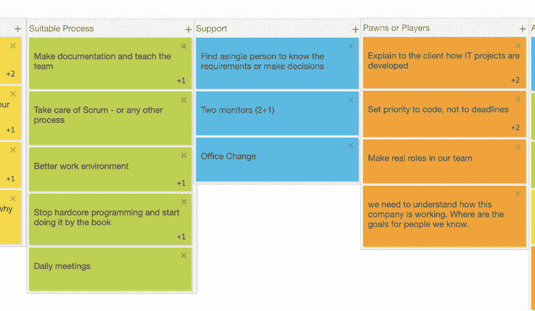

# 工具，帮助我建立健康💕和表演团队👩🏾‍💻👨🏼‍💻

> 原文：<https://dev.to/oskarkaminski/tools-that-help-me-build-healthy-and-performing-teams-237e>

如果你明天被分配去建立一个公司的梦之队，你会用什么技术和工具来支持你的战略？

## 打造一流团队

伟大的团队不会在一天之内诞生。每个团队都必须经历一定的阶段，才能最终成为公司的第一团队。你是知道的...这种团队，当事情变得非常严重时，你会寻求帮助-特种部队，王牌，阿尔法狗...叫他们什么来着。

但这些阶段是什么，为什么不是每个团队都达到这种最佳表现状态？

## 群体发展的阶段

科学家 Bruce Tuckman 在他的流行理论[中证明了 Tuckman 的团队发展阶段](https://en.wikipedia.org/wiki/Tuckman%27s_stages_of_group_development)，即**要达到高绩效状态**，每个团队都要经历三个前期阶段——组建、强攻和规范。

那么走过这些阶段到达表演状态只是时间问题吗？

是...我的屁股。

在这些阶段，基本上所有的事情都会变糟。而且经常如此。
从强攻阶段的权力之争(你有没有在一个由前技术领导组建的团队里？你会喜欢的)，建立不正常的规范，比如指手画脚或者永远不要对你的老板说不(然后带着它离开你的团队)。

似乎大多数团队没有花足够的时间来建立基础，这将使他们不仅仅是一群一起工作的人。

这是为什么呢？

## Sh##必须交货

通常，团队的创建只有一个目的。去完成一项特殊的任务。任务成了他们的头等大事，而取得进展(或没有进展)是衡量他们成功的主要标准。因此，毫不奇怪，经理们不顾团队的健康状况，创造各种激励机制，将团队推向极限。

不幸的是，在没有对团队健康状况有充分了解的情况下追求结果——就像驾驶一辆没有检查也没有维修的汽车——导致(在最好的情况下)永久的损害。

如何避免伤害？

让我分享一些技术和工具，帮助我以一致的、可重复的方式建立健康的、高效的团队。通过这样做，作为回报，你将获得最高的价值——你家人的信任和忠诚。

### 团队健康检查

如果你是开发团队的一员，这个工具就是为你准备的。
Team Health Check 是 Spotify 设计的基于[回顾模式的移动应用。](https://labs.spotify.com/2014/09/16/squad-health-check-model/)

没有任何应用程序可以取代团队成员之间的坦诚对话，而每个人都可以表达自己的感受和想法。但是，如果确定的问题是针对一个真正的威胁或者只是一个团队中最直言不讳的部分的要求，那么如何理解你的团队的关键痛点，而不会陷入冗长的、消极的、没有把握的抱怨漩涡中呢？

团队健康检查通过让整个团队参与对其工作中最重要(和紧急)部分的匿名投票来应对这一挑战。

| 学问 | 传递价值 |
| --- | --- |
|  |  |

预定义的类别使您的团队能够立即开始工作。
在 [iOS](https://itunes.apple.com/us/app/team-health-check/id1455739040?mt=8) 或 [Android](https://play.google.com/store/apps/details?id=net.teamhealthcheck) app 中注册免费账号，你就准备好了第一次健康检查！

然后，通过观察多次健康检查/投票之间的趋势，关注(并迅速改进)你的团队的方向。

#### 如何下载？

由于团队健康检查是一个移动应用程序，您可以在[应用商店](https://itunes.apple.com/us/app/team-health-check/id1455739040?mt=8)或 [Google Play](https://play.google.com/store/apps/details?id=net.teamhealthcheck) 中找到它，或者通过扫描下面的二维码找到它。

| ios | 机器人 |
| --- | --- |
|  |  |

### 胶粘物. io

如果你已经知道你的团队的健康状况(你可以使用团队健康检查)，那么快速的[头脑写作会议](https://www.mindtools.com/pages/article/newCT_86.htm)很可能是你接下来要找的。

Brainwriting 是一种类似于头脑风暴的技术，但是参与者将他们的想法写在便笺条上。

脑力写作的酷之处在于:

*   这是非常民主的——所有的人都可以在同一时间写文章，表达自己的观点，而无需争夺关注。
*   它促进了不墨守成规——在头脑风暴期间，人们可以专注于之前表达的想法，而 brainwriting 让每个人都专注于自己的想法。
*   没有社交游手好闲——团队倾向于让少数人做团队的大部分工作，而有些人不做贡献。Brainwriting 通过为每个人提供平等的贡献机会并使参与更加透明来解决这个问题。

Stickies.io 是一个免费的虚拟便签板。该网站甚至可以为分散的团队组织头脑写作会议，而(可选)匿名模式确保参与者可以专注于自己的想法(无需看到彼此的笔记)。

会议结束后，参与者可以发现他们的想法，将他们分组，并投票选出最佳方案。

## 接下来呢？

组建团队是一个耗时的过程，不能做一次就忘。

我已经与你分享了我最喜欢的工具，它们帮助我建立更健康的团队。他们也可以成为你的指南针，引导你的团队在充满挑战的道路上找到适合自己独特背景的独特文化。