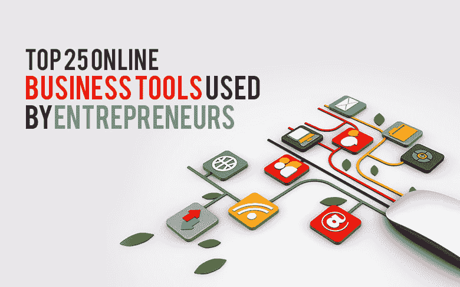

# 2018 年企业家使用的 25 大在线商业工具

> 原文：<https://dev.to/iam_roma_/top-25-online-business-tools-used-by-entrepreneurs-in-2018-2h03>

但是，创业并取得成功并不是每个人都喜欢的。当今竞争激烈的商业世界给企业家带来了许多挑战。我们有几种工具可以帮助我们解决这个问题。我们拥有令人惊叹的在线工具来提高销售额和生产率。这些工具还可以帮助应用程序开发公司吸引潜在的投资者和客户。下面就详细说说吧。

Hootsuite 可能是人们在考虑社交媒体管理时列出的第一个名字。logo maker 是一个图形设计工具，可以帮助公司自己创建独特而有创意的 logo。CodePen 推出了自己的 IDE(集成开发环境)，名为 CodePen Projects。它允许你在浏览器中建立网站。要了解更多关于这些工具的信息，请阅读这里的文章。