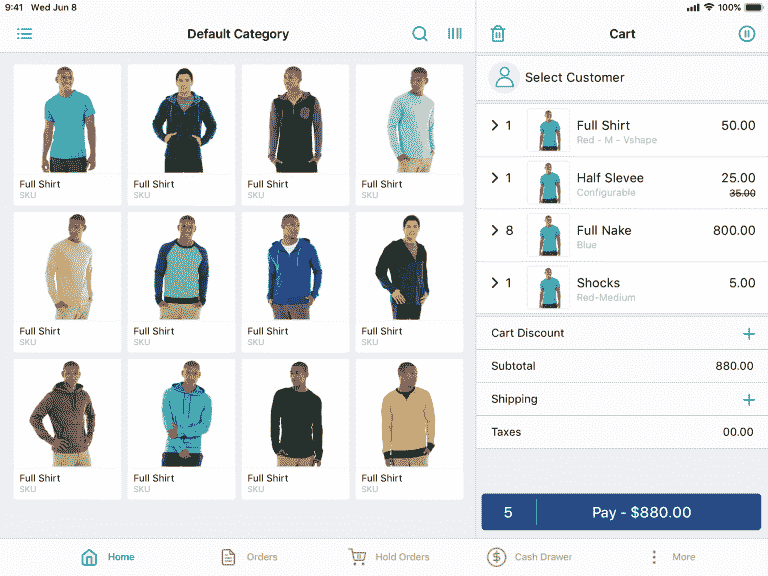

# 前 3 名最佳 Laravel 电子商务套餐

> 原文：<https://dev.to/pathaksaurav/top-3-best-laravel-ecommerce-packages-1lcc>

[Bagisto](https://bagisto.com/) 、[favored](https://www.avored.com/)和 [Aimeos](https://aimeos.org/laravel-ecommerce-package) 是目前顶级的开源 laravel 电子商务包，它们重新发明了轮子，并随着时间的推移保持强劲。

作为所有 PHP 开发框架中最年轻的一个，Laravel 已经迅速成为了 PHP 开发框架的**最佳选择**。框架的简单性、清晰性和灵活性也为许多真正的 Laravel 电子商务包铺平了道路。

类似于**安全授权**、**高可伸缩性**、**可定制性**以及**广泛社区**支持等特性的融合使得 Laravel 成为电子商务开发的热门选择之一。

开发一个电子商务项目需要对电子商务生态系统和正确的数据工作流程的透彻理解。自 2014 年成立以来，已经有许多电子商务包，但只有少数几个仍然存在，并定期更新和更改。

让我们一个接一个地研究每个包。

## 1。巴基斯托

开源 Laravel 电子商务很快吸引了 Laravel 社区的目光，并提供**开箱即用的多仓库库存**。

Bagisto Github 存储库:https://github . com/bagisto/bagisto

此外，与内置的易于导航的管理面板捆绑在一起，它提供了诸如**多货币**、本地化、**访问控制级别**、多渠道、支付集成等功能。

[**代码驱动的方法**](https://devdocs.bagisto.com/) 、开放论坛上的社区&群组和易于定制的功能使得在 Bagisto 上获得支持和建立您的电子商务商店变得非常容易。

bagthis live demo:[https://demo . bagisto . com/](https://demo.bagisto.com/)

一些要求最苛刻的扩展点缀着框架，如用于创建市场的 [B2C](https://bagisto.com/en/laravel-multi-vendor-marketplace/) & [B2B](https://bagisto.com/en/laravel-b2b-marketplace/) 模块、 [laravel 电子商务 PWA](https://bagisto.com/en/extensions/laravel-ecommerce-progressive-web-application/) 构建在无头架构上、[销售点](https://bagisto.com/en/laravel-point-of-sale/)、全球速卖通直运、[多租户 SaaS](https://bagisto.com/en/laravel-multi-tenant-saas/) 解决方案等等。

他们还推出了更多的功能和先进的技术堆栈，如支持 **REST & GraphQL API** 、**一键更新**、微服务、业务应用平台等。

## 2。喜爱的

基于 Laravel 的[开源购物车](https://www.avored.com/)可以根据你的需求轻松定制，默认提供**手机友好界面**布局。

最喜欢的现场演示:[https://demo.avored.com/](https://demo.avored.com/)

该平台允许您轻松创建产品实体，如类别、属性等，并提供高效的订单管理功能来跟踪您的订单、客户信息和库存管理。

最喜欢的 Github 库:[https://github.com/avored/laravel-ecommerce](https://github.com/avored/laravel-ecommerce)

营销模块允许您向客户发送促销电子邮件，这有助于成功推广您的产品，从而为您提供管理整个电子商务流程的惊人体验。

## 3。艾米斯

[开源 PHP 库](https://aimeos.org/)为 Symfony、Laravel 和 Slim 等各种框架提供**高性能电子商务组件**。Aimeos TYPO3 发行版允许店主轻松地建立他们的网上商店。

Aimeos 现场演示:[https://demo.aimeos.org/](https://demo.aimeos.org/)

该框架提供的**渲染时间**可达 **40 ms** ，被**分配**到 **16 个数据库**，每天可处理 **10，000 个订单**。该网上商店是完全搜索引擎优化优化，并提供安全层，以防止对 SQL 注入和跨网站脚本(XSS)。

Aimeos Github 库:[https://github.com/aimeos/aimeos-laravel](https://github.com/aimeos/aimeos-laravel)

[**有据可查的代码结构**](https://aimeos.org/docs/Home) 以及与任何 PHP 应用程序的本机集成，使得开发人员可以根据自己的需求添加组件和定制框架，从而简化开发任务。

还有其他的 Laravel 电子商务包，但要么它们即将过时，要么已经停滞不前。

请在下面的评论中告诉我们你对上述框架的想法，或者推荐一个你认为最适合这个电子商务生态系统的框架。