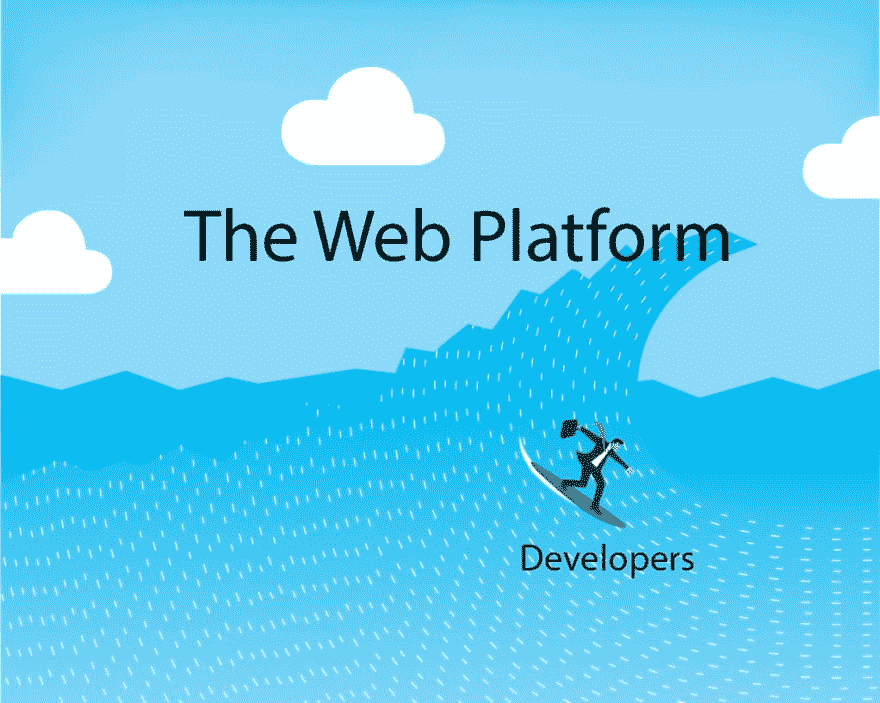

# 五大前端开发大趋势

> 原文：<https://dev.to/kball/top-5-frontend-development-megatrends-6p8>

作为一名 web 开发人员，你可能会感到力不从心。

不断尝试跟上，学习新的框架，学习新的语言特性，有时学习全新的语言。也难怪前端开发者经常会被压得喘不过气来。

但是还是有希望的:在过去的几年中，虽然仍然有非常快速的变化，并且有比以往更多的前端框架和软件包可用，但是也有一些概念被整合到几个大趋势中。

如果我们对这些大趋势有所了解，那将有助于我们集中思想，明白该学些什么。在这种背景下，决定使用哪种特定的框架或工具来学习 feel 就不那么令人生畏了——只要我们选择的框架或工具符合这些大趋势，我们就能够转移我们的大部分知识。

我们越能理解大局，我们就越能驾驭网络这个疯狂的浪潮，而不是感到被淹没。

这就是:五大前端开发大趋势。

## 1。面向组件的开发

如今，每个 JavaScript 框架都在采用面向组件的方法。不管你使用哪一个，React、Angular、Vue 是三大工具，但是进一步看看 Ember、Dojo、Mithril 等工具，它们都使用组件作为考虑 UI 的核心抽象。

这种取向也存在于 CSS 中，包括方法和框架层面。像 BEM 这样的方法正是为了支持面向组件的 CSS 方法而设计的。像 Bootstrap、Material 或 Foundation 这样的 UI 框架本质上只是预制组件的集合。这是几乎所有现代前端开发的根源。

为什么面向组件的开发如此流行？因为它允许关注点的分离和模块化开发，使得*对用户界面*有意义。

我们一直都知道模块化代码的重要性——它允许我们开发更复杂的系统，同时保持代码的可管理性。但是前端实现模块化的正确方法并不总是很明确。React 将分离壁垒推向组件而不是编程语言的深刻见解彻底改变了前端世界。

JSX 并不是每个人都喜欢的解决方案。我更喜欢 Vue 的单文件组件方法，围绕模板语言和美化 JavaScript 的争论双方都有有效的论据。无论如何，关键的变化是将组件视为紧密耦合的 HTML、CSS 和 JavaScript 的小捆绑包，然后它们本身可以与其他组件松散耦合。

## 2。声明性编码

在 web 的早期，直到今天，对于许多简单的非框架 JavaScript 应用程序，我们使用的是命令式范式。做这件事，改这件事，这样做。

越来越多的，JavaScript 框架本身正在向一个*声明式*范例整合，在这个范例中，我们描述结果，而框架本身负责计算如何实现。我们现在只陈述*什么*，框架处理*如何*和*何时*。

如果我们想改变一个 UI 元素，我们只需告诉我们的框架新的最终状态应该是什么，并让它进行所有必要的更新。它可以使用虚拟 DOM 之类的工具来有效地进行这些更改，也可以使用时间切片之类的工具，以不干扰用户交互的方式进行更改，但我们开发人员不必担心这一点。

这解开了两件事。

它开启的第一件事是代码可读性&可理解性的*显著的*提高。我们可以直接查看模板，直接看到它，而不必挖掘 jQuery 的许多行来找出正在更改的内容，并尝试推断最终的状态。

它开启的第二件事是利用框架作者更容易、更快速地实现最佳实践的能力。React 已经在通过时间片和暂停组件获取异步数据来实现这一点，但我也怀疑这将是 WebAssembly 影响前端的最高杠杆之一。框架管理的越多，就越能在幕后无形地为我们做事。

## 3。巩固国家管理

随着越来越多的复杂性转移到前端，我们也必须为前端状态管理提供越来越好的解决方案。纯面向组件的开发非常适合本地状态，但是有时我们需要在不同的组件之间共享状态。前端的一个独特挑战是一切是如何异步发生的，但有时我们需要将可预测性强加到我们的状态管理中。

这有两个截然不同的，但我认为相关的发展。

首先是[通量架构](https://facebook.github.io/flux/)的开发。这种模式已经在 Elm、Redux、Vuex 等工具中实现。这种架构的美妙之处在于它强制单向数据流，使得管理和调试状态变得容易得多。一切最终都要经过一个中央调度程序，这意味着您可以在状态管理中创建可预测性、可再现性和可调试性。

我认为正在解决同样问题的第二个发展是 GraphQL 的兴起。这又一次解决了这个问题，它创建了一个整合层，而不是驻留在调度程序的前端，而是驻留在 GraphQL 服务器上。前端不再需要管理它们需要从中获取状态的所有不同位置，以及它们之间的相互关系…它们只需要准确地询问它们需要什么，GraphQL 服务器就会负责为它们打包。

## 4。单页应用程序&客户端可路由性

当复杂的前端首次进入它们自己的领域时，并不清楚我们将如何组织它们。我们会简单地将越来越强大的组件嵌入到独立的服务器呈现的页面中吗？

随着时间的推移，URL 显然是 web 最伟大的创新之一，但是完全在我们的客户端应用程序中在页面之间移动可能会有巨大的优势。

Ember.js 可能是第一个真正把它作为一种哲学来阐述的框架，但是它已经被几乎所有主要的客户端框架所吸收。虽然不是每个项目都需要一个完整的单页面应用程序，或者只有一个，但是越来越普遍的情况是，至少有一部分甚至全部的前端程序在执行自己的路由。

无论你使用 React 路由器，Vue 路由器，Mithril 的路由，或其他完全核心的概念是非常相似的。URL 映射到一组组件和状态，通常具有基于嵌套路由的组件嵌套。

## 5。管理复杂性的类型

JavaScript 长期以来一直是一个快速而松散的开发环境。类型是松散的，参数没有被检查，甚至自动化测试也长期被忽视。但是随着我们在前端构建的复杂性的增加，我们对帮助管理代码和防止错误的需求也在增加。

我们获得帮助的最大趋势是类型。从像 [Flow](https://flow.org/) 这样的工具开始，现在越来越多地使用像 TypeScript 这样的编译成 JavaScript 的语言，前端正在接受类型检查。

像 [46%的 npm 调查受访者](https://medium.com/npm-inc/this-year-in-javascript-2018-in-review-and-npms-predictions-for-2019-3a3d7e5298ef)使用 TypeScript 这样的 Jawdropping 采用统计数据显示，这正在起飞，2019 年的所有迹象都表明这一趋势仍在继续。

## 奖励:服务器端渲染和通用 JavaScript

虽然更多的是“部署”或操作创新，而不是前端开发创新，但一个更明显的大趋势是促进单页面应用程序的服务器端呈现的趋势。

这使您可以利用服务器端渲染和 SPA 应用程序的最佳特性——快速查看第一页，同时还具有网络效率，并具有 SPA 的所有延迟和交互性优势。

## 包装完毕

识别这些大趋势的好处是，你不需要为“跟上”或弄清楚该学什么而恐慌。您可以专注于一个堆栈，但当您学习它时，请注意大的图片课程，您将能够根据需要快速应用到其他堆栈。

例如，您可能选择使用 TypeScript 深入研究 [Next.js](https://nextjs.org/) 。这会让你接触到这些大趋势中的每一个。

您将使用 React 进行构建，React 是一个面向组件的框架，具有很好的声明式风格。你可以选择使用 [Redux](https://github.com/kirill-konshin/next-redux-wrapper) 或者 [GraphQL](https://github.com/jaydenseric/next-graphql-react) ，你将获得开箱即用的可路由性*和*服务器端渲染。

举例来说，如果以后您决定要迁移到 Vue.js，所有这些知识都将转化为 Vue 的细节略有不同，但总体情况非常相似，甚至还有一个等效的更高级别的框架: [Nuxt.js](https://nuxtjs.org/) 。

如果你想在*如何*了解其中一些主题方面获得一些帮助，你可以查看我的[2019 年要学习的前 5 个前端主题](https://dev.to/kball/top-5-frontend-development-topics-to-learn-in-2019-4m0m)，我在那里细分了 5 个更具体的主题，并列出了很好的资源列表。

* * *

如果你关心前端开发，你可能也会对我的每周时事通讯《星期五前端》感兴趣。每周五我会发出 15 个链接，链接到 CSS/SCSS、JavaScript 和其他各种精彩的前端新闻中的最佳文章、教程和公告。在这里报名:[https://zendev.com/friday-frontend.html](https://zendev.com/friday-frontend.html)