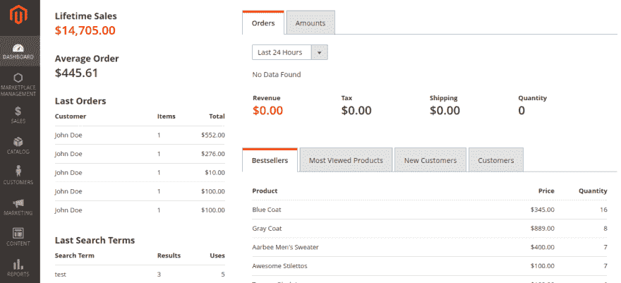
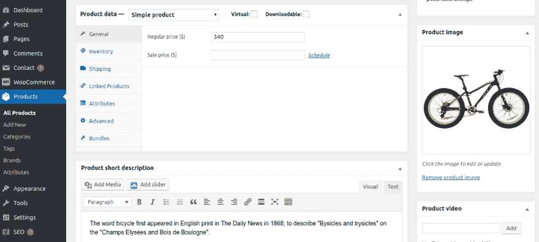
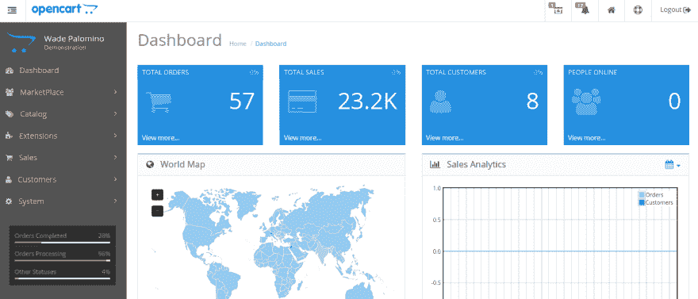
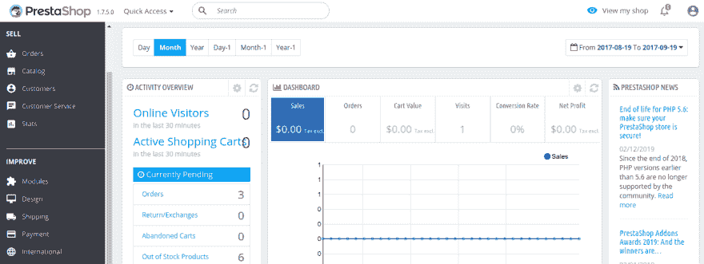
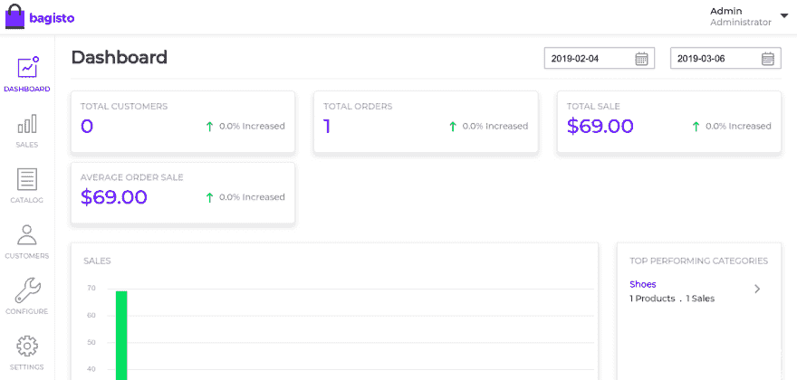

# 2019 年 5 大开源电子商务框架

> 原文：<https://dev.to/pathaksaurav/top-5-open-source-ecommerce-framework-for-2019-2f4l>

如果您正在寻找建立您的 **[电子商务网站](https://webkul.com/blog/laravel-ecommerce-website/)** ，并且寻找可以根据您的需求轻松定制并提供基本**电子商务功能**的框架，那么 **[开源电子商务框架](https://bagisto.com/en/bagisto-open-source-ecommerce-framework-laravel/)** 是您应该寻找的。

事实上，这些开源电子商务框架是完全**免费的**，**由世界各地的**社区**管理**，并且在博客&网站上有大量的**文档**，这使得他们选择开发一个**在线电子商务商店**。

电子商务收入正以惊人的速度增长，预计到 2020 年 将突破 **[4 万亿美元。下面我们列出了 2019 年你应该考虑的顶级开源电子商务框架](https://www.emarketer.com/Article/Worldwide-Retail-Ecommerce-Sales-Will-Reach-1915-trillion-This-Year/1014369?utm_source=Sailthru&utm_medium=email&utm_campaign=Issue:%202016-08-22%20Retail%20Dive%20Newsletter%20%5Bissue:6973%5D&utm_term=Retail%20Dive)**

# Magento

被认为是电子商务行业的**圣经**、**、 [Magento](https://magento.com/products/magento-open-source) 、**是应用最广泛的电子商务开发工具。全球**电子商务网站**中几乎有 **17%** 是基于 Magento 框架构建的**。**

凭借 **[广泛的社区支持](https://magento.com/community)****强大的特性**和**对设计和功能的完全控制**，Magento 在开源列表中遥遥领先。

# WooCommerce

WooCommerce 是 **WordPress 社区**的 **[领先电子商务平台](https://woocommerce.com/)** 。如果你有任何关于 **WordPress 基础编程技巧**的知识，你可以轻松集成 **[WooCommerce](https://github.com/woocommerce/woocommerce)** ，轻松管理你的产品。

由于它对 WordPress 的依赖，它可能对大商店没有太大的吸引力，但对于那些使用 WordPress 的人来说，在 WordPress 上发布他们的店面可能是有用的

# 开放式购物车

Opencart 是 T2 初创公司和小企业最喜欢的框架之一。任何人只要有一点点**的**编程经验**就可以很容易地使用这个框架，因为它易于使用并且简单地控制 **[OpenCart](https://www.opencart.com/)** 的后端功能。**

即使与其他购物车相比，Opencart 发现自己的功能最少，但由于 **[易于访问](https://www.opencart.com/index.php?route=cms/demo)** 和**不太复杂的特性**，它仍然很受开发人员的欢迎。

与此同时，随着大多数开发者使用它，它也得到了 **[强大的社区支持](https://github.com/opencart/opencart)** 。

# 预铺

在这个框架下， **[PrestaShop](https://www.prestashop.com/en)** 在**欧洲地区**经营的众多商家中，超过 **30 万家店铺**成功运营。

**[直观安装](https://github.com/PrestaShop/PrestaShop)** 和**定制**过程为开发者提供了易于访问的开源框架。

然而，要定制功能齐全的网站，你需要购买一些插件，这会让 PrestaShop 处于不利地位。

# 巴基斯托

对于**快速增长的 laravel 社区**，**， [Bagisto](https://bagisto.com/en/) ，**提供了一个易于定制和使用的 **laravel 电子商务框架**。平台提供开箱即用的 **[多仓库库存](https://www.youtube.com/watch?v=GAHgD_bMAk8)** 管理。

新推出的框架可能是该平台唯一的缺点，但它在**开源**和 **laravel 社区**中发展很快。

凭借 **[多厂商](https://bagisto.com/en/extensions/laravel-multi-vendor-marketplace/)** 插件和**易于定制的 laravel 框架**，Bagisto 已经跻身前 5 名。

还有其他流行的框架，像 **[Virtuemart](https://virtuemart.net/)** 、 **[osCommerce](https://www.oscommerce.com/)** 、 **[Zen-Cart](https://www.zen-cart.com/)** 、**[spree commerce](https://spreecommerce.org/)**等都被 lot 使用，你可以根据需要自由选择。

# 结论

每一个**框架**都有其**的独特性**，使用大多基于你**的具体需求**。因此，**最佳框架的定义并不存在**。

请在评论中告诉我们哪个电子商务框架是您的首选解决方案，以及它解决了哪些问题。