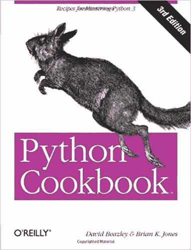
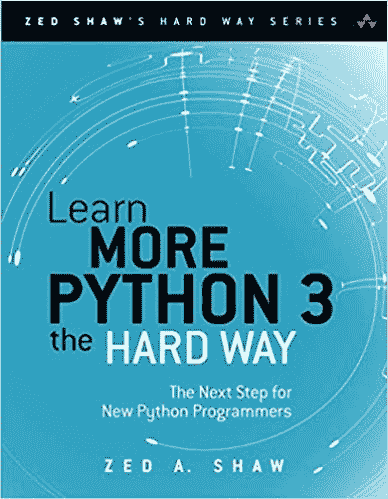
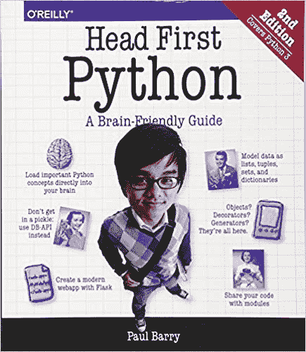
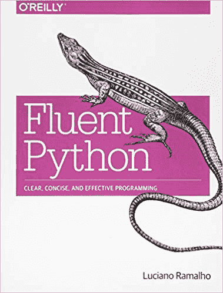

# 从初学者到专家的五大 Python 书籍

> 原文：<https://dev.to/yogeswaran79/top-5-python-books-from-beginners-to-expert-8on>

虽然网上有许多 python 课程，但是从书本中学习仍然是极大地提高你的 python 技能和知识的最好方法之一。

## 1。 [Python 烹饪书，第三版，作者大卫·比兹利和布莱恩·k·琼斯](https://amzn.to/2QSUiDw)

Python 指南在一本综合的书中涵盖了最常见编程任务的教程。书中的代码示例展示了如何用惯用的 Python 3 代码完成事情。书中解释了代码为什么以及如何工作，非常有帮助。

## 2。[费了九牛二虎之力学习 Python，作者 Zed A. Shaw](https://amzn.to/2V6TIR7)

Zed Shaw 的*艰难地学习 Python*已经帮助了成千上万的人学习如何用 Python 编程。这本书以对学习过程采取动手操作的方式而闻名。

## 3。[保罗·巴里著《第一个 Python:对大脑友好的指南》](https://amzn.to/2Rh441n)

*Headd First Python* 在 Python 书籍中脱颖而出，因为它平易近人，易于学习。诙谐的评论和插图解决了作为 Python 程序员初学者会遇到的确切问题。

## 4。 [Python 速成班:基于项目的编程入门，作者 Eric Matthes](https://amzn.to/2AgS5r7)

*Python 速成课程*超越了基础知识，让您沉浸在功能齐全的软件项目中。您将使用 **Django** 编写项目代码，这是一个非常流行的 Python Web 框架。其他项目将向您展示用 Python 制作游戏的有趣一面。这本书将向你介绍 Python 编程语言的基础。

## 5。[流畅的 Python:清晰、简洁、有效的编程，作者卢西亚诺·拉马尔霍](https://amzn.to/2Rktuva)

**(针对高级 Python 程序员)**
这本书对高级 Python 程序员非常有用，可以帮助你学习你应该使用的最佳技术。应用书中的经验将会为你已经开发的所有应用程序带来更清晰、更简短和更快速的代码。

如果有什么 Python 书籍从初学者到专家的书籍推荐。别忘了在下面提一下！

加入我的电报社区，这样你就不会错过任何一篇文章！